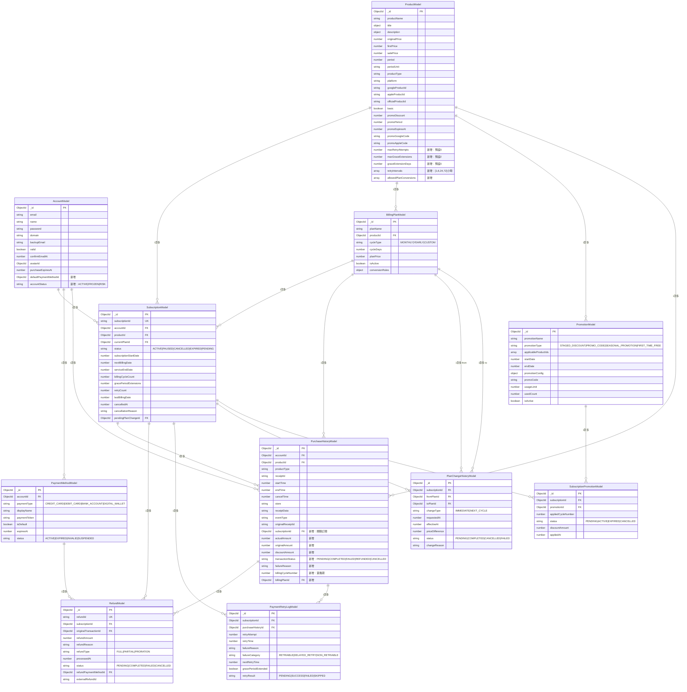
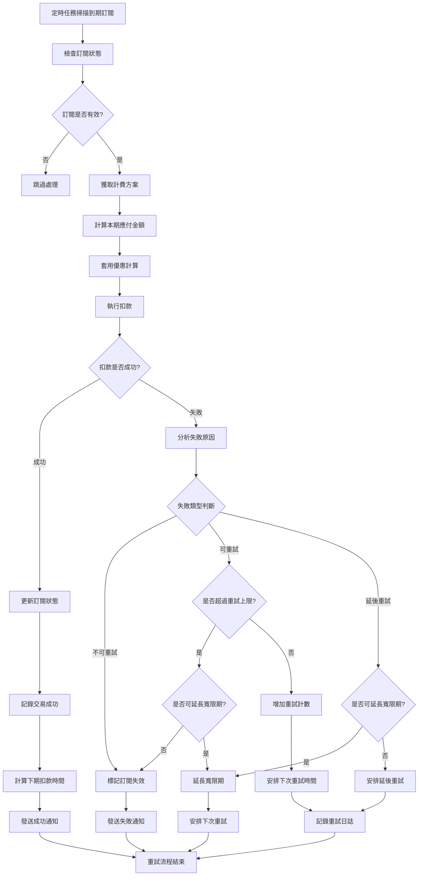
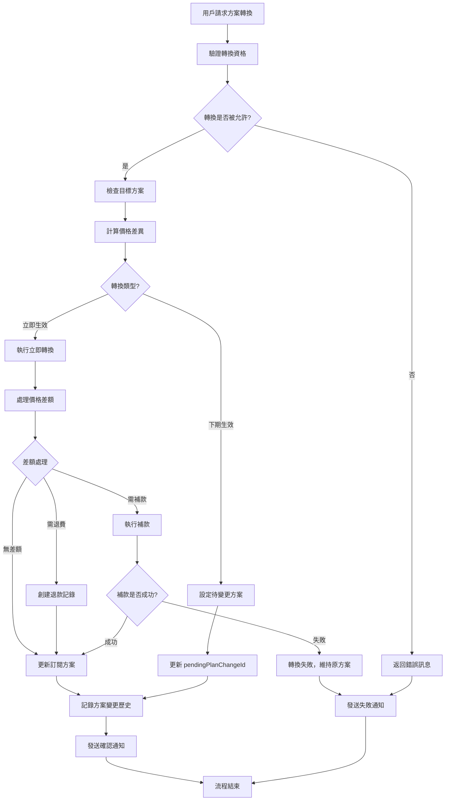
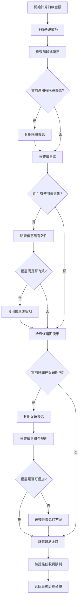
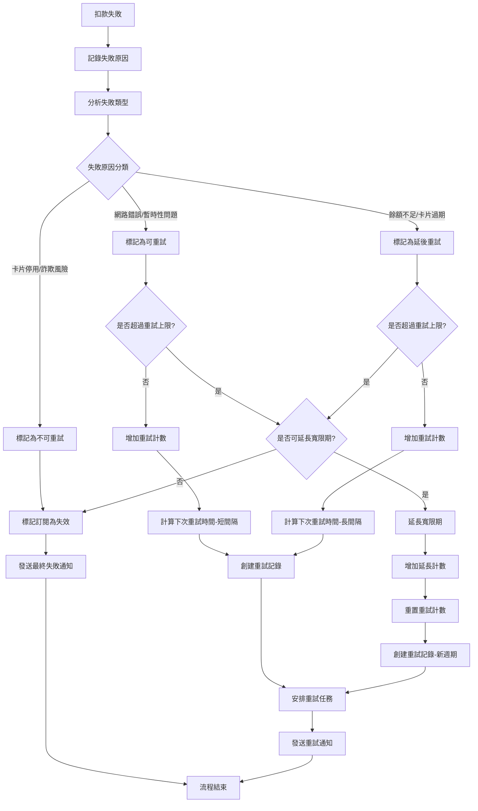
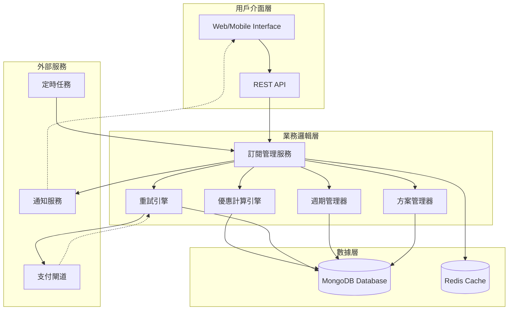
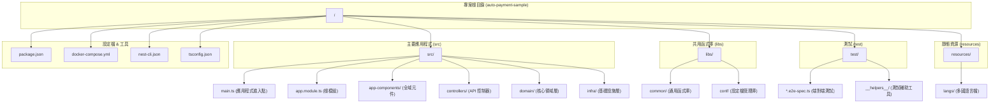

# 自動扣款機器人系統 (Subscription Billing Robot)

## Description

這是一個靈活且可擴展的自動扣款機器人系統，專為處理複雜的訂閱制商品計費場景而設計。系統支援多樣化的計費週期、智能優惠管理、失敗重試機制，以及無縫的方案轉換功能。

### 主要特色
- 🔄 **彈性計費週期**：支援月扣、年扣、自定義週期
- 🎯 **智能優惠系統**：階段式優惠、優惠碼、促銷期管理
- 🛡️ **智能重試機制**：產品層級配置，支援寬限期延長
- 🔄 **方案轉換**：支援即時或下期生效的方案變更
- 📊 **完整審計**：所有操作都有完整的歷史記錄
- 🎛️ **高度配置化**：業務邏輯可透過配置調整，無需修改程式碼

## Concept

### 核心設計理念

#### 1. 分層架構
```
用戶層 → 訂閱管理層 → 計費規則引擎 → 優惠計算引擎 → 扣款執行層 → 支付閘道
```

#### 2. 關鍵設計原則
- **狀態分離**：訂閱狀態、交易狀態、退款狀態獨立管理
- **時間分離**：下次扣款時間與服務到期時間分開追蹤
- **配置化**：重試策略、優惠規則、轉換規則均可配置
- **事件驅動**：採用事件驅動架構，便於擴展和整合
- **向後相容**：在現有表結構基礎上擴展，最小化既有系統影響

#### 3. 智能重試策略
- **分類處理**：可重試、延後重試、不可重試三種失敗類型
- **產品配置**：每個產品可定義專屬的重試策略
- **寬限期管理**：支援延長服務時間，給用戶處理支付問題的緩衝期
- **次數控制**：重試次數和寬限期延長次數都有上限控制

#### 4. 優惠系統架構
- **多層優惠**：支援基礎優惠、階段優惠、優惠碼、促銷期優惠的組合
- **時序控制**：可設定第N期免費、第N期折扣等時序性優惠
- **條件判斷**：基於用戶資格、時間窗口、使用次數的動態優惠計算

## Diagrams

### Entity Relationship Diagram (ERD)



### Activity Flow - 自動扣款流程



### Activity Flow - 方案轉換流程



### Activity Flow - 優惠計算引擎



### Activity Flow - 智能重試機制



### System Architecture Overview



### Project Structure (專案結構)

這是一個典型的 NestJS 專案結構，採用了 Monorepo (單一程式碼庫) 的模式，並融入了部分領域驅動設計 (DDD) 的概念。



#### 資料夾作用說明

以下是每個主要資料夾和其中關鍵檔案的職責說明：

##### 根目錄 (`/`)

這是專案的基礎，包含設定檔和工具腳本。

*   `package.json`: 定義專案的依賴套件和可執行的腳本 (如 `start`, `build`, `test`)。
*   `nest-cli.json`: NestJS 命令列工具的設定檔。這裡面定義了這是一個 "monorepo" 專案，並管理 `libs` 裡的函式庫。
*   `tsconfig.json`: TypeScript 的主要設定檔。
*   `docker-compose.yml` & `Dockerfile`: 用於建立和管理 Docker 容器，方便部署和建立一致的開發環境。
*   `jest-*.json`/`.ts`: 測試框架 Jest 的設定檔。

##### `src/` - 主要應用程式

這是應用程式的核心程式碼所在。

*   `main.ts`: **應用程式的進入點**。它會建立 NestJS 應用程式實例並啟動伺服器。
*   `app.module.ts`: 應用程式的**根模組**，它負責組織和串連所有的控制器、服務和模組。
*   `app-components/`: 存放應用程式級別的共用元件，例如：
    *   `app-exception.filter.ts`: 全域的例外錯誤處理器。
    *   `app-tracer.middleware.ts`: 用於追蹤請求的 Middleware (中介層)。
*   `controllers/`: 存放 API 的**控制器 (Controller)**。每個控制器負責處理特定的路由請求，例如 `exemple.controller.ts`。
*   `domain/`: **核心領域層**。這是業務邏輯的核心，與框架和基礎設施無關。
    *   `entities/`: 定義業務實體，代表核心的業務物件 (例如 `Example`)。
    *   `value-objects/`: 定義值物件，用於描述事物的屬性 (例如 `CreateExampleRequest`)。
*   `infra/`: **基礎設施層**。負責與外部系統互動，例如資料庫。
    *   `models/`: 定義資料庫的 Schema 或 Model，通常與特定 ORM (如 Mongoose, TypeORM) 相關。
    *   `repositories/`: **倉儲模式**的實作。它封裝了資料庫的操作邏輯，提供一個清晰的介面給 `domain` 層使用，將業務邏輯與資料庫存取分離。

##### `libs/` - 共用函式庫

在 Monorepo 架構下，這裡存放可以被多個應用程式或函式庫共用的程式碼。

*   `common/`: 一個通用的函式庫，可能包含：
    *   `default-logger.service.ts`: 自訂的日誌服務。
    *   `err.code.ts`, `err.const.ts`: 統一的錯誤碼和常數定義。
    *   `async-local-storage.provider.ts`: 用於在非同步操作中傳遞上下文 (例如追蹤 ID)。
*   `conf/`: 專門用來管理和提供設定檔的函式庫。

##### `test/` - 端對端測試 (E2E)

存放端對端測試案例。這些測試會模擬真實的使用者請求，從 API 入口一路測試到資料庫，確保整個系統流程的正確性。

*   `*.e2e-spec.ts`: 具體的測試案例檔案。
*   `__helpers__/`: 存放測試時會用到的輔助工具，例如啟動測試用的 App 或操作資料庫。

##### `resources/` - 靜態資源

存放非程式碼的靜態檔案。

*   `langs/`: 存放多國語言的翻譯檔案 (i18n)，例如 `dev.json`, `zh-tw.json`。

## 核心業務流程說明

### 1. 訂閱創建流程
1. 用戶選擇產品和計費方案
2. 系統創建 SubscriptionModel 記錄
3. 執行首次扣款
4. 根據計費週期設定下次扣款時間
5. 套用首購優惠（如有）

### 2. 定期扣款流程
1. 定時任務掃描 `nextBillingDate` 到期的訂閱
2. 優惠計算引擎計算本期應付金額
3. 執行扣款並記錄到 PurchaseHistoryModel
4. 扣款成功：更新訂閱狀態，計算下期時間
5. 扣款失敗：觸發智能重試機制

### 3. 智能重試流程
1. 根據失敗原因分類處理策略
2. 檢查產品配置的重試上限
3. 計算重試間隔時間
4. 必要時延長寬限期（serviceEndDate）
5. 記錄完整的重試歷史

### 4. 方案轉換流程
1. 驗證轉換規則和用戶資格
2. 計算價格差異
3. 選擇轉換時機（立即/下期）
4. 處理差額退費或補款
5. 更新訂閱配置並記錄歷史

## 技術特點

- **MongoDB** 作為主要數據存儲
- **TypeScript** + **Typegoose** 提供類型安全
- **事件驅動架構** 支援系統解耦和擴展
- **配置化設計** 支援業務規則的動態調整
- **完整審計** 確保金流操作的可追溯性