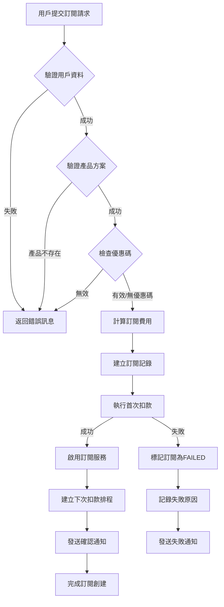
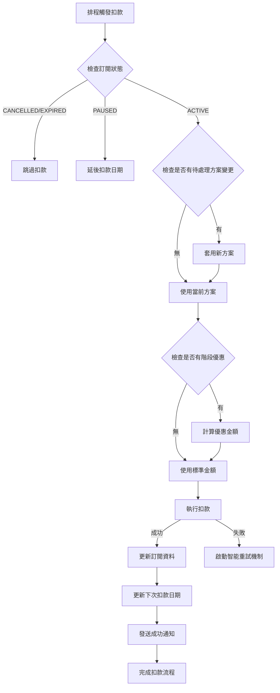
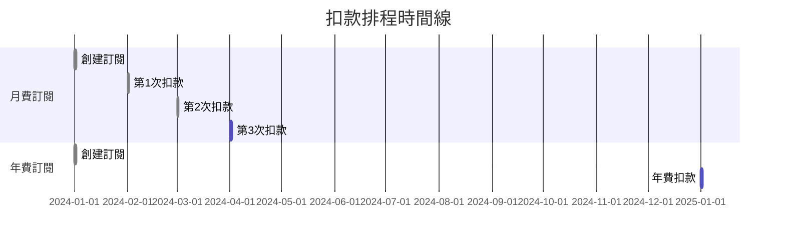
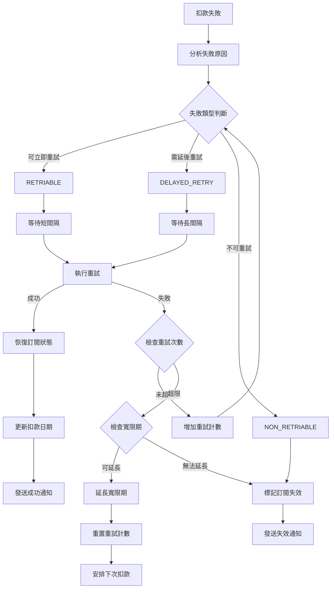
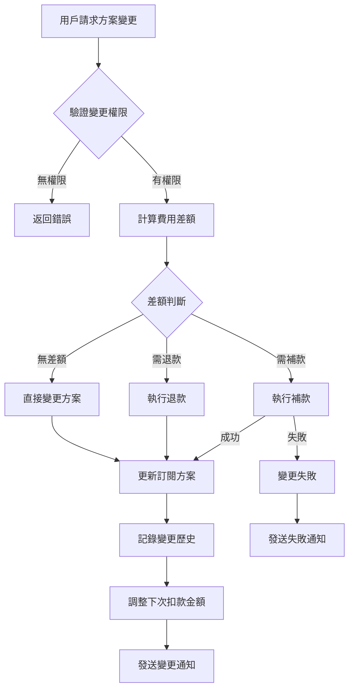
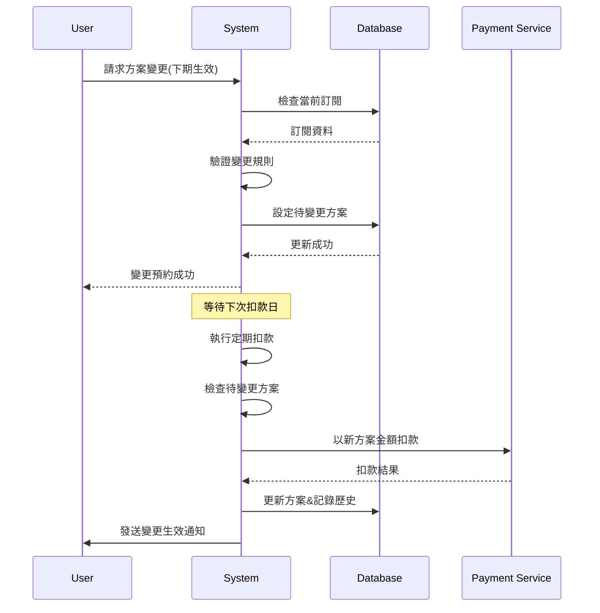
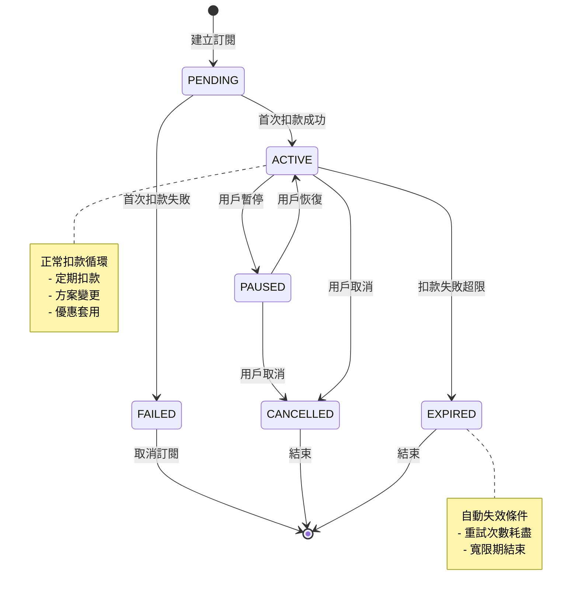
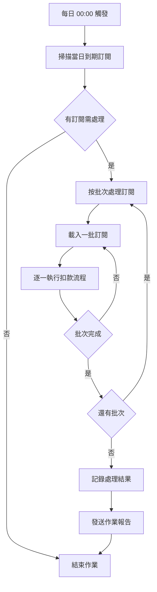
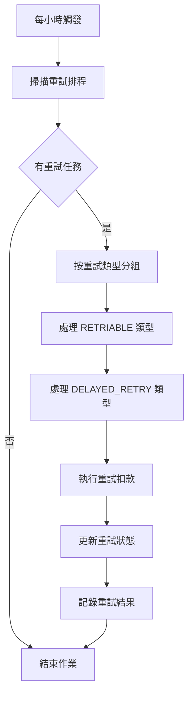

# 業務流程圖 (Activity Flow)

本文件定義自動扣款系統的主要業務流程，包含核心的活動流程圖和關鍵決策點。

## 1. 訂閱創建流程 (Subscription Creation Flow)

### 1.1 流程圖

### 1.2 關鍵決策點

| 決策點 | 條件 | 動作 | 後續流程 |
|---------|------|------|----------|
| 驗證用戶資料 | 用戶身份、支付方式有效 | 繼續流程 | 驗證產品方案 |
| 驗證產品方案 | 產品存在且可訂閱 | 繼續流程 | 檢查優惠碼 |
| 檢查優惠碼 | 優惠碼有效且可使用 | 應用優惠 | 計算費用 |
| 首次扣款 | 支付成功 | 啟用服務 | 建立排程 |

## 2. 自動扣款流程 (Auto Billing Flow)

### 2.1 流程圖

### 2.2 扣款時機控制

## 3. 智能重試流程 (Smart Retry Flow)

### 3.1 流程圖

### 3.2 重試策略決策表

| 失敗原因 | 失敗類型 | 重試間隔 | 最大重試次數 | 寬限期策略 |
|---------|---------|---------|-------------|------------|
| 網路逾時 | RETRIABLE | 5分鐘 | 3次 | 不適用 |
| 系統錯誤 | RETRIABLE | 10分鐘 | 3次 | 不適用 |
| 餘額不足 | DELAYED_RETRY | 1天 | 5次 | 延長7天 |
| 卡片過期 | DELAYED_RETRY | 3天 | 3次 | 延長5天 |
| 卡片停用 | NON_RETRIABLE | 不重試 | 0次 | 不適用 |
| 詐欺風險 | NON_RETRIABLE | 不重試 | 0次 | 不適用 |

## 4. 方案轉換流程 (Plan Change Flow)

### 4.1 立即生效流程

### 4.2 下期生效流程

## 5. 訂閱生命週期流程 (Subscription Lifecycle)

### 5.1 狀態轉換圖

### 5.2 生命週期事件觸發

| 狀態 | 觸發事件 | 系統動作 | 通知類型 |
|------|----------|----------|----------|
| PENDING → ACTIVE | 首次扣款成功 | 啟用服務、設定下次扣款 | 歡迎信件 |
| ACTIVE → PAUSED | 用戶暫停 | 暫停扣款排程 | 暫停確認 |
| ACTIVE → EXPIRED | 扣款失敗超限 | 停用服務、清理排程 | 服務終止通知 |
| PAUSED → ACTIVE | 用戶恢復 | 恢復扣款排程 | 服務恢復通知 |

## 6. 排程作業流程 (Scheduled Jobs Flow)

### 6.1 每日排程作業

### 6.2 重試排程作業

這個 Activity Flow 文件涵蓋了系統的主要業務流程。接下來讓我創建自動扣款排程作業的詳細文件。
