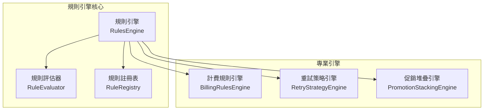

# 業務規則引擎設計 (Business Rules Engine)

> 現況對齊說明（依程式碼為準）：
> - 類別命名：使用 RulesEngine、RuleRegistry、RuleEvaluator（非 *Service 尾綴）。
> - 主要檔案：
>   - src/domain/services/rules-engine/rules-engine.service.ts
>   - src/domain/services/rules-engine/rule-registry.service.ts
>   - src/domain/services/rules-engine/rule-evaluator.service.ts
>   - src/domain/services/rules-engine/business-rules-engine.module.ts
> - 規則類型與介面：src/domain/services/rules-engine/interfaces/rules-engine.interface.ts

## 1. 設計概覽

### 1.1 設計目標

- **可配置性**：業務規則可透過配置檔案或資料庫動態調整
- **可擴展性**：支援新增規則類型，無需修改核心程式碼  
- **可測試性**：規則邏輯獨立，便於單元測試
- **效能優化**：規則快取機制，減少重複計算
- **審計追蹤**：完整記錄規則執行過程和結果

### 1.2 架構圖



## 2. 核心接口定義（對齊實作）

### 2.1 規則引擎核心介面

```typescript
interface IRulesEngine {
  execute<T = any>(type: RuleType, context: IRuleExecutionContext): Promise<IRuleExecutionResult<T>>;
  executeRule<T = any>(ruleId: string, context: IRuleExecutionContext): Promise<IRuleExecutionResult<T>>;
  loadRules(loader: IRuleLoader): Promise<void>;
  registerRule(rule: IRuleDefinition): void;
  getStatistics(): RuleStatistics;
}
```

### 2.2 規則類型枚舉

```typescript
enum RuleType {
  PRICING = 'PRICING',      // 定價規則
  PROMOTION = 'PROMOTION',  // 優惠規則
  RETRY = 'RETRY',         // 重試規則
  REFUND = 'REFUND',       // 退款規則
  BILLING = 'BILLING',     // 計費規則
}
```

### 2.3 規則定義結構

```typescript
interface IRuleDefinition {
  id: string;
  name: string;
  description?: string;
  type: RuleType;
  priority: number;
  conditions: IRuleCondition[];
  actions: IRuleAction[];
  terminal?: boolean;
  enabled: boolean;
  validFrom?: Date;
  validTo?: Date;
  metadata?: Record<string, any>;
  version: number;
  createdAt: Date;
  updatedAt: Date;
}
```

## 3. 規則註冊表（RuleRegistry）

```typescript
@Injectable()
export class RuleRegistry implements IRuleRegistry {
  registerRule(rule: IRuleDefinition): void;
  unregisterRule(ruleId: string): void;
  getRulesByType(type: RuleType): IRuleDefinition[];
  getAllRules(): IRuleDefinition[];
  getRule(ruleId: string): IRuleDefinition | null;
  clearRules(): void;
  getEnabledRulesByType(type: RuleType): IRuleDefinition[];
  getValidRulesAtTime(type: RuleType, timestamp: Date): IRuleDefinition[];
  getStatistics(): RuleStatistics;
  // private validateRule(rule: IRuleDefinition): void;
}
```

## 4. 規則評估器（RuleEvaluator）

### 4.1 支援的條件操作符（與實作一致）

| 操作符 | 描述 | 範例 |
|-------|------|------|
| `EQUALS` | 等於 | `field: 'status', value: 'ACTIVE'` |
| `NOT_EQUALS` | 不等於 | `field: 'tier', value: 'BASIC'` |
| `GREATER_THAN` | 大於 | `field: 'amount', value: 1000` |
| `LESS_THAN` | 小於 | `field: 'retryCount', value: 3` |
| `GREATER_THAN_OR_EQUAL` | 大於等於 | `field: 'amount', value: 500` |
| `LESS_THAN_OR_EQUAL` | 小於等於 | `field: 'retryCount', value: 5` |
| `IN` | 包含在陣列中 | `field: 'category', value: ['A', 'B']` |
| `NOT_IN` | 不包含在陣列中 | `field: 'status', value: ['BANNED']` |
| `CONTAINS` | 包含 | `field: 'tags', value: 'VIP'` |
| `NOT_CONTAINS` | 不包含 | `field: 'tags', value: 'BANNED'` |
| `REGEX` | 正則表達式 | `field: 'email', value: '/@example\\.com$/'` |

### 4.2 支援的動作類型（與實作一致）

- `SET_VALUE` - 設定值
- `CALCULATE_DISCOUNT` - 計算折扣
- `APPLY_FREE_PERIOD` - 應用免費期間
- `MODIFY_RETRY_COUNT` - 修改重試次數
- `SET_RETRY_DELAY` - 設定重試延遲
- `APPROVE_REFUND` - 批准退款
- `REJECT_REFUND` - 拒絕退款

## 5. 專業規則引擎

### 5.1 計費規則引擎 (BillingRulesEngine)

```typescript
@Injectable()
export class BillingRulesEngine {
  /**
   * 評估是否應該進行扣款
   */
  async evaluateBillingDecision(context: BillingDecisionContext): Promise<BillingDecisionResult>;
  
  /**
   * 計算寬限期
   */
  async calculateGracePeriod(context: GracePeriodContext): Promise<GracePeriodResult>;
  
  /**
   * 計算按比例費用
   */
  async calculateProRatedAmount(context: ProRatedBillingContext): Promise<ProRatedBillingResult>;
}
```

### 5.2 重試策略引擎 (RetryStrategyEngine)

```typescript
@Injectable()
export class RetryStrategyEngine {
  /**
   * 評估重試決策
   */
  async evaluateRetryDecision(context: RetryDecisionContext): Promise<RetryDecisionResult>;
  
  /**
   * 計算下次重試時間
   */
  calculateNextRetryTime(attemptNumber: number, strategy: RetryConfiguration): Date;
  
  /**
   * 獲取重試策略
   */
  getRetryStrategy(failureCategory: PaymentFailureCategory): RetryConfiguration;
}
```

### 5.3 促銷堆疊引擎 (PromotionStackingEngine)

```typescript
@Injectable()
export class PromotionStackingEngine {
  /**
   * 驗證促銷代碼堆疊
   */
  async validatePromotionStacking(context: PromotionStackingContext): Promise<PromotionStackingResult>;
  
  /**
   * 自動選擇最佳促銷組合
   */
  async findOptimalPromotionCombination(
    context: PromotionStackingContext, 
    availableCodes: string[]
  ): Promise<OptimalPromotionResult>;
}
```

## 6. 測試與監控

- 已提供單元與整合測試，覆蓋 RuleRegistry、RuleEvaluator、RulesEngine 與各專業引擎的關鍵路徑。
- 執行過程提供 appliedRules、errors、executionTime 與 metadata 以利監控與除錯。

```typescript
interface IRuleExecutionResult<T=any> {
  success: boolean;
  result?: T;
  appliedRules: string[];
  errors?: { ruleId: string; message: string; code?: string; details?: any; }[];
  executionTime: number;
  metadata?: Record<string, any>;
}
```

## 7. 模組匯出（BusinessRulesEngineModule）

- 提供並匯出：RuleRegistry、RulesEngine、RuleEvaluator、BillingRulesEngine、RetryStrategyEngine、PromotionStackingEngine。

> 註：若需新增 RuleType 或動作，請同步擴充 interfaces/rules-engine.interface.ts 與 RuleEvaluator 的對應分支。
