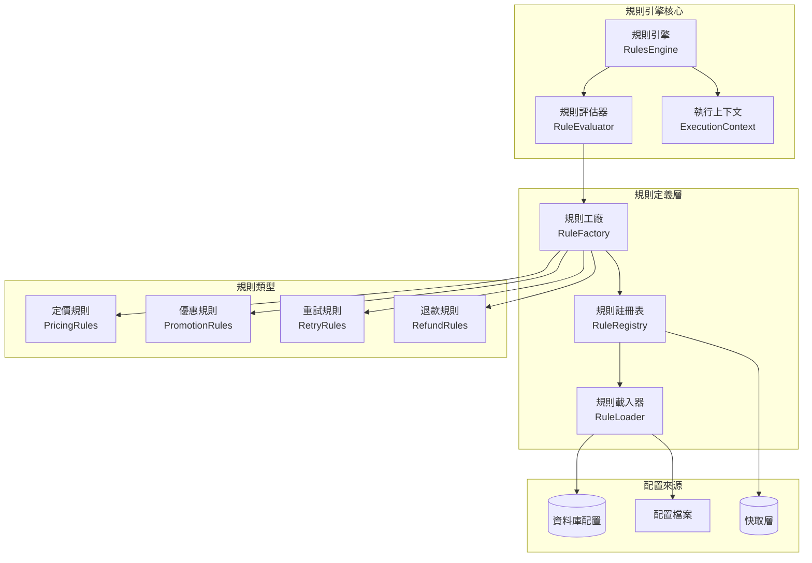

# 業務規則引擎設計 (Business Rules Engine)

本文件定義自動扣款系統的業務規則引擎設計，實現可配置、可擴展的業務邏輯處理機制。

## 1. 設計概覽

### 1.1 設計目標

- **可配置性**：業務規則可透過配置檔案或資料庫動態調整
- **可擴展性**：支援新增規則類型，無需修改核心程式碼  
- **可測試性**：規則邏輯獨立，便於單元測試
- **效能優化**：規則快取機制，減少重複計算
- **審計追蹤**：完整記錄規則執行過程和結果

### 1.2 架構圖



## 11. 與排程作業整合

### 11.1 排程作業規則
商業規則引擎與排程作業系統密切整合，提供動態的扣款規則處理：

#### 整合參考
- **文檔位置**: `docs/architecture/scheduled-billing-jobs.md`
- **整合點**: 每日扣款作業、智能重試排程
- **規則應用**: 定價規則、重試規則、促銷規則

```typescript
// 在排程作業中使用規則引擎
@Injectable()
export class DailyBillingService {
  constructor(
    private readonly rulesEngine: IRulesEngine,
    private readonly dateCalculator: DateCalculator,
  ) {}

  async processBillingBatch(subscriptions: Subscription[]): Promise<void> {
    for (const subscription of subscriptions) {
      // 應用定價規則
      const pricingRules = await this.rulesEngine.evaluateRules(
        'PRICING',
        { subscription, billingDate: new Date() }
      );
      
      // 計算確切扣款金額
      const amount = this.calculateBillingAmount(subscription, pricingRules);
      
      // 執行扣款邏輯
      await this.executeBilling(subscription, amount);
    }
  }
}
```

### 11.2 規則快取最佳化
排程作業期間的大量規則評估需要高效的快取策略：

```typescript
// 針對批次處理的規則快取
export class ScheduledJobRulesCache {
  private readonly cache = new Map<string, RuleResult>();
  
  async getBatchRules(ruleType: string, batchSize: number): Promise<Rule[]> {
    const cacheKey = `batch_rules_${ruleType}_${batchSize}`;
    
    if (this.cache.has(cacheKey)) {
      return this.cache.get(cacheKey);
    }
    
    // 預先載入批次處理所需的規則
    const rules = await this.rulesEngine.loadRulesForBatch(ruleType, batchSize);
    this.cache.set(cacheKey, rules);
    
    return rules;
  }
}
```

## 12. 總結

### 2.1 規則引擎核心

#### 規則引擎介面

```typescript
interface IRulesEngine {
  evaluate<T>(ruleType: RuleType, context: ExecutionContext): Promise<T>;
  evaluateChain<T>(ruleChain: RuleChain, context: ExecutionContext): Promise<T>;
  addRule(rule: BusinessRule): void;
  removeRule(ruleId: string): void;
  clearCache(): void;
}
```

#### 規則引擎實作

```typescript
@Injectable()
export class RulesEngine implements IRulesEngine {
  constructor(
    private readonly ruleRegistry: RuleRegistry,
    private readonly ruleEvaluator: RuleEvaluator,
    private readonly cacheService: CacheService,
    private readonly logger: Logger,
  ) {}

  async evaluate<T>(ruleType: RuleType, context: ExecutionContext): Promise<T> {
    const cacheKey = this.generateCacheKey(ruleType, context);
    
    // 檢查快取
    const cachedResult = await this.cacheService.get<T>(cacheKey);
    if (cachedResult) {
      this.logger.debug(`Rules cache hit for ${ruleType}`, { cacheKey });
      return cachedResult;
    }

    // 取得規則
    const rules = await this.ruleRegistry.getRules(ruleType);
    if (!rules || rules.length === 0) {
      throw new BusinessRuleError(`No rules found for type: ${ruleType}`);
    }

    // 執行規則評估
    const result = await this.ruleEvaluator.evaluate<T>(rules, context);
    
    // 快取結果
    await this.cacheService.set(cacheKey, result, this.getCacheTTL(ruleType));
    
    // 記錄執行日誌
    this.logger.info(`Rules executed successfully`, {
      ruleType,
      rulesCount: rules.length,
      result: this.sanitizeLogData(result),
    });

    return result;
  }

  async evaluateChain<T>(ruleChain: RuleChain, context: ExecutionContext): Promise<T> {
    let currentResult = context.initialValue;
    
    for (const ruleStep of ruleChain.steps) {
      const stepContext = {
        ...context,
        previousResult: currentResult,
      };
      
      currentResult = await this.evaluate(ruleStep.ruleType, stepContext);
      
      // 檢查是否需要中斷鏈條
      if (ruleStep.breakCondition && this.shouldBreakChain(currentResult, ruleStep.breakCondition)) {
        break;
      }
    }
    
    return currentResult as T;
  }
}
```

### 2.2 規則評估器

```typescript
interface IRuleEvaluator {
  evaluate<T>(rules: BusinessRule[], context: ExecutionContext): Promise<T>;
}

@Injectable()
export class RuleEvaluator implements IRuleEvaluator {
  async evaluate<T>(rules: BusinessRule[], context: ExecutionContext): Promise<T> {
    // 按優先級排序規則
    const sortedRules = this.sortRulesByPriority(rules);
    
    for (const rule of sortedRules) {
      try {
        // 檢查規則條件
        if (await this.checkConditions(rule.conditions, context)) {
          // 執行規則動作
          const result = await this.executeActions(rule.actions, context);
          
          // 如果規則設定為終止執行，則返回結果
          if (rule.terminal) {
            return result;
          }
          
          // 更新執行上下文
          context = this.updateContext(context, result);
        }
      } catch (error) {
        this.logger.error(`Rule execution failed`, {
          ruleId: rule.id,
          error: error.message,
        });
        
        if (rule.errorHandling === 'FAIL_FAST') {
          throw error;
        }
        // CONTINUE_ON_ERROR: 繼續執行下一個規則
      }
    }
    
    return context.result as T;
  }

  private async checkConditions(conditions: RuleCondition[], context: ExecutionContext): Promise<boolean> {
    if (!conditions || conditions.length === 0) return true;
    
    for (const condition of conditions) {
      const result = await this.evaluateCondition(condition, context);
      if (!result) {
        return false; // AND 邏輯，任一條件不符合即返回 false
      }
    }
    
    return true;
  }

  private async evaluateCondition(condition: RuleCondition, context: ExecutionContext): Promise<boolean> {
    const { field, operator, value, valueType } = condition;
    const actualValue = this.getFieldValue(field, context);
    
    switch (operator) {
      case 'EQUALS':
        return actualValue === this.convertValue(value, valueType);
      case 'NOT_EQUALS':
        return actualValue !== this.convertValue(value, valueType);
      case 'GREATER_THAN':
        return Number(actualValue) > Number(value);
      case 'LESS_THAN':
        return Number(actualValue) < Number(value);
      case 'GREATER_EQUAL':
        return Number(actualValue) >= Number(value);
      case 'LESS_EQUAL':
        return Number(actualValue) <= Number(value);
      case 'IN':
        return Array.isArray(value) && value.includes(actualValue);
      case 'NOT_IN':
        return Array.isArray(value) && !value.includes(actualValue);
      case 'CONTAINS':
        return String(actualValue).includes(String(value));
      case 'REGEX':
        return new RegExp(String(value)).test(String(actualValue));
      case 'IS_NULL':
        return actualValue === null || actualValue === undefined;
      case 'IS_NOT_NULL':
        return actualValue !== null && actualValue !== undefined;
      default:
        throw new BusinessRuleError(`Unknown operator: ${operator}`);
    }
  }
}
```

## 3. 規則類型定義

### 3.1 基礎規則結構

```typescript
interface BusinessRule {
  id: string;
  name: string;
  description: string;
  ruleType: RuleType;
  priority: number;
  conditions: RuleCondition[];
  actions: RuleAction[];
  terminal: boolean; // 是否終止後續規則執行
  errorHandling: 'FAIL_FAST' | 'CONTINUE_ON_ERROR';
  metadata: Record<string, any>;
  createdAt: Date;
  updatedAt: Date;
  version: number;
  enabled: boolean;
}

interface RuleCondition {
  field: string;
  operator: ConditionOperator;
  value: any;
  valueType: 'STRING' | 'NUMBER' | 'BOOLEAN' | 'DATE' | 'ARRAY';
  description?: string;
}

interface RuleAction {
  actionType: ActionType;
  parameters: Record<string, any>;
  description?: string;
}

enum RuleType {
  PRICING = 'PRICING',
  PROMOTION = 'PROMOTION',
  RETRY = 'RETRY',
  REFUND = 'REFUND',
  NOTIFICATION = 'NOTIFICATION',
  GRACE_PERIOD = 'GRACE_PERIOD',
}
```

### 3.2 定價規則 (Pricing Rules)

```typescript
interface PricingRuleContext extends ExecutionContext {
  subscription: SubscriptionData;
  product: ProductData;
  billingCycle: BillingCycle;
  userTier: string;
}

// 範例：企業用戶折扣規則
const enterpriseDiscountRule: BusinessRule = {
  id: 'pricing_enterprise_discount',
  name: '企業用戶折扣',
  description: '企業用戶享有 15% 折扣',
  ruleType: RuleType.PRICING,
  priority: 100,
  conditions: [
    {
      field: 'userTier',
      operator: 'EQUALS',
      value: 'ENTERPRISE',
      valueType: 'STRING',
    },
    {
      field: 'subscription.planType',
      operator: 'IN',
      value: ['MONTHLY', 'YEARLY'],
      valueType: 'ARRAY',
    },
  ],
  actions: [
    {
      actionType: 'APPLY_DISCOUNT',
      parameters: {
        discountType: 'PERCENTAGE',
        discountValue: 15,
        description: '企業用戶折扣',
      },
    },
  ],
  terminal: false,
  errorHandling: 'CONTINUE_ON_ERROR',
  metadata: {},
  enabled: true,
  // ... 其他欄位
};
```

### 3.3 優惠規則 (Promotion Rules)

```typescript
interface PromotionRuleContext extends ExecutionContext {
  promotionCode?: string;
  userType: 'NEW' | 'EXISTING';
  subscriptionHistory: SubscriptionHistoryData[];
  currentDate: Date;
}

// 範例：新用戶首月免費規則
const newUserFreeTrialRule: BusinessRule = {
  id: 'promo_new_user_free_trial',
  name: '新用戶首月免費',
  description: '新用戶首次訂閱享有首月免費',
  ruleType: RuleType.PROMOTION,
  priority: 200,
  conditions: [
    {
      field: 'userType',
      operator: 'EQUALS',
      value: 'NEW',
      valueType: 'STRING',
    },
    {
      field: 'subscriptionHistory.length',
      operator: 'EQUALS',
      value: 0,
      valueType: 'NUMBER',
    },
  ],
  actions: [
    {
      actionType: 'APPLY_FREE_PERIOD',
      parameters: {
        periodCount: 1,
        periodUnit: 'MONTH',
        description: '新用戶首月免費',
      },
    },
  ],
  terminal: true, // 終止執行，不再檢查其他優惠
  errorHandling: 'FAIL_FAST',
  metadata: {
    category: 'NEW_USER_PROMOTION',
    campaign: 'Q1_2024_GROWTH',
  },
  enabled: true,
  // ... 其他欄位
};
```

### 3.4 重試規則 (Retry Rules)

```typescript
interface RetryRuleContext extends ExecutionContext {
  paymentFailure: PaymentFailureData;
  retryCount: number;
  subscription: SubscriptionData;
  paymentMethod: PaymentMethodData;
}

// 範例：餘額不足重試規則
const insufficientFundsRetryRule: BusinessRule = {
  id: 'retry_insufficient_funds',
  name: '餘額不足重試策略',
  description: '餘額不足時的重試邏輯',
  ruleType: RuleType.RETRY,
  priority: 300,
  conditions: [
    {
      field: 'paymentFailure.errorCode',
      operator: 'EQUALS',
      value: 'INSUFFICIENT_FUNDS',
      valueType: 'STRING',
    },
    {
      field: 'retryCount',
      operator: 'LESS_THAN',
      value: 3,
      valueType: 'NUMBER',
    },
  ],
  actions: [
    {
      actionType: 'SCHEDULE_RETRY',
      parameters: {
        retryCategory: 'DELAYED_RETRY',
        retryInterval: 86400, // 24 小時（秒）
        maxRetries: 3,
        notifyUser: true,
        notificationType: 'INSUFFICIENT_FUNDS',
      },
    },
  ],
  terminal: true,
  errorHandling: 'FAIL_FAST',
  metadata: {
    retryCategory: 'DELAYED_RETRY',
  },
  enabled: true,
  // ... 其他欄位
};
```

## 4. 規則配置管理

### 4.1 資料庫規則配置

```typescript
// 規則配置表結構
interface BusinessRuleConfig {
  id: string;
  ruleType: RuleType;
  name: string;
  description: string;
  priority: number;
  conditions: RuleCondition[];
  actions: RuleAction[];
  terminal: boolean;
  errorHandling: 'FAIL_FAST' | 'CONTINUE_ON_ERROR';
  productIds: string[]; // 適用的產品ID，空陣列表示全部
  userTiers: string[]; // 適用的用戶層級，空陣列表示全部
  effectiveFrom: Date;
  effectiveTo?: Date;
  enabled: boolean;
  version: number;
  createdBy: string;
  createdAt: Date;
  updatedBy: string;
  updatedAt: Date;
  metadata: Record<string, any>;
}
```

### 4.2 規則載入器

```typescript
@Injectable()
export class RuleLoader {
  constructor(
    private readonly ruleConfigRepository: BusinessRuleConfigRepository,
    private readonly cacheService: CacheService,
  ) {}

  async loadRules(ruleType: RuleType, context?: LoadContext): Promise<BusinessRule[]> {
    const cacheKey = `rules:${ruleType}:${this.getContextHash(context)}`;
    
    // 檢查快取
    const cachedRules = await this.cacheService.get<BusinessRule[]>(cacheKey);
    if (cachedRules) {
      return cachedRules;
    }

    // 從資料庫載入
    const ruleConfigs = await this.ruleConfigRepository.findByTypeAndContext(ruleType, context);
    
    // 轉換為規則物件
    const rules = ruleConfigs
      .filter(config => this.isRuleApplicable(config, context))
      .map(config => this.mapConfigToRule(config))
      .sort((a, b) => b.priority - a.priority); // 高優先級在前

    // 快取規則
    await this.cacheService.set(cacheKey, rules, 300); // 5分鐘快取

    return rules;
  }

  private isRuleApplicable(config: BusinessRuleConfig, context?: LoadContext): boolean {
    const now = new Date();
    
    // 檢查生效時間
    if (config.effectiveFrom > now) return false;
    if (config.effectiveTo && config.effectiveTo < now) return false;
    
    // 檢查產品適用性
    if (context?.productId && config.productIds.length > 0) {
      if (!config.productIds.includes(context.productId)) return false;
    }
    
    // 檢查用戶層級適用性
    if (context?.userTier && config.userTiers.length > 0) {
      if (!config.userTiers.includes(context.userTier)) return false;
    }
    
    return config.enabled;
  }
}
```

## 5. 規則執行策略

### 5.1 執行模式

| 執行模式 | 描述 | 使用情境 |
|---------|------|----------|
| **FIRST_MATCH** | 執行第一個符合條件的規則 | 快速決策情境 |
| **ALL_MATCH** | 執行所有符合條件的規則 | 需要累積效果的情境 |
| **PRIORITY_CHAIN** | 按優先級執行，遇到終止規則停止 | 複雜業務邏輯 |
| **WEIGHTED_RANDOM** | 按權重隨機選擇規則 | A/B 測試情境 |

### 5.2 效能優化策略

```typescript
@Injectable()
export class RuleOptimizer {
  // 規則預編譯
  precompileRules(rules: BusinessRule[]): CompiledRule[] {
    return rules.map(rule => ({
      ...rule,
      compiledConditions: this.compileConditions(rule.conditions),
      estimatedCost: this.calculateExecutionCost(rule),
    }));
  }

  // 規則執行計劃
  createExecutionPlan(rules: CompiledRule[], context: ExecutionContext): ExecutionPlan {
    // 根據條件複雜度和歷史執行時間排序
    const sortedRules = this.optimizeRuleOrder(rules, context);
    
    return {
      rules: sortedRules,
      estimatedTime: this.calculateTotalExecutionTime(sortedRules),
      cacheStrategy: this.determineCacheStrategy(sortedRules),
    };
  }
}
```

## 6. 監控和審計

### 6.1 規則執行監控

```typescript
interface RuleExecutionLog {
  executionId: string;
  ruleType: RuleType;
  ruleIds: string[];
  context: ExecutionContext;
  result: any;
  executionTimeMs: number;
  rulesEvaluated: number;
  rulesExecuted: number;
  cacheHit: boolean;
  errors: RuleExecutionError[];
  timestamp: Date;
}

@Injectable()
export class RuleMonitoringService {
  async logExecution(log: RuleExecutionLog): Promise<void> {
    // 記錄到資料庫
    await this.ruleExecutionLogRepository.save(log);
    
    // 發送監控指標
    this.metricsService.increment('rules.execution.total');
    this.metricsService.timing('rules.execution.duration', log.executionTimeMs);
    
    if (log.errors.length > 0) {
      this.metricsService.increment('rules.execution.errors');
    }
    
    if (log.cacheHit) {
      this.metricsService.increment('rules.cache.hits');
    }
  }
}
```

### 6.2 規則效能分析

```typescript
interface RulePerformanceMetrics {
  ruleId: string;
  ruleType: RuleType;
  avgExecutionTime: number;
  totalExecutions: number;
  successRate: number;
  errorRate: number;
  cacheHitRate: number;
  lastExecuted: Date;
  trendData: PerformanceTrend[];
}

@Injectable()
export class RuleAnalyticsService {
  async generatePerformanceReport(timeRange: DateRange): Promise<RulePerformanceReport> {
    const metrics = await this.calculateRuleMetrics(timeRange);
    const recommendations = this.generateOptimizationRecommendations(metrics);
    
    return {
      timeRange,
      metrics,
      recommendations,
      generatedAt: new Date(),
    };
  }
}
```

## 7. 使用範例

### 7.1 定價計算範例

```typescript
@Injectable()
export class PricingService {
  constructor(private readonly rulesEngine: RulesEngine) {}

  async calculatePrice(subscriptionData: SubscriptionData): Promise<PriceCalculationResult> {
    const context: PricingRuleContext = {
      subscription: subscriptionData,
      product: await this.getProductData(subscriptionData.productId),
      billingCycle: subscriptionData.billingCycle,
      userTier: await this.getUserTier(subscriptionData.userId),
      initialValue: subscriptionData.basePrice,
    };

    const finalPrice = await this.rulesEngine.evaluate<number>(
      RuleType.PRICING,
      context
    );

    return {
      basePrice: subscriptionData.basePrice,
      finalPrice,
      appliedRules: context.appliedRules,
      discounts: context.discounts,
    };
  }
}
```

### 7.2 優惠計算範例

```typescript
@Injectable()
export class PromotionService {
  async applyPromotions(
    subscriptionData: SubscriptionData,
    promotionCode?: string
  ): Promise<PromotionResult> {
    const context: PromotionRuleContext = {
      promotionCode,
      userType: await this.determineUserType(subscriptionData.userId),
      subscriptionHistory: await this.getSubscriptionHistory(subscriptionData.userId),
      currentDate: new Date(),
      subscription: subscriptionData,
    };

    return await this.rulesEngine.evaluate<PromotionResult>(
      RuleType.PROMOTION,
      context
    );
  }
}
```

這個業務規則引擎設計提供了靈活、可擴展的規則管理機制，支援動態配置和高效執行，完全滿足自動扣款系統的複雜業務需求。
