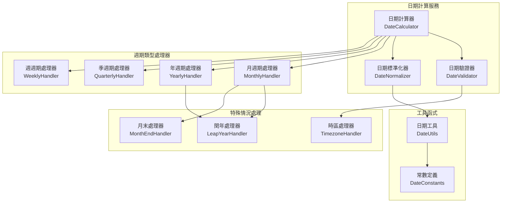

# 日期計算演算法 (Date Calculation Algorithms)

> 現況對齊說明（依程式碼為準）：
> - 現行實作以值物件為核心，使用 BillingCycleVO 與 BillingPeriod 完成「下一次計費日」與「計費期間」計算。
> - 主要檔案：
>   - src/domain/value-objects/billing-cycle.ts（BillingCycleVO、BillingPeriod）
>   - src/domain/enums/codes.const.ts（BillingCycle 列舉）
>
> 註：本文件保留原先分層的演算法概念（如月末處理、閏年處理），但在實作介面上以 BillingCycleVO 既有方法對齊。

## 1. 設計概覽

### 1.1 核心挑戰

- **扣款週期計算**：準確計算下次扣款日期
- **大小月處理**：妥善處理不同月份的天數差異  
- **閏年處理**：正確處理閏年的 2 月 29 日情況
- **時區處理**：支援多時區的日期計算
- **邊界情況**：處理月末日期的特殊情況

### 1.2 演算法架構

> 說明：以下架構圖為概念層設計，實際程式碼以 BillingCycleVO/BillingPeriod 的方法封裝對應能力。



## 2. 核心能力對齊現行實作

- 下一次計費日：BillingCycleVO.calculateNextBillingDate(fromDate?: Date): Date
- 計費期間：BillingCycleVO.calculateBillingPeriod(startDate: Date): { startDate, endDate }
- 按比例計算：BillingCycleVO.calculateProration(fromDate: Date, toDate: Date, fullCycleAmount: number): number
- 週期天數：BillingCycleVO.getTotalCycleDays(): number

使用示例：
- 建立月費（每月 15 日扣款）
  - const cycle = BillingCycleVO.monthly(15)
  - const next = cycle.calculateNextBillingDate(new Date('2025-02-10'))
- 建立年費（每年 1 日扣款）
  - const cycle = BillingCycleVO.yearly(1)
  - const period = cycle.calculateBillingPeriod(new Date('2025-01-01'))

## 3. 月末與閏年處理（概念對齊）

- 月末日（如 31 日）在短月時自動調整至該月最後一天。
  - 例如：1/31 → 2/28（平年）、2/29（閏年）、3/31
- YEARLY 同理：若設定 billingDay 造成目標月無該日期，會自動取該月最後一天。
- 現行實作重點：
  - BillingCycleVO.monthly(billingDay?) 與 yearly(billingDay?) 於計算時使用 Math.min(billingDay, 該月最後一天)。

## 4. 方法與回傳值

- calculateNextBillingDate(fromDate?: Date): Date
  - DAILY: +1 天
  - WEEKLY: +7 天
  - MONTHLY: +1 月（含月末處理）
  - QUARTERLY: +3 月（含月末處理）
  - YEARLY: +1 年（含月末處理）
  - CUSTOM: 以 intervalDays 加總

- calculateBillingPeriod(startDate: Date)
  - endDate = nextBillingDate - 1 天

- calculateProration(fromDate, toDate, fullCycleAmount)
  - 以週期天數的比例換算（現行為平均天數估算：MONTHLY=30、YEARLY=365 等）

## 5. 邊界案例建議測試

- 月末：1/31 起算之連續月度結算（2 月、3 月）
- 閏年：2024/2/29 → 2025 年/2 月
- QUARTERLY：含跨月末的季度跳轉
- CUSTOM：intervalDays < 1 規則驗證（應拋出錯誤）
- billingDay 範圍：<1 或 >31 應拋出錯誤

## 6. 現行使用範例（以值物件為主）

```ts
const cycle = BillingCycleVO.monthly(31);
const now = new Date('2025-01-31T00:00:00Z');
const next = cycle.calculateNextBillingDate(now); // 2025-02-28 或 2025-02-29（閏年）

const { startDate, endDate } = cycle.calculateBillingPeriod(now);
const proration = cycle.calculateProration(startDate, endDate, 1000);
```

## 7. 後續擴充方向

- 時區處理：如需精確到使用者時區，可在應用服務層加入 timeZone 轉換，再將轉換後的 Date 傳入 BillingCycleVO。
- 商務日調整：若需避開週末/假日，可於應用層在 nextDate 基礎上加上下一個商務日的調整。
- 更精細的按比例算法：以真實月份天數或期間實際天數計算，而非平均天數。

## 8. 測試案例

### 8.1 邊界情況測試

```typescript
describe('日期計算邊界情況測試（以 BillingCycleVO 為主）', () => {
  describe('月末訂閱處理', () => {
    const testCases = [
      {
        description: '1/31 訂閱，2月扣款（閏年）',
        subscriptionDate: new Date(2024, 0, 31),
        currentDate: new Date(2024, 1, 15),
        expected: new Date(2024, 1, 29),
      },
      {
        description: '1/31 訂閱，2月扣款（平年）',
        subscriptionDate: new Date(2023, 0, 31),
        currentDate: new Date(2023, 1, 15),
        expected: new Date(2023, 1, 28),
      },
      {
        description: '1/31 訂閱，4月扣款',
        subscriptionDate: new Date(2024, 0, 31),
        currentDate: new Date(2024, 3, 15),
        expected: new Date(2024, 3, 30),
      },
    ];

    testCases.forEach(({ description, subscriptionDate, currentDate, expected }) => {
      it(description, () => {
        const cycle = BillingCycleVO.monthly(subscriptionDate.getDate());
        const result = cycle.calculateNextBillingDate(currentDate);
        expect(result).toEqual(expected);
      });
    });
  });

  describe('閏年處理', () => {
    it('應該正確處理 2/29 訂閱在非閏年的情況（YEARLY）', () => {
      const subscriptionDate = new Date(2024, 1, 29); // 2024/2/29
      const currentDate = new Date(2025, 1, 15);      // 2025/2/15

      const cycle = BillingCycleVO.yearly(subscriptionDate.getDate());
      const result = cycle.calculateNextBillingDate(currentDate);

      expect(result).toEqual(new Date(2025, 1, 28)); // 2025/2/28
    });
  });
});
```
