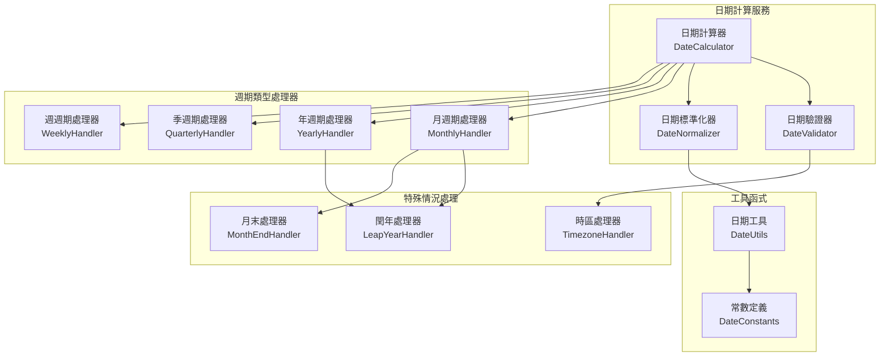

# 日期計算演算法 (Date Calculation Algorithms)

本文件定義自動扣款系統中的日期計算邏輯，包含扣款週期計算、大小月處理、閏年處理等核心演算法。

## 1. 設計概覽

### 1.1 核心挑戰

- **扣款週期計算**：準確計算下次扣款日期
- **大小月處理**：妥善處理不同月份的天數差異  
- **閏年處理**：正確處理閏年的 2 月 29 日情況
- **時區處理**：支援多時區的日期計算
- **邊界情況**：處理月末日期的特殊情況

### 1.2 演算法架構



## 2. 核心介面定義

### 2.1 基礎介面

```typescript
interface IDateCalculator {
  calculateNextBillingDate(currentDate: Date, billingCycle: BillingCycle, subscriptionDate: Date): Date;
  calculateServiceEndDate(billingDate: Date, billingCycle: BillingCycle): Date;
  calculateProrationDays(startDate: Date, endDate: Date, billingCycle: BillingCycle): number;
  isValidBillingDate(date: Date, billingCycle: BillingCycle): boolean;
}

enum BillingCycle {
  WEEKLY = 'WEEKLY',
  MONTHLY = 'MONTHLY',  
  QUARTERLY = 'QUARTERLY',
  YEARLY = 'YEARLY',
  CUSTOM = 'CUSTOM',
}

interface CustomBillingCycle {
  intervalCount: number;
  intervalUnit: 'DAYS' | 'WEEKS' | 'MONTHS' | 'YEARS';
}

interface DateCalculationOptions {
  timezone?: string;
  preserveTime?: boolean;
  adjustForBusinessDays?: boolean;
  monthEndHandling?: MonthEndHandling;
}

enum MonthEndHandling {
  LAST_DAY = 'LAST_DAY',           // 總是月底最後一天
  SAME_DAY = 'SAME_DAY',           // 保持相同日期（如果可能）
  NEXT_VALID = 'NEXT_VALID',       // 下一個有效日期
  PREVIOUS_VALID = 'PREVIOUS_VALID', // 前一個有效日期
}
```

### 2.2 日期計算結果

```typescript
interface DateCalculationResult {
  nextBillingDate: Date;
  serviceEndDate: Date;
  daysUntilNextBilling: number;
  adjustmentReason?: string;
  originalRequestedDate?: Date;
  calculationMetadata: {
    algorithm: string;
    monthEndAdjustment: boolean;
    leapYearAdjustment: boolean;
    timezoneAdjustment: boolean;
  };
}
```

## 3. 日期計算器實作

### 3.1 主要計算器

```typescript
@Injectable()
export class DateCalculator implements IDateCalculator {
  private readonly handlers: Map<BillingCycle, IBillingCycleHandler> = new Map();

  constructor(
    private readonly dateValidator: DateValidator,
    private readonly dateNormalizer: DateNormalizer,
    private readonly leapYearHandler: LeapYearHandler,
    private readonly monthEndHandler: MonthEndHandler,
    private readonly timezoneHandler: TimezoneHandler,
  ) {
    this.initializeHandlers();
  }

  calculateNextBillingDate(
    currentDate: Date,
    billingCycle: BillingCycle,
    subscriptionDate: Date,
    options: DateCalculationOptions = {}
  ): Date {
    // 1. 驗證輸入參數
    this.dateValidator.validateInputs(currentDate, billingCycle, subscriptionDate);

    // 2. 標準化日期（處理時區、時間等）
    const normalizedCurrent = this.dateNormalizer.normalize(currentDate, options);
    const normalizedSubscription = this.dateNormalizer.normalize(subscriptionDate, options);

    // 3. 取得對應的週期處理器
    const handler = this.handlers.get(billingCycle);
    if (!handler) {
      throw new DateCalculationError(`Unsupported billing cycle: ${billingCycle}`);
    }

    // 4. 執行核心計算邏輯
    let nextDate = handler.calculateNext(normalizedCurrent, normalizedSubscription, options);

    // 5. 處理特殊情況
    nextDate = this.handleSpecialCases(nextDate, billingCycle, options);

    // 6. 最終驗證
    this.dateValidator.validateResult(nextDate, billingCycle);

    return nextDate;
  }

  private handleSpecialCases(
    date: Date,
    billingCycle: BillingCycle,
    options: DateCalculationOptions
  ): Date {
    let adjustedDate = date;

    // 處理月末情況
    if (billingCycle === BillingCycle.MONTHLY || billingCycle === BillingCycle.QUARTERLY) {
      adjustedDate = this.monthEndHandler.handle(adjustedDate, options.monthEndHandling);
    }

    // 處理閏年情況
    adjustedDate = this.leapYearHandler.handle(adjustedDate);

    // 處理工作日調整
    if (options.adjustForBusinessDays) {
      adjustedDate = this.adjustForBusinessDays(adjustedDate);
    }

    return adjustedDate;
  }
}
```

## 4. 週期處理器實作

### 4.1 月週期處理器

```typescript
@Injectable()
export class MonthlyBillingHandler implements IBillingCycleHandler {
  calculateNext(
    currentDate: Date, 
    subscriptionDate: Date, 
    options: DateCalculationOptions = {}
  ): Date {
    const subscriptionDay = subscriptionDate.getDate();
    const currentYear = currentDate.getFullYear();
    const currentMonth = currentDate.getMonth();
    
    // 計算下一個月份
    let nextYear = currentYear;
    let nextMonth = currentMonth + 1;
    
    if (nextMonth > 11) {
      nextYear++;
      nextMonth = 0;
    }
    
    // 處理目標月份的天數限制
    const targetDay = this.adjustDayForMonth(subscriptionDay, nextYear, nextMonth, options);
    
    return new Date(nextYear, nextMonth, targetDay);
  }

  private adjustDayForMonth(
    targetDay: number, 
    year: number, 
    month: number,
    options: DateCalculationOptions
  ): number {
    const daysInMonth = this.getDaysInMonth(year, month);
    
    if (targetDay <= daysInMonth) {
      return targetDay;
    }

    // 目標日期超過該月天數，根據處理策略調整
    switch (options.monthEndHandling || MonthEndHandling.LAST_DAY) {
      case MonthEndHandling.LAST_DAY:
        return daysInMonth;
      
      case MonthEndHandling.SAME_DAY:
        // 如果無法保持相同日期，返回該月最後一天
        return Math.min(targetDay, daysInMonth);
      
      case MonthEndHandling.NEXT_VALID:
        // 移到下個月的第一天（在上層處理）
        return 1;
      
      case MonthEndHandling.PREVIOUS_VALID:
        // 返回該月最後一天
        return daysInMonth;
      
      default:
        return daysInMonth;
    }
  }

  private getDaysInMonth(year: number, month: number): number {
    return new Date(year, month + 1, 0).getDate();
  }
}
```

### 4.2 年週期處理器

```typescript
@Injectable()
export class YearlyBillingHandler implements IBillingCycleHandler {
  calculateNext(
    currentDate: Date,
    subscriptionDate: Date,
    options: DateCalculationOptions = {}
  ): Date {
    const subscriptionMonth = subscriptionDate.getMonth();
    const subscriptionDay = subscriptionDate.getDate();
    const currentYear = currentDate.getFullYear();
    
    // 計算下一年
    const nextYear = currentYear + 1;
    
    // 處理閏年的 2/29 情況
    if (subscriptionMonth === 1 && subscriptionDay === 29) {
      return this.handleLeapYearDate(nextYear, options);
    }
    
    return new Date(nextYear, subscriptionMonth, subscriptionDay);
  }

  private handleLeapYearDate(year: number, options: DateCalculationOptions): Date {
    if (this.isLeapYear(year)) {
      // 目標年份是閏年，可以使用 2/29
      return new Date(year, 1, 29);
    } else {
      // 目標年份不是閏年，調整到 2/28
      return new Date(year, 1, 28);
    }
  }

  private isLeapYear(year: number): boolean {
    return (year % 4 === 0 && year % 100 !== 0) || (year % 400 === 0);
  }
}
```

## 5. 特殊情況處理

### 5.1 閏年處理器

```typescript
@Injectable()
export class LeapYearHandler {
  handle(date: Date): Date {
    const year = date.getFullYear();
    const month = date.getMonth();
    const day = date.getDate();
    
    // 只有 2/29 需要特殊處理
    if (month === 1 && day === 29 && !this.isLeapYear(year)) {
      // 當前年份不是閏年，調整為 2/28
      return new Date(year, 1, 28);
    }
    
    return date;
  }

  isLeapYear(year: number): boolean {
    return (year % 4 === 0 && year % 100 !== 0) || (year % 400 === 0);
  }

  getNextLeapYear(year: number): number {
    let nextYear = year + 1;
    while (!this.isLeapYear(nextYear)) {
      nextYear++;
    }
    return nextYear;
  }

  getPreviousLeapYear(year: number): number {
    let prevYear = year - 1;
    while (!this.isLeapYear(prevYear)) {
      prevYear--;
    }
    return prevYear;
  }
}
```

### 5.2 月末處理器

```typescript
@Injectable()
export class MonthEndHandler {
  handle(date: Date, handling: MonthEndHandling = MonthEndHandling.LAST_DAY): Date {
    const year = date.getFullYear();
    const month = date.getMonth();
    const day = date.getDate();
    const daysInMonth = new Date(year, month + 1, 0).getDate();
    
    // 如果不是月末日期，直接返回
    if (day <= daysInMonth) {
      return date;
    }
    
    switch (handling) {
      case MonthEndHandling.LAST_DAY:
        return new Date(year, month, daysInMonth);
      
      case MonthEndHandling.SAME_DAY:
        return new Date(year, month, Math.min(day, daysInMonth));
      
      case MonthEndHandling.NEXT_VALID:
        return new Date(year, month + 1, 1);
      
      case MonthEndHandling.PREVIOUS_VALID:
        return new Date(year, month, daysInMonth);
      
      default:
        return new Date(year, month, daysInMonth);
    }
  }

  isMonthEnd(date: Date): boolean {
    const year = date.getFullYear();
    const month = date.getMonth();
    const day = date.getDate();
    const daysInMonth = new Date(year, month + 1, 0).getDate();
    
    return day === daysInMonth;
  }
}
```

## 6. 實際案例演示

### 6.1 月費扣款案例

```typescript
describe('月費扣款日期計算', () => {
  const dateCalculator = new DateCalculator();

  it('應該正確處理 1/31 訂閱的月費扣款', () => {
    const subscriptionDate = new Date(2024, 0, 31); // 2024/1/31
    const currentDate = new Date(2024, 1, 15);      // 2024/2/15
    
    const nextBillingDate = dateCalculator.calculateNextBillingDate(
      currentDate,
      BillingCycle.MONTHLY,
      subscriptionDate,
      { monthEndHandling: MonthEndHandling.LAST_DAY }
    );
    
    // 期望結果：2024/2/29（閏年的最後一天）
    expect(nextBillingDate).toEqual(new Date(2024, 1, 29));
  });

  it('應該正確處理 1/31 訂閱的非閏年情況', () => {
    const subscriptionDate = new Date(2023, 0, 31); // 2023/1/31
    const currentDate = new Date(2023, 1, 15);      // 2023/2/15
    
    const nextBillingDate = dateCalculator.calculateNextBillingDate(
      currentDate,
      BillingCycle.MONTHLY,
      subscriptionDate,
      { monthEndHandling: MonthEndHandling.LAST_DAY }
    );
    
    // 期望結果：2023/2/28（平年的最後一天）
    expect(nextBillingDate).toEqual(new Date(2023, 1, 28));
  });
});
```

### 6.2 年費扣款案例

```typescript
describe('年費扣款日期計算', () => {
  it('應該正確處理 2/29 訂閱的年費扣款', () => {
    const subscriptionDate = new Date(2024, 1, 29); // 2024/2/29（閏年）
    const currentDate = new Date(2024, 11, 15);     // 2024/12/15
    
    const nextBillingDate = dateCalculator.calculateNextBillingDate(
      currentDate,
      BillingCycle.YEARLY,
      subscriptionDate
    );
    
    // 期望結果：2025/2/28（2025年不是閏年）
    expect(nextBillingDate).toEqual(new Date(2025, 1, 28));
  });
});
```

## 7. 計費期間計算

### 7.1 按比例計費計算

```typescript
@Injectable()
export class ProrationCalculator {
  /**
   * 計算按比例計費天數
   * @param startDate 開始日期
   * @param endDate 結束日期  
   * @param billingCycle 計費週期
   * @returns 按比例天數
   */
  calculateProrationDays(
    startDate: Date,
    endDate: Date,
    billingCycle: BillingCycle
  ): number {
    const diffTime = Math.abs(endDate.getTime() - startDate.getTime());
    const diffDays = Math.ceil(diffTime / (1000 * 60 * 60 * 24));
    
    switch (billingCycle) {
      case BillingCycle.MONTHLY:
        return this.calculateMonthlyProration(startDate, endDate);
      
      case BillingCycle.YEARLY:
        return this.calculateYearlyProration(startDate, endDate);
      
      case BillingCycle.QUARTERLY:
        return this.calculateQuarterlyProration(startDate, endDate);
      
      default:
        return diffDays;
    }
  }

  private calculateMonthlyProration(startDate: Date, endDate: Date): number {
    const startYear = startDate.getFullYear();
    const startMonth = startDate.getMonth();
    const daysInMonth = new Date(startYear, startMonth + 1, 0).getDate();
    
    const startDay = startDate.getDate();
    const endDay = endDate.getDate();
    
    if (startMonth === endDate.getMonth() && startYear === endDate.getFullYear()) {
      // 同一個月內
      return endDay - startDay + 1;
    } else {
      // 跨月計算
      const daysFromStart = daysInMonth - startDay + 1;
      // 這裡可以根據業務需求決定如何處理跨月情況
      return daysFromStart;
    }
  }

  private calculateYearlyProration(startDate: Date, endDate: Date): number {
    const year = startDate.getFullYear();
    const daysInYear = this.isLeapYear(year) ? 366 : 365;
    
    const startDayOfYear = this.getDayOfYear(startDate);
    const endDayOfYear = this.getDayOfYear(endDate);
    
    return endDayOfYear - startDayOfYear + 1;
  }

  private getDayOfYear(date: Date): number {
    const start = new Date(date.getFullYear(), 0, 0);
    const diff = date.getTime() - start.getTime();
    return Math.floor(diff / (1000 * 60 * 60 * 24));
  }

  private isLeapYear(year: number): boolean {
    return (year % 4 === 0 && year % 100 !== 0) || (year % 400 === 0);
  }
}
```

## 8. 時區處理

### 8.1 時區處理器

```typescript
@Injectable()
export class TimezoneHandler {
  /**
   * 將日期轉換到指定時區
   * @param date 原始日期
   * @param timezone 目標時區
   * @returns 轉換後的日期
   */
  convertToTimezone(date: Date, timezone: string): Date {
    return new Date(date.toLocaleString("en-US", { timeZone: timezone }));
  }

  /**
   * 取得時區偏移量（分鐘）
   * @param timezone 時區字串
   * @param date 參考日期
   * @returns 偏移量（分鐘）
   */
  getTimezoneOffset(timezone: string, date: Date = new Date()): number {
    const utc = date.getTime() + (date.getTimezoneOffset() * 60000);
    const targetTime = new Date(utc + this.getOffsetForTimezone(timezone, date));
    return (targetTime.getTime() - date.getTime()) / 60000;
  }

  private getOffsetForTimezone(timezone: string, date: Date): number {
    // 使用 Intl.DateTimeFormat 來計算偏移量
    const formatter = new Intl.DateTimeFormat('en', {
      timeZone: timezone,
      timeZoneName: 'longOffset'
    });
    
    const parts = formatter.formatToParts(date);
    const offsetPart = parts.find(part => part.type === 'timeZoneName');
    
    if (offsetPart) {
      const offset = offsetPart.value;
      const match = offset.match(/GMT([+-]\d{2}):(\d{2})/);
      if (match) {
        const hours = parseInt(match[1]);
        const minutes = parseInt(match[2]);
        return (hours * 60 + (hours >= 0 ? minutes : -minutes)) * 60000;
      }
    }
    
    return 0;
  }
}
```

## 9. 工具函式

### 9.1 日期工具類

```typescript
export class DateUtils {
  static readonly MILLISECONDS_PER_DAY = 24 * 60 * 60 * 1000;
  static readonly MILLISECONDS_PER_HOUR = 60 * 60 * 1000;
  static readonly MILLISECONDS_PER_MINUTE = 60 * 1000;

  /**
   * 計算兩個日期之間的天數差
   */
  static daysBetween(date1: Date, date2: Date): number {
    const diffTime = Math.abs(date2.getTime() - date1.getTime());
    return Math.ceil(diffTime / DateUtils.MILLISECONDS_PER_DAY);
  }

  /**
   * 新增指定天數到日期
   */
  static addDays(date: Date, days: number): Date {
    const result = new Date(date);
    result.setDate(result.getDate() + days);
    return result;
  }

  /**
   * 新增指定月數到日期
   */
  static addMonths(date: Date, months: number): Date {
    const result = new Date(date);
    result.setMonth(result.getMonth() + months);
    return result;
  }

  /**
   * 新增指定年數到日期
   */
  static addYears(date: Date, years: number): Date {
    const result = new Date(date);
    result.setFullYear(result.getFullYear() + years);
    return result;
  }

  /**
   * 檢查日期是否為工作日
   */
  static isBusinessDay(date: Date): boolean {
    const dayOfWeek = date.getDay();
    return dayOfWeek >= 1 && dayOfWeek <= 5; // 週一到週五
  }

  /**
   * 取得下一個工作日
   */
  static getNextBusinessDay(date: Date): Date {
    let nextDay = DateUtils.addDays(date, 1);
    while (!DateUtils.isBusinessDay(nextDay)) {
      nextDay = DateUtils.addDays(nextDay, 1);
    }
    return nextDay;
  }

  /**
   * 取得月份的第一天
   */
  static getFirstDayOfMonth(date: Date): Date {
    return new Date(date.getFullYear(), date.getMonth(), 1);
  }

  /**
   * 取得月份的最後一天
   */
  static getLastDayOfMonth(date: Date): Date {
    return new Date(date.getFullYear(), date.getMonth() + 1, 0);
  }
}
```

## 10. 測試案例

### 10.1 邊界情況測試

```typescript
describe('日期計算邊界情況測試', () => {
  const dateCalculator = new DateCalculator();

  describe('月末訂閱處理', () => {
    const testCases = [
      {
        description: '1/31 訂閱，2月扣款（閏年）',
        subscriptionDate: new Date(2024, 0, 31),
        currentDate: new Date(2024, 1, 15),
        expected: new Date(2024, 1, 29),
      },
      {
        description: '1/31 訂閱，2月扣款（平年）',
        subscriptionDate: new Date(2023, 0, 31),
        currentDate: new Date(2023, 1, 15),
        expected: new Date(2023, 1, 28),
      },
      {
        description: '1/31 訂閱，4月扣款',
        subscriptionDate: new Date(2024, 0, 31),
        currentDate: new Date(2024, 3, 15),
        expected: new Date(2024, 3, 30),
      },
    ];

    testCases.forEach(({ description, subscriptionDate, currentDate, expected }) => {
      it(description, () => {
        const result = dateCalculator.calculateNextBillingDate(
          currentDate,
          BillingCycle.MONTHLY,
          subscriptionDate
        );
        expect(result).toEqual(expected);
      });
    });
  });

  describe('閏年處理', () => {
    it('應該正確處理 2/29 訂閱在非閏年的情況', () => {
      const subscriptionDate = new Date(2024, 1, 29); // 2024/2/29
      const currentDate = new Date(2025, 1, 15);      // 2025/2/15
      
      const result = dateCalculator.calculateNextBillingDate(
        currentDate,
        BillingCycle.YEARLY,
        subscriptionDate
      );
      
      expect(result).toEqual(new Date(2025, 1, 28)); // 2025/2/28
    });
  });
});
```

這個日期計算演算法文件涵蓋了自動扣款系統中所有可能遇到的日期計算情況，特別是處理了需求中提到的大小月、閏年等複雜情況。演算法設計考慮了可擴展性和可測試性，能夠滿足各種業務場景的需求。
