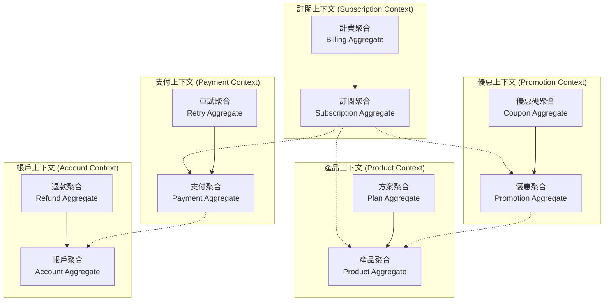

# 領域模型設計 (Domain Model Design)

## 1. 領域概述

根據需求分析，自動扣款系統涉及五個核心業務領域：**訂閱管理**、**產品管理**、**優惠管理**、**支付處理**、**帳戶管理**。每個領域都有其特定的業務規則和資料結構。

## 2. 領域上下文地圖 (Domain Context Map)



## 3. 核心聚合設計

### 3.1 訂閱聚合 (Subscription Aggregate)

**聚合根**: `Subscription`

**職責**: 管理訂閱的完整生命週期，包括狀態轉換、計費週期、方案變更等。

```typescript
// 訂閱聚合根
class Subscription {
  private constructor(
    private readonly id: SubscriptionId,
    private accountId: AccountId,
    private productId: ProductId,
    private planId: PlanId,
    private status: SubscriptionStatus,
    private billingCycle: BillingCycle,
    private currentPeriod: BillingPeriod,
    private retryState: RetryState
  ) {}
  
  // 工廠方法
  static create(params: CreateSubscriptionParams): Subscription
  
  // 領域方法
  activate(): void
  pause(): void
  cancel(reason: CancellationReason): void
  changePlan(newPlanId: PlanId, changeType: PlanChangeType): void
  processPayment(amount: Money): PaymentResult
  handlePaymentFailure(failure: PaymentFailure): void
  extendGracePeriod(): void
  
  // 領域事件
  private addDomainEvent(event: DomainEvent): void
}
```

**值物件**:
- `SubscriptionId`: 訂閱唯一識別碼
- `BillingCycle`: 計費週期 (月/季/年/自定義)
- `BillingPeriod`: 計費期間 (開始/結束時間)
- `SubscriptionStatus`: 訂閱狀態枚舉
- `RetryState`: 重試狀態資訊

**領域服務**:
- `BillingCycleCalculator`: 計費週期計算服務
- `SubscriptionPolicyService`: 訂閱政策服務

### 3.2 產品聚合 (Product Aggregate)

**聚合根**: `Product`

**職責**: 管理產品資訊、計費方案、產品配置等。

```typescript
class Product {
  private constructor(
    private readonly id: ProductId,
    private name: ProductName,
    private description: ProductDescription,
    private plans: Map<PlanId, BillingPlan>,
    private configuration: ProductConfiguration
  ) {}
  
  static create(params: CreateProductParams): Product
  
  addPlan(plan: BillingPlan): void
  updatePlan(planId: PlanId, updates: PlanUpdates): void
  removePlan(planId: PlanId): void
  isValidPlanConversion(fromPlan: PlanId, toPlan: PlanId): boolean
  
  getRetryConfiguration(): RetryConfiguration
  getGracePeriodConfiguration(): GracePeriodConfiguration
}

class BillingPlan {
  constructor(
    private readonly id: PlanId,
    private name: PlanName,
    private price: Money,
    private cycle: BillingCycle,
    private features: PlanFeatures
  ) {}
  
  calculateNextBillingDate(currentDate: Date): Date
  isActive(): boolean
}
```

**值物件**:
- `ProductId`, `PlanId`: 識別碼
- `Money`: 金額值物件 (包含幣別和數值)
- `ProductConfiguration`: 產品配置 (重試次數、寬限期等)

### 3.3 優惠聚合 (Promotion Aggregate)

**聚合根**: `Promotion`

**職責**: 管理各類優惠活動、優惠碼、檔期優惠等。

```typescript
class Promotion {
  private constructor(
    private readonly id: PromotionId,
    private name: PromotionName,
    private type: PromotionType,
    private rules: PromotionRules,
    private period: PromotionPeriod,
    private usage: PromotionUsage
  ) {}
  
  static create(params: CreatePromotionParams): Promotion
  
  isApplicable(context: PromotionContext): boolean
  calculateDiscount(originalAmount: Money): DiscountResult
  markAsUsed(subscriptionId: SubscriptionId): void
  
  // 不同優惠類型的工廠方法
  static createStageDiscount(params: StageDiscountParams): Promotion
  static createCouponCode(params: CouponCodeParams): Promotion
  static createSeasonalPromotion(params: SeasonalPromotionParams): Promotion
}

class PromotionRules {
  constructor(
    private discountType: DiscountType, // 百分比 | 固定金額
    private discountValue: number,
    private applicablePlans: PlanId[],
    private priority: number
  ) {}
  
  apply(amount: Money, context: PromotionContext): Money
}
```

**領域服務**:
- `PromotionEngine`: 優惠計算引擎
- `PromotionPriorityResolver`: 優惠優先級解析服務

### 3.4 支付聚合 (Payment Aggregate)

**聚合根**: `Payment`

**職責**: 處理支付交易、失敗重試、狀態管理等。

```typescript
class Payment {
  private constructor(
    private readonly id: PaymentId,
    private subscriptionId: SubscriptionId,
    private amount: Money,
    private status: PaymentStatus,
    private attempts: PaymentAttempt[],
    private retryPolicy: RetryPolicy
  ) {}
  
  static create(params: CreatePaymentParams): Payment
  
  process(): PaymentResult
  retry(): PaymentResult
  fail(reason: PaymentFailureReason): void
  succeed(): void
  
  canRetry(): boolean
  getNextRetryTime(): Date
  categorizeFailure(failure: PaymentFailure): FailureCategory
}

class PaymentAttempt {
  constructor(
    private readonly attemptNumber: number,
    private timestamp: Date,
    private result: PaymentResult,
    private failureReason?: PaymentFailureReason
  ) {}
}
```

**值物件**:
- `PaymentId`: 支付識別碼
- `PaymentStatus`: 支付狀態 (待處理/成功/失敗/重試中)
- `RetryPolicy`: 重試策略配置

**領域服務**:
- `PaymentFailureClassifier`: 支付失敗分類服務
- `RetryScheduler`: 重試排程服務

### 3.5 帳戶聚合 (Account Aggregate)

**聚合根**: `Account`

**職責**: 管理用戶帳戶資訊、支付方式、退款等。

```typescript
class Account {
  private constructor(
    private readonly id: AccountId,
    private profile: AccountProfile,
    private paymentMethods: PaymentMethod[],
    private subscriptions: SubscriptionId[],
    private status: AccountStatus
  ) {}
  
  static create(params: CreateAccountParams): Account
  
  addPaymentMethod(paymentMethod: PaymentMethod): void
  removePaymentMethod(paymentMethodId: PaymentMethodId): void
  setDefaultPaymentMethod(paymentMethodId: PaymentMethodId): void
  
  requestRefund(subscriptionId: SubscriptionId, reason: RefundReason): Refund
  canSubscribe(productId: ProductId): boolean
}

class Refund {
  constructor(
    private readonly id: RefundId,
    private accountId: AccountId,
    private originalPaymentId: PaymentId,
    private amount: Money,
    private reason: RefundReason,
    private status: RefundStatus
  ) {}
  
  process(): RefundResult
  approve(): void
  reject(reason: string): void
}
```

## 4. 領域事件設計

### 4.1 訂閱相關事件
```typescript
// 訂閱創建事件
class SubscriptionCreated extends DomainEvent {
  constructor(
    public readonly subscriptionId: SubscriptionId,
    public readonly accountId: AccountId,
    public readonly productId: ProductId,
    public readonly planId: PlanId
  ) { super(); }
}

// 訂閱狀態變更事件
class SubscriptionStatusChanged extends DomainEvent {
  constructor(
    public readonly subscriptionId: SubscriptionId,
    public readonly fromStatus: SubscriptionStatus,
    public readonly toStatus: SubscriptionStatus,
    public readonly reason?: string
  ) { super(); }
}

// 計費週期開始事件
class BillingCycleStarted extends DomainEvent {
  constructor(
    public readonly subscriptionId: SubscriptionId,
    public readonly billingPeriod: BillingPeriod,
    public readonly amount: Money
  ) { super(); }
}
```

### 4.2 支付相關事件
```typescript
// 支付成功事件
class PaymentSucceeded extends DomainEvent {
  constructor(
    public readonly paymentId: PaymentId,
    public readonly subscriptionId: SubscriptionId,
    public readonly amount: Money
  ) { super(); }
}

// 支付失敗事件
class PaymentFailed extends DomainEvent {
  constructor(
    public readonly paymentId: PaymentId,
    public readonly subscriptionId: SubscriptionId,
    public readonly reason: PaymentFailureReason,
    public readonly category: FailureCategory
  ) { super(); }
}
```

## 5. 領域服務設計

### 5.1 計費週期計算服務
```typescript
interface BillingCycleCalculator {
  calculateNextBillingDate(
    currentDate: Date,
    cycle: BillingCycle
  ): Date;
  
  handleSpecialDates(
    targetDate: Date,
    originalDay: number
  ): Date;
}

class StandardBillingCycleCalculator implements BillingCycleCalculator {
  calculateNextBillingDate(currentDate: Date, cycle: BillingCycle): Date {
    // 處理大小月、閏年邏輯
    // 1/31 → 2/28(29) → 3/31
  }
}
```

### 5.2 優惠計算引擎
```typescript
interface PromotionEngine {
  calculateBestPromotion(
    originalAmount: Money,
    availablePromotions: Promotion[],
    context: PromotionContext
  ): PromotionResult;
}

class RuleBasedPromotionEngine implements PromotionEngine {
  calculateBestPromotion(
    originalAmount: Money,
    availablePromotions: Promotion[],
    context: PromotionContext
  ): PromotionResult {
    // 1. 篩選適用的優惠
    // 2. 依優先級排序
    // 3. 計算最佳優惠組合
  }
}
```

## 6. 儲存庫介面設計

```typescript
interface SubscriptionRepository {
  save(subscription: Subscription): Promise<void>;
  findById(id: SubscriptionId): Promise<Subscription | null>;
  findByAccountId(accountId: AccountId): Promise<Subscription[]>;
  findDueForBilling(date: Date): Promise<Subscription[]>;
}

interface ProductRepository {
  save(product: Product): Promise<void>;
  findById(id: ProductId): Promise<Product | null>;
  findAll(): Promise<Product[]>;
}

interface PromotionRepository {
  save(promotion: Promotion): Promise<void>;
  findById(id: PromotionId): Promise<Promotion | null>;
  findActivePromotions(date: Date): Promise<Promotion[]>;
  findByCode(code: string): Promise<Promotion | null>;
}
```

## 7. 業務規則與約束

### 7.1 訂閱業務規則
1. **狀態轉換規則**: 訂閱只能按特定順序轉換狀態
2. **計費週期規則**: 大小月和閏年的日期計算規則
3. **方案轉換規則**: 只能轉換至產品允許的方案

### 7.2 優惠業務規則
1. **優惠互斥規則**: 同時段只能套用一個優惠
2. **優惠優先級規則**: 依設定的優先級選擇最佳優惠
3. **使用限制規則**: 優惠碼只能使用一次

### 7.3 支付業務規則
1. **重試分類規則**: 依失敗原因決定重試策略
2. **寬限期規則**: 重試失敗時的寬限期延長邏輯
3. **金額一致性規則**: 支付金額必須與計費金額一致

## 8. 領域模型驗證

### 8.1 一致性檢查
- 聚合內部狀態一致性
- 跨聚合引用完整性
- 業務規則完整性

### 8.2 完整性檢查
- 所有業務用例都有對應的領域方法
- 所有業務規則都在領域模型中體現
- 所有狀態轉換都有明確的觸發條件

這個領域模型設計為系統提供了清晰的業務概念和結構，為後續的實現提供了堅實的基礎。
