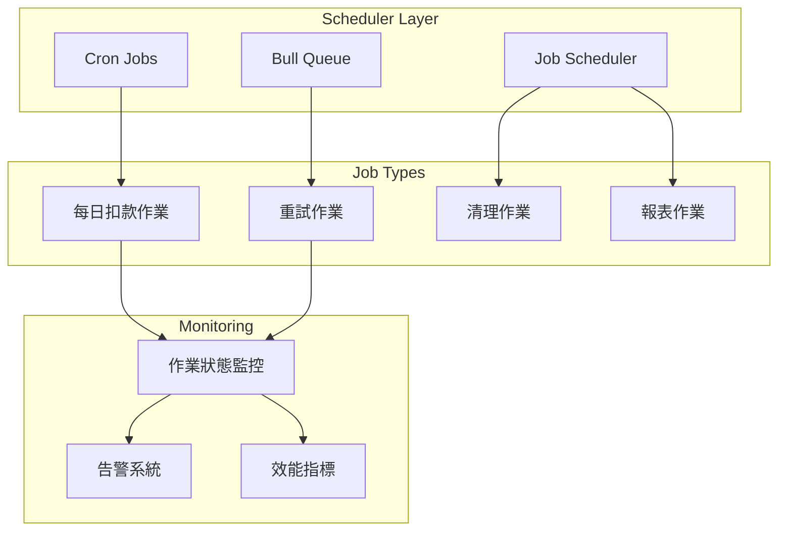
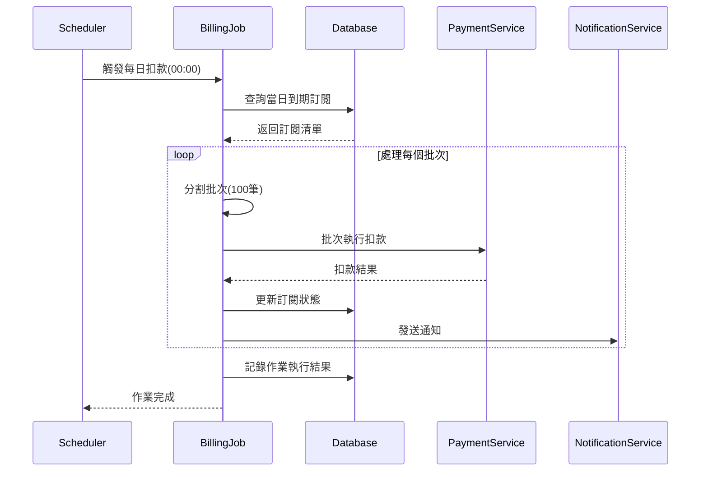
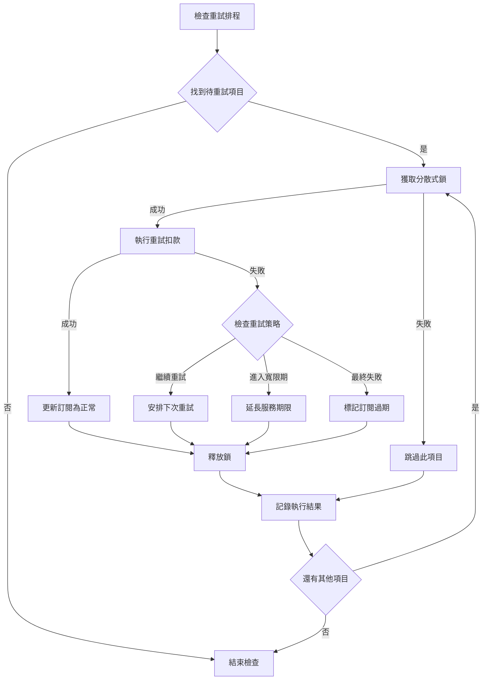
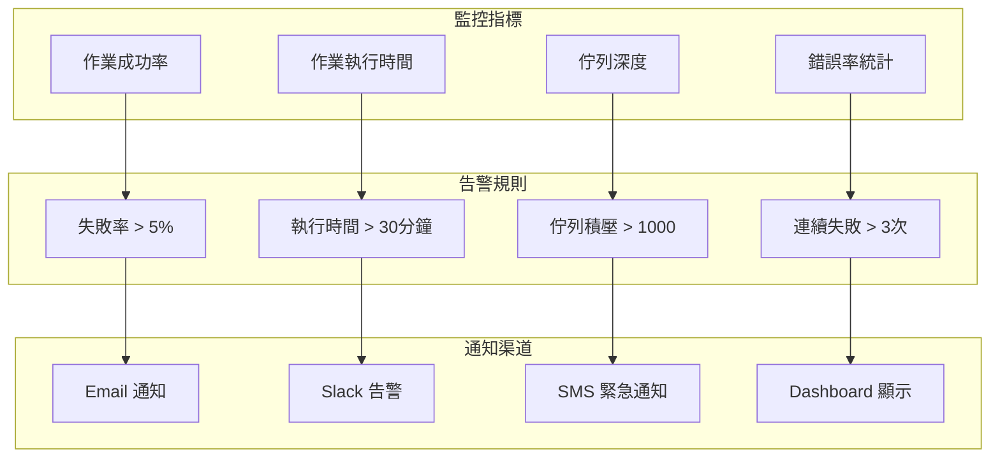
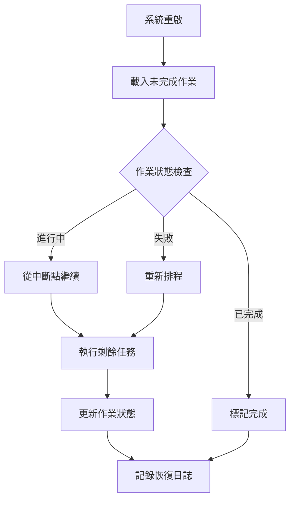

# 自動扣款排程作業 (Scheduled Billing Jobs)

本文件詳細說明自動扣款系統的排程作業設計，包含任務調度、執行策略、監控機制等。

## 1. 排程架構概覽

### 1.1 整體架構



### 1.2 技術堆疊

| 組件 | 技術選擇 | 用途 |
|------|----------|------|
| 排程引擎 | Bull Queue + Redis | 分散式作業佇列 |
| Cron 管理 | @nestjs/schedule | 定時任務觸發 |
| 資料庫鎖 | MongoDB FindAndModify | 避免重複處理 |
| 監控告警 | Bull Dashboard | 作業監控介面 |
| 日誌記錄 | Winston | 結構化日誌 |

## 2. 每日扣款作業 (Daily Billing Job)

### 2.1 作業排程

```typescript
// daily-billing.job.ts
@Injectable()
export class DailyBillingJob {
  constructor(
    private readonly billingService: BillingService,
    private readonly jobQueue: Queue,
  ) {}

  @Cron('0 0 * * *', { // 每日 00:00 執行
    name: 'daily-billing',
    timeZone: 'Asia/Taipei',
  })
  async handleDailyBilling() {
    const today = new Date();
    const batchSize = 100;
    let offset = 0;
    
    // 查詢當日需要扣款的訂閱
    const subscriptions = await this.findDueSubscriptions(today, batchSize, offset);
    
    for (const batch of this.chunkArray(subscriptions, batchSize)) {
      await this.jobQueue.add('process-billing-batch', {
        subscriptions: batch,
        billingDate: today,
        batchId: uuidv4(),
      }, {
        attempts: 3,
        backoff: {
          type: 'exponential',
          delay: 2000,
        },
      });
    }
  }

  private async findDueSubscriptions(targetDate: Date, batchSize: number, offset: number): Promise<Subscription[]> {
    // 使用日期計算演算法確保正確的扣款日期比較
    // 詳細演算法請參考：docs/architecture/date-calculation-algorithms.md
    
    const startOfDay = new Date(targetDate);
    startOfDay.setHours(0, 0, 0, 0);
    
    const endOfDay = new Date(targetDate);
    endOfDay.setHours(23, 59, 59, 999);
    
    return await this.subscriptionRepository.findDueForBilling(startOfDay, endOfDay, batchSize, offset);
  }
}
```

### 2.2 批次處理邏輯



### 2.3 分散式鎖機制

```typescript
// billing-lock.service.ts
@Injectable()
export class BillingLockService {
  constructor(private readonly redisService: RedisService) {}

  async acquireLock(subscriptionId: string, ttl: number = 300): Promise<boolean> {
    const lockKey = `billing:lock:${subscriptionId}`;
    const lockValue = uuidv4();
    
    const result = await this.redisService.set(
      lockKey,
      lockValue,
      'PX', // milliseconds
      ttl * 1000,
      'NX' // only if not exists
    );
    
    return result === 'OK';
  }

  async releaseLock(subscriptionId: string): Promise<void> {
    const lockKey = `billing:lock:${subscriptionId}`;
    await this.redisService.del(lockKey);
  }
}
```

## 3. 智能重試排程 (Retry Scheduling)

### 3.1 重試策略配置

```typescript
// retry-config.ts
export const RETRY_STRATEGIES = {
  RETRIABLE: {
    intervals: [5, 10, 30], // 5分鐘, 10分鐘, 30分鐘
    maxAttempts: 3,
    backoffMultiplier: 1,
  },
  DELAYED_RETRY: {
    intervals: [1440, 2880, 4320], // 1天, 2天, 3天 (分鐘)
    maxAttempts: 3,
    backoffMultiplier: 1.5,
  },
  GRACE_PERIOD: {
    intervals: [10080], // 7天 (分鐘)
    maxAttempts: 1,
    extendGracePeriod: true,
  }
} as const;
```

### 3.2 重試排程作業

```typescript
// retry-billing.job.ts
@Injectable()
export class RetryBillingJob {
  @Cron('*/15 * * * *') // 每15分鐘檢查一次
  async handleRetryableFailures() {
    await this.processRetryType('RETRIABLE');
  }

  @Cron('0 */6 * * *') // 每6小時檢查一次
  async handleDelayedRetries() {
    await this.processRetryType('DELAYED_RETRY');
  }

  @Cron('0 9 * * *') // 每日上午9點檢查
  async handleGracePeriodRetries() {
    await this.processRetryType('GRACE_PERIOD');
  }

  private async processRetryType(retryType: string) {
    const dueRetries = await this.findDueRetries(retryType);
    
    for (const retry of dueRetries) {
      await this.jobQueue.add('process-retry', {
        subscriptionId: retry.subscriptionId,
        retryType: retry.failureCategory,
        attemptNumber: retry.retryCount + 1,
      });
    }
  }
}
```

### 3.3 重試執行流程



## 4. 作業監控與告警

### 4.1 作業狀態追蹤

```typescript
// job-monitoring.service.ts
@Injectable()
export class JobMonitoringService {
  constructor(
    private readonly metricsService: MetricsService,
    private readonly alertService: AlertService,
  ) {}

  async trackJobExecution(jobName: string, status: 'SUCCESS' | 'FAILED', duration: number) {
    // 記錄效能指標
    this.metricsService.increment(`job.${jobName}.${status.toLowerCase()}`);
    this.metricsService.timing(`job.${jobName}.duration`, duration);
    
    // 檢查告警條件
    if (status === 'FAILED') {
      await this.checkFailureAlert(jobName);
    }
    
    if (duration > this.getJobTimeoutThreshold(jobName)) {
      await this.alertService.sendAlert({
        type: 'JOB_TIMEOUT',
        message: `Job ${jobName} execution time exceeded threshold`,
        severity: 'WARNING',
      });
    }
  }

  private async checkFailureAlert(jobName: string) {
    const recentFailures = await this.getRecentFailureCount(jobName, 60); // 1小時內
    
    if (recentFailures >= 3) {
      await this.alertService.sendAlert({
        type: 'JOB_FAILURE',
        message: `Job ${jobName} failed ${recentFailures} times in the last hour`,
        severity: 'CRITICAL',
      });
    }
  }
}
```

### 4.2 監控儀表板



## 5. 日期計算邏輯

### 5.1 扣款日期計算邏輯
本模組使用專門的日期計算演算法處理複雜的計費週期計算：

#### 月份計費處理
- 月底日期處理（如 1/31 → 2/28）
- 閏年處理
- 跨年度計算

#### 演算法參考
完整的日期計算邏輯實現請參考：
- **文檔位置**: `docs/architecture/date-calculation-algorithms.md`
- **實現細節**: 月週期、季週期、年週期的計算邏輯
- **邊際案例**: 閏年、月底、時區處理

```typescript
// 示例：使用日期計算服務
const nextBillingDate = this.dateCalculator.calculateNextBillingDate(
  subscription.currentPeriodEnd,
  subscription.billingCycle,
  subscription.timezone
);
```

## 6. 效能優化策略

### 6.1 多實例部署

| 最佳化項目 | 策略 | 預期效果 |
|-----------|------|----------|
| 批次大小 | 動態調整 100-500 筆 | 平衡記憶體使用與處理效率 |
| 資料庫查詢 | 使用複合索引 | 減少查詢時間 50% |
| 並發控制 | Worker 數量限制 | 避免資源爭用 |
| 快取策略 | Redis 暫存常用資料 | 減少 DB 查詢 30% |

### 6.2 資源使用監控

```typescript
// performance-monitor.ts
export interface JobPerformanceMetrics {
  executionTime: number;
  memoryUsage: number;
  cpuUsage: number;
  databaseQueries: number;
  cacheHitRate: number;
}

@Injectable()
export class PerformanceMonitor {
  async recordJobMetrics(jobName: string, metrics: JobPerformanceMetrics) {
    await this.metricsService.recordGauge(`job.${jobName}.execution_time`, metrics.executionTime);
    await this.metricsService.recordGauge(`job.${jobName}.memory_usage`, metrics.memoryUsage);
    await this.metricsService.recordGauge(`job.${jobName}.cpu_usage`, metrics.cpuUsage);
    await this.metricsService.recordCounter(`job.${jobName}.db_queries`, metrics.databaseQueries);
    await this.metricsService.recordGauge(`job.${jobName}.cache_hit_rate`, metrics.cacheHitRate);
  }
}
```

## 7. 災難恢復機制

### 6.1 作業恢復策略



### 6.2 資料一致性保證

| 一致性機制 | 實作方式 | 使用時機 |
|-----------|----------|----------|
| 分散式鎖 | Redis SETNX | 防止重複處理 |
| 事務控制 | MongoDB Transaction | 狀態更新 |
| 冪等性設計 | UUID + 狀態檢查 | 重複執行保護 |
| 補償機制 | Saga Pattern | 失敗回滾 |

## 8. 配置管理

### 7.1 環境配置

```yaml
# config/billing-jobs.yml
billing:
  jobs:
    daily-billing:
      enabled: true
      schedule: "0 0 * * *"
      batch-size: 100
      timeout: 1800 # 30分鐘
      
    retry-jobs:
      enabled: true
      retriable-check: "*/15 * * * *" # 每15分鐘
      delayed-check: "0 */6 * * *"   # 每6小時
      grace-check: "0 9 * * *"       # 每日上午9點
      
  monitoring:
    failure-threshold: 3
    timeout-alert: 1800
    queue-depth-alert: 1000
    
  performance:
    max-workers: 5
    memory-limit: "512MB"
    cpu-limit: "2000m"
```

### 7.2 動態配置更新

```typescript
// config-updater.service.ts
@Injectable()
export class ConfigUpdaterService {
  async updateJobConfig(jobName: string, config: Partial<JobConfig>) {
    // 驗證配置
    await this.validateConfig(config);
    
    // 更新 Redis 配置
    await this.redisService.hset('job:config', jobName, JSON.stringify(config));
    
    // 通知所有 Worker 更新配置
    await this.eventBus.publish(new ConfigUpdatedEvent(jobName, config));
  }
}
```

這個文件涵蓋了自動扣款排程作業的完整設計。接下來讓我創建使用者情境文件。
