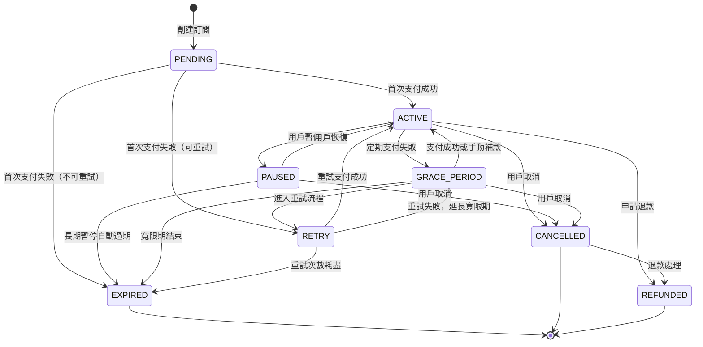
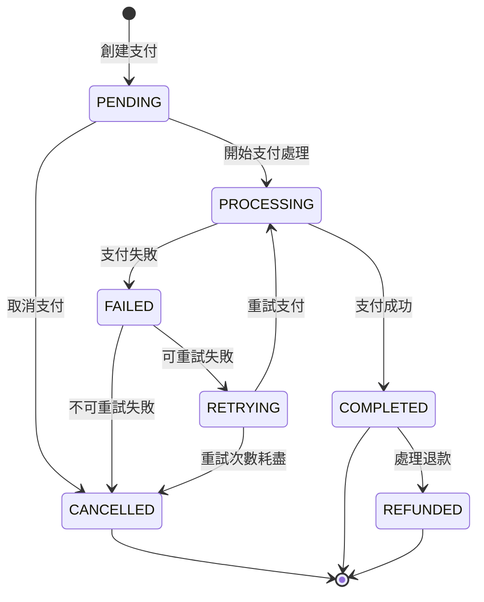
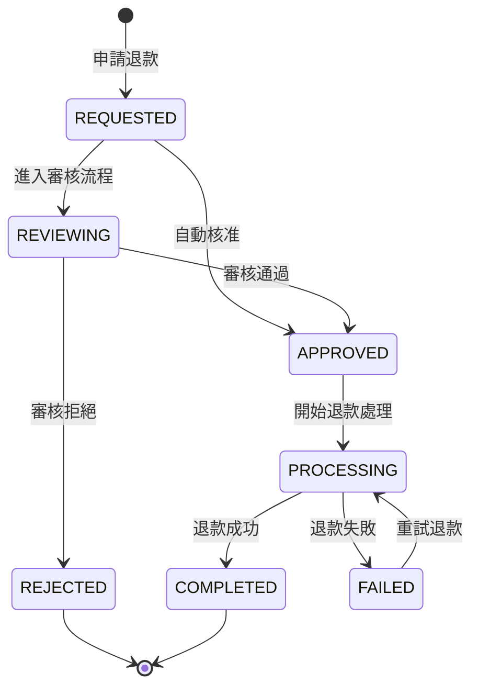
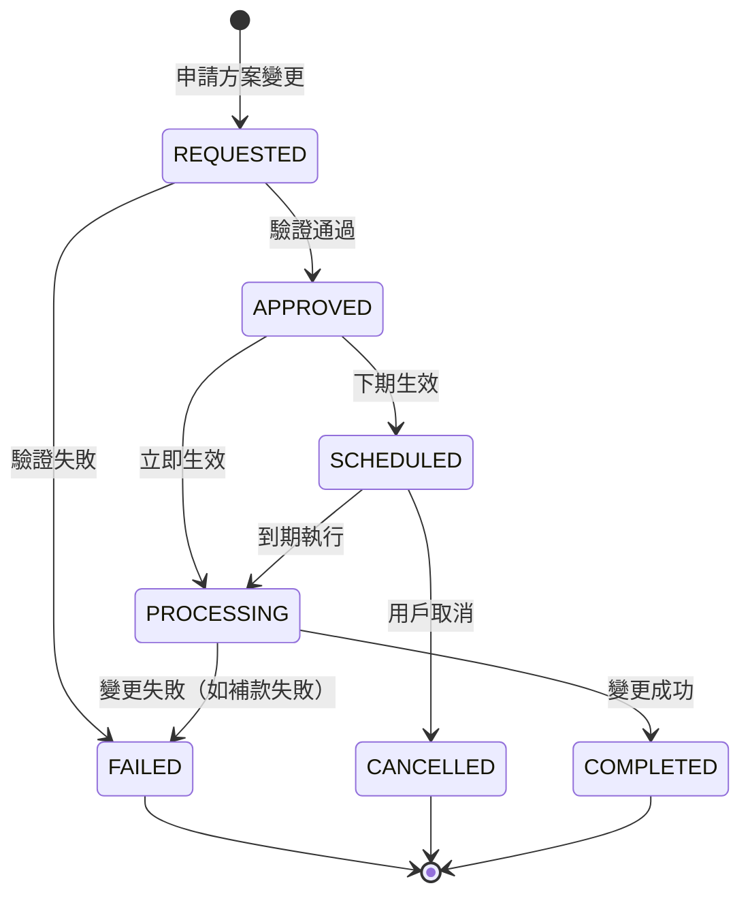

# 狀態機設計 (State Machine Design)

## 1. 概述

自動扣款系統中涉及多個核心實體的狀態管理，每個實體都有其特定的狀態轉換規則。本文檔定義了**訂閱**、**支付**、**退款**等核心實體的狀態機設計。

## 2. 訂閱狀態機 (Subscription State Machine)

### 2.1 狀態定義

```typescript
enum SubscriptionStatus {
  // 初始狀態
  PENDING = 'PENDING',           // 待啟用（首次支付處理中）
  
  // 正常狀態
  ACTIVE = 'ACTIVE',             // 活躍中
  PAUSED = 'PAUSED',             // 暫停（用戶主動暫停）
  
  // 問題狀態
  GRACE_PERIOD = 'GRACE_PERIOD', // 寬限期（支付失敗，但仍提供服務）
  RETRY = 'RETRY',               // 重試中（支付失敗，正在重試）
  
  // 終止狀態
  EXPIRED = 'EXPIRED',           // 已過期（重試失敗，服務終止）
  CANCELLED = 'CANCELLED',       // 已取消（用戶主動取消）
  REFUNDED = 'REFUNDED',         // 已退款
}
```

### 2.2 狀態轉換圖



### 2.3 狀態轉換規則

```typescript
class SubscriptionStateMachine {
  private static readonly VALID_TRANSITIONS = new Map([
    [SubscriptionStatus.PENDING, [
      SubscriptionStatus.ACTIVE,
      SubscriptionStatus.EXPIRED,
      SubscriptionStatus.RETRY
    ]],
    [SubscriptionStatus.ACTIVE, [
      SubscriptionStatus.PAUSED,
      SubscriptionStatus.GRACE_PERIOD,
      SubscriptionStatus.CANCELLED,
      SubscriptionStatus.REFUNDED
    ]],
    [SubscriptionStatus.PAUSED, [
      SubscriptionStatus.ACTIVE,
      SubscriptionStatus.CANCELLED,
      SubscriptionStatus.EXPIRED
    ]],
    [SubscriptionStatus.GRACE_PERIOD, [
      SubscriptionStatus.ACTIVE,
      SubscriptionStatus.RETRY,
      SubscriptionStatus.EXPIRED,
      SubscriptionStatus.CANCELLED
    ]],
    [SubscriptionStatus.RETRY, [
      SubscriptionStatus.ACTIVE,
      SubscriptionStatus.GRACE_PERIOD,
      SubscriptionStatus.EXPIRED
    ]],
    [SubscriptionStatus.CANCELLED, [
      SubscriptionStatus.REFUNDED
    ]],
    // 終止狀態無法轉換
    [SubscriptionStatus.EXPIRED, []],
    [SubscriptionStatus.REFUNDED, []],
  ]);
  
  static canTransition(
    fromStatus: SubscriptionStatus,
    toStatus: SubscriptionStatus
  ): boolean {
    const validTransitions = this.VALID_TRANSITIONS.get(fromStatus);
    return validTransitions?.includes(toStatus) ?? false;
  }
  
  static validateTransition(
    fromStatus: SubscriptionStatus,
    toStatus: SubscriptionStatus,
    context: TransitionContext
  ): TransitionResult {
    if (!this.canTransition(fromStatus, toStatus)) {
      return TransitionResult.invalid(
        `Invalid transition from ${fromStatus} to ${toStatus}`
      );
    }
    
    // 具體轉換條件檢查
    switch (toStatus) {
      case SubscriptionStatus.ACTIVE:
        return this.validateTransitionToActive(fromStatus, context);
      case SubscriptionStatus.GRACE_PERIOD:
        return this.validateTransitionToGracePeriod(fromStatus, context);
      case SubscriptionStatus.RETRY:
        return this.validateTransitionToRetry(fromStatus, context);
      // ... 其他狀態檢查
      default:
        return TransitionResult.valid();
    }
  }
}
```

### 2.4 狀態轉換觸發條件

| 觸發事件 | 原始狀態 | 目標狀態 | 條件檢查 |
|---------|----------|----------|----------|
| 首次支付成功 | PENDING | ACTIVE | 支付金額正確 |
| 定期支付失敗 | ACTIVE | GRACE_PERIOD | 失敗原因可重試 |
| 用戶主動暫停 | ACTIVE | PAUSED | 允許暫停的產品 |
| 支付重試成功 | RETRY | ACTIVE | 支付確認成功 |
| 重試次數耗盡 | RETRY | EXPIRED | 超過最大重試次數 |
| 用戶申請退款 | CANCELLED | REFUNDED | 符合退款政策 |

## 3. 支付狀態機 (Payment State Machine)

### 3.1 狀態定義

```typescript
enum PaymentStatus {
  PENDING = 'PENDING',           // 處理中
  PROCESSING = 'PROCESSING',     // 支付處理中
  COMPLETED = 'COMPLETED',       // 支付成功
  FAILED = 'FAILED',             // 支付失敗
  RETRYING = 'RETRYING',         // 重試中
  CANCELLED = 'CANCELLED',       // 已取消
  REFUNDED = 'REFUNDED',         // 已退款
}
```

### 3.2 狀態轉換圖



### 3.3 支付失敗分類狀態機

```typescript
enum PaymentFailureCategory {
  RETRIABLE = 'RETRIABLE',           // 可立即重試（網路錯誤等）
  DELAYED_RETRY = 'DELAYED_RETRY',   // 延後重試（餘額不足等）
  NON_RETRIABLE = 'NON_RETRIABLE',   // 不可重試（卡片停用等）
}

class PaymentFailureClassifier {
  static classifyFailure(
    failureCode: string,
    failureMessage: string
  ): PaymentFailureCategory {
    // 根據支付閘道回傳的錯誤碼分類
    const retriableErrors = [
      'NETWORK_ERROR',
      'GATEWAY_TIMEOUT',
      'TEMPORARY_UNAVAILABLE'
    ];
    
    const delayedRetryErrors = [
      'INSUFFICIENT_FUNDS',
      'CARD_EXPIRED',
      'LIMIT_EXCEEDED'
    ];
    
    const nonRetriableErrors = [
      'CARD_BLOCKED',
      'FRAUD_SUSPECTED',
      'INVALID_CARD'
    ];
    
    if (retriableErrors.includes(failureCode)) {
      return PaymentFailureCategory.RETRIABLE;
    } else if (delayedRetryErrors.includes(failureCode)) {
      return PaymentFailureCategory.DELAYED_RETRY;
    } else {
      return PaymentFailureCategory.NON_RETRIABLE;
    }
  }
}
```

## 4. 退款狀態機 (Refund State Machine)

### 4.1 狀態定義

```typescript
enum RefundStatus {
  REQUESTED = 'REQUESTED',       // 已申請
  REVIEWING = 'REVIEWING',       // 審核中
  APPROVED = 'APPROVED',         // 已核准
  PROCESSING = 'PROCESSING',     // 處理中
  COMPLETED = 'COMPLETED',       // 已完成
  REJECTED = 'REJECTED',         // 已拒絕
  FAILED = 'FAILED',             // 處理失敗
}
```

### 4.2 狀態轉換圖



## 5. 方案變更狀態機 (Plan Change State Machine)

### 5.1 狀態定義

```typescript
enum PlanChangeStatus {
  REQUESTED = 'REQUESTED',       // 已申請
  APPROVED = 'APPROVED',         // 已核准
  SCHEDULED = 'SCHEDULED',       // 已排程（下期生效）
  PROCESSING = 'PROCESSING',     // 處理中
  COMPLETED = 'COMPLETED',       // 已完成
  FAILED = 'FAILED',             // 失敗
  CANCELLED = 'CANCELLED',       // 已取消
}
```

### 5.2 狀態轉換圖



## 6. 狀態機實現架構

### 6.1 狀態機基礎類別

```typescript
abstract class StateMachine<TState, TEvent> {
  protected currentState: TState;
  
  constructor(initialState: TState) {
    this.currentState = initialState;
  }
  
  abstract canTransition(event: TEvent): boolean;
  abstract transition(event: TEvent): TransitionResult<TState>;
  
  getCurrentState(): TState {
    return this.currentState;
  }
  
  protected setState(newState: TState): void {
    const oldState = this.currentState;
    this.currentState = newState;
    this.onStateChanged(oldState, newState);
  }
  
  protected abstract onStateChanged(
    oldState: TState, 
    newState: TState
  ): void;
}
```

### 6.2 訂閱狀態機實現

```typescript
class SubscriptionStateMachine extends StateMachine<
  SubscriptionStatus, 
  SubscriptionEvent
> {
  constructor(
    initialState: SubscriptionStatus,
    private readonly subscription: Subscription
  ) {
    super(initialState);
  }
  
  canTransition(event: SubscriptionEvent): boolean {
    const targetState = this.getTargetState(event);
    return SubscriptionStateMachine.canTransition(
      this.currentState, 
      targetState
    );
  }
  
  transition(event: SubscriptionEvent): TransitionResult<SubscriptionStatus> {
    if (!this.canTransition(event)) {
      return TransitionResult.invalid(`Cannot transition from ${this.currentState} with event ${event.type}`);
    }
    
    const targetState = this.getTargetState(event);
    const validationResult = SubscriptionStateMachine.validateTransition(
      this.currentState,
      targetState,
      event.context
    );
    
    if (!validationResult.isValid) {
      return validationResult;
    }
    
    this.setState(targetState);
    return TransitionResult.success(targetState);
  }
  
  protected onStateChanged(
    oldState: SubscriptionStatus,
    newState: SubscriptionStatus
  ): void {
    // 發布狀態變更事件
    this.subscription.addDomainEvent(
      new SubscriptionStatusChanged(
        this.subscription.getId(),
        oldState,
        newState
      )
    );
    
    // 執行狀態進入邏輯
    this.executeStateEntryActions(newState);
  }
  
  private executeStateEntryActions(state: SubscriptionStatus): void {
    switch (state) {
      case SubscriptionStatus.GRACE_PERIOD:
        this.scheduleGracePeriodExpiry();
        break;
      case SubscriptionStatus.RETRY:
        this.scheduleNextRetry();
        break;
      case SubscriptionStatus.EXPIRED:
        this.stopAllServices();
        break;
    }
  }
}
```

## 7. 狀態機整合與協調

### 7.1 狀態機協調器

```typescript
class StateCoordinator {
  constructor(
    private readonly subscriptionStateMachine: SubscriptionStateMachine,
    private readonly paymentStateMachine: PaymentStateMachine,
    private readonly eventBus: EventBus
  ) {
    this.setupEventHandlers();
  }
  
  private setupEventHandlers(): void {
    this.eventBus.subscribe(PaymentCompleted, (event) => {
      this.subscriptionStateMachine.transition(
        new SubscriptionEvent('PAYMENT_SUCCEEDED', event)
      );
    });
    
    this.eventBus.subscribe(PaymentFailed, (event) => {
      const transitionEvent = this.determineSubscriptionTransition(event);
      this.subscriptionStateMachine.transition(transitionEvent);
    });
  }
  
  private determineSubscriptionTransition(
    paymentFailed: PaymentFailed
  ): SubscriptionEvent {
    const category = PaymentFailureClassifier.classifyFailure(
      paymentFailed.failureCode,
      paymentFailed.failureMessage
    );
    
    switch (category) {
      case PaymentFailureCategory.RETRIABLE:
        return new SubscriptionEvent('ENTER_RETRY', paymentFailed);
      case PaymentFailureCategory.DELAYED_RETRY:
        return new SubscriptionEvent('ENTER_GRACE_PERIOD', paymentFailed);
      case PaymentFailureCategory.NON_RETRIABLE:
        return new SubscriptionEvent('EXPIRE', paymentFailed);
    }
  }
}
```

## 8. 狀態機監控與追蹤

### 8.1 狀態變更日誌

```typescript
interface StateChangeLog {
  entityId: string;
  entityType: string;
  fromState: string;
  toState: string;
  event: string;
  context: Record<string, any>;
  timestamp: Date;
  reason?: string;
}

class StateChangeLogger {
  constructor(private readonly logger: Logger) {}
  
  logStateChange(log: StateChangeLog): void {
    this.logger.info('State transition occurred', {
      entityId: log.entityId,
      entityType: log.entityType,
      transition: `${log.fromState} → ${log.toState}`,
      event: log.event,
      context: log.context,
      timestamp: log.timestamp,
      reason: log.reason
    });
  }
}
```

### 8.2 狀態機指標

```typescript
class StateMachineMetrics {
  private readonly stateDistribution = new Map<string, number>();
  private readonly transitionCounts = new Map<string, number>();
  
  recordStateEntry(entityType: string, state: string): void {
    const key = `${entityType}:${state}`;
    this.stateDistribution.set(
      key, 
      (this.stateDistribution.get(key) || 0) + 1
    );
  }
  
  recordTransition(
    entityType: string, 
    fromState: string, 
    toState: string
  ): void {
    const key = `${entityType}:${fromState}→${toState}`;
    this.transitionCounts.set(
      key,
      (this.transitionCounts.get(key) || 0) + 1
    );
  }
  
  getStateDistribution(): Map<string, number> {
    return new Map(this.stateDistribution);
  }
  
  getTransitionCounts(): Map<string, number> {
    return new Map(this.transitionCounts);
  }
}
```

這個狀態機設計提供了清晰的狀態管理機制，確保系統中各個實體的狀態轉換都遵循預定的業務規則，同時提供了良好的監控和追蹤能力。
