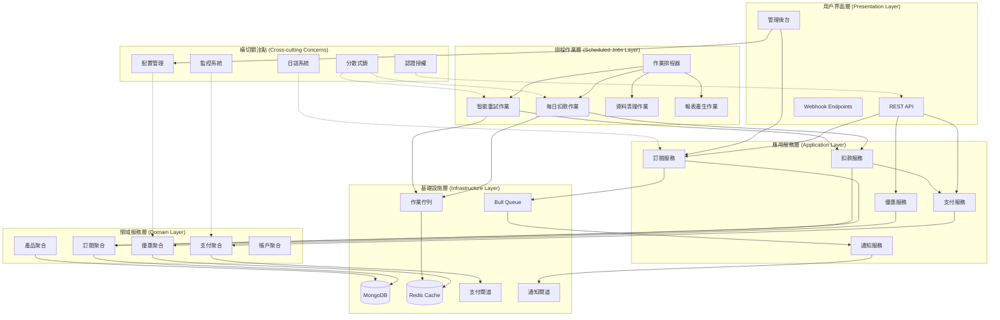
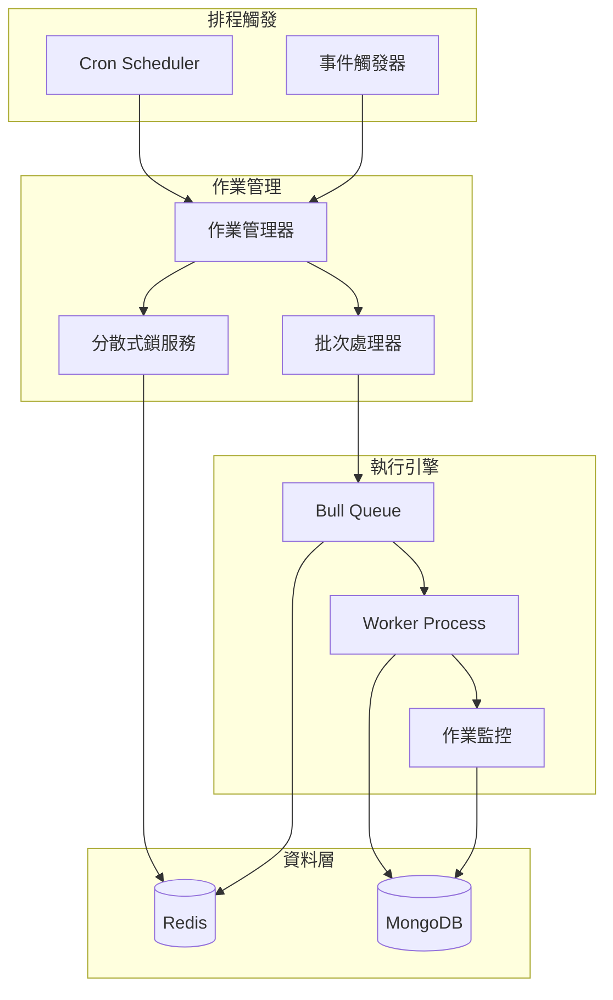

# 系統架構概覽 (System Architecture Overview)

## 1. 架構願景

自動扣款機器人系統是一個**企業級訂閱管理平台**，採用領域驅動設計 (DDD) 和分層架構，支援複雜的業務邏輯和高度可配置的規則引擎。

### 設計原則
- **領域驅動**：以業務領域為核心，技術服務於業務
- **分層解耦**：清晰的架構分層，降低耦合度
- **事件驅動**：通過領域事件實現模組間的鬆耦合
- **配置化**：業務規則可配置，支援動態調整
- **可觀測性**：完整的監控、日誌和審計機制

## 2. 整體架構圖

## 3. 分層架構詳述

### 3.1 展示層 (Presentation Layer)
**職責**：處理外部請求，資料驗證，回應格式化

- **REST API**：提供標準的 RESTful 介面
- **管理後台**：系統管理和配置介面
- **Webhook**：接收外部系統事件通知

**技術實現**：
- NestJS Controller
- DTO (Data Transfer Object)
- 輸入驗證 (class-validator)
- API 文件 (Swagger)

### 3.2 應用服務層 (Application Layer)
**職責**：協調領域物件，處理用例流程，事務管理

- **訂閱服務**：訂閱生命週期管理
- **優惠服務**：優惠計算和管理
- **支付服務**：支付處理和重試邏輯
- **通知服務**：事件通知處理
- **扣款服務**：核心扣款業務邏輯

**技術實現**：
- NestJS Service
- 事務管理 (Database Transaction)
- 事件發佈 (Event Emitter)
- 工作流程協調

### 3.3 排程作業層 (Scheduled Jobs Layer)
**職責**：定時任務執行，批次處理，系統維護

- **每日扣款作業**：處理到期訂閱的自動扣款
- **智能重試作業**：處理失敗交易的重試邏輯
- **資料清理作業**：清理過期資料和日誌
- **報表產生作業**：定期產生業務報表
- **作業排程器**：統一的任務調度管理

**技術實現**：
- Bull Queue + Redis
- Cron Jobs (@nestjs/schedule)
- 分散式鎖機制
- 批次處理優化
- 作業監控和告警

### 3.4 領域服務層 (Domain Layer)
**職責**：核心業務邏輯，領域規則，業務不變性

- **聚合根**：封裝業務邏輯的一致性邊界
- **領域服務**：跨聚合的業務邏輯
- **領域事件**：業務狀態變化的通知機制
- **規則引擎**：可配置的業務規則

**技術實現**：
- TypeScript Class
- 領域事件 (Domain Events)
- 規則模式 (Strategy Pattern)
- 工廠模式 (Factory Pattern)

### 3.5 基礎設施層 (Infrastructure Layer)
**職責**：外部系統整合，資料持久化，技術細節

- **資料庫**：資料持久化和查詢
- **快取**：性能優化和資料快取
- **訊息佇列**：非同步處理和解耦
- **作業佇列**：排程任務的執行佇列
- **外部服務**：第三方 API 整合

**技術實現**：
- MongoDB with Mongoose
- Redis (Cache + Queue Backend)
- Bull Queue
- HTTP Client (Axios)

## 4. 核心設計模式

### 4.1 聚合模式 (Aggregate Pattern)
- 每個聚合有明確的一致性邊界
- 聚合根控制對聚合內部的存取
- 跨聚合操作透過領域服務協調

### 4.2 儲存庫模式 (Repository Pattern)
- 抽象化資料存取邏輯
- 支援不同的資料來源
- 便於單元測試和維護

### 4.3 策略模式 (Strategy Pattern)
- 可插拔的業務規則
- 支援運行時切換策略
- 便於擴展新的業務邏輯

### 4.4 事件驱动模式 (Event-Driven Pattern)
- 領域事件驅動業務流程
- 鬆耦合的模組通訊
- 支援最終一致性

### 4.5 排程作業模式 (Scheduled Jobs Pattern)
- 基於 Cron 表達式的定時觸發
- Bull Queue 實現分散式作業處理
- Redis 分散式鎖避免重複執行
- 批次處理提升效能
- 完整的作業監控和告警機制

## 5. 排程作業架構

### 5.1 作業類型

| 作業類型 | 執行頻率 | 用途 | 技術實現 |
|---------|---------|------|----------|
| **每日扣款作業** | 每日 00:00 | 處理到期訂閱扣款 | Cron + Bull Queue |
| **智能重試作業** | 每15分鐘/6小時 | 處理失敗交易重試 | 動態排程 |
| **資料清理作業** | 每週日 02:00 | 清理過期資料 | Cron Job |
| **報表產生作業** | 每日 01:00 | 產生業務報表 | Bull Queue |

### 5.2 排程架構圖

### 5.3 性能優化策略

- **批次處理**：每批次處理 100-500 筆資料
- **並發控制**：限制 Worker 數量避免資源爭用
- **快取策略**：Redis 暫存常用配置資料
- **資料庫優化**：複合索引優化查詢效能
- **分散式鎖**：避免多實例重複執行

## 6. 非功能性需求

### 5.1 性能要求
- **響應時間**：API 回應時間 < 200ms (90%)
- **吞吐量**：支援 1000 TPS 的扣款處理
- **併發性**：支援 10000 並發用戶

### 5.2 可靠性要求
- **可用性**：99.9% 系統可用率
- **資料一致性**：強一致性的金流處理
- **容錯性**：支援服務降級和熔斷

### 5.3 安全性要求
- **認證授權**：JWT Token 認證機制
- **資料加密**：敏感資料加密儲存
- **審計追蹤**：完整的操作日誌記錄

### 5.4 可維護性要求
- **程式碼品質**：80% 以上測試覆蓋率
- **文件化**：完整的 API 和架構文件
- **監控告警**：全面的系統監控機制

## 6. 非功能性需求

### 6.1 性能要求
- **響應時間**：API 回應時間 < 200ms (90%)
- **吞吐量**：支援 1000 TPS 的扣款處理
- **併發性**：支援 10000 並發用戶
- **批次處理**：每日處理 100萬筆訂閱扣款

### 6.2 可靠性要求
- **可用性**：99.9% 系統可用率
- **資料一致性**：強一致性的金流處理
- **容錯性**：支援服務降級和熔斷
- **作業可靠性**：排程作業 99.5% 成功率

### 6.3 安全性要求
- **認證授權**：JWT Token 認證機制
- **資料加密**：敏感資料加密儲存
- **審計追蹤**：完整的操作日誌記錄
- **PCI DSS**：支付卡行業資料安全標準合規

### 6.4 可維護性要求
- **程式碼品質**：80% 以上測試覆蓋率
- **文件化**：完整的 API 和架構文件
- **監控告警**：全面的系統監控機制
- **作業監控**：排程作業執行狀態追蹤

### 6.5 可擴展性要求
- **水平擴展**：支援多實例部署
- **垂直擴展**：支援硬體資源擴充
- **排程擴展**：支援分散式作業執行
- **儲存擴展**：支援分片和讀寫分離

## 7. 技術棧選擇

### 7.1 後端技術
- **框架**：NestJS (TypeScript)
- **運行時**：Node.js 18+
- **包管理**：pnpm

### 7.2 資料存儲
- **主資料庫**：MongoDB 6.0+
- **快取**：Redis 7.0+
- **搜索引擎**：Elasticsearch (可選)

### 7.3 基礎設施
- **容器化**：Docker + Docker Compose
- **訊息佇列**：Bull Queue (Redis-based)
- **定時任務**：@nestjs/schedule + Node-cron
- **作業佇列**：Bull Dashboard 監控介面
- **分散式鎖**：Redis SETNX 實現

### 7.4 監控與日誌
- **監控**：Prometheus + Grafana
- **日誌**：Winston + ELK Stack
- **錯誤追蹤**：Sentry
- **作業監控**：Bull Dashboard + 自訂告警

### 7.5 開發工具
- **測試**：Jest + Supertest
- **程式碼品質**：ESLint + Prettier
- **API 文件**：Swagger/OpenAPI

## 8. 部署架構

### 8.1 開發環境
- Docker Compose 一鍵啟動
- 本地 MongoDB 和 Redis
- 模擬支付閘道
- Bull Dashboard 作業監控

### 8.2 測試環境
- 自動化測試流水線
- 資料庫遷移腳本
- 整合測試套件
- 排程作業測試

### 8.3 生產環境
- Kubernetes 集群部署
- 資料庫叢集和備份
- CDN 和負載平衡器
- 分散式作業調度

## 9. 下一步行動計劃

1. **完成領域模型設計** (Week 1-2)
2. **建立核心聚合和領域服務** (Week 3-4)
3. **實現基礎設施層和排程作業** (Week 5-6)
4. **開發應用服務層** (Week 7-8)
5. **建置 API 和管理後台** (Week 9-10)
6. **系統測試和優化** (Week 11-12)

這個架構設計為系統提供了堅實的基礎，支援複雜的業務邏輯和未來的擴展需求。
