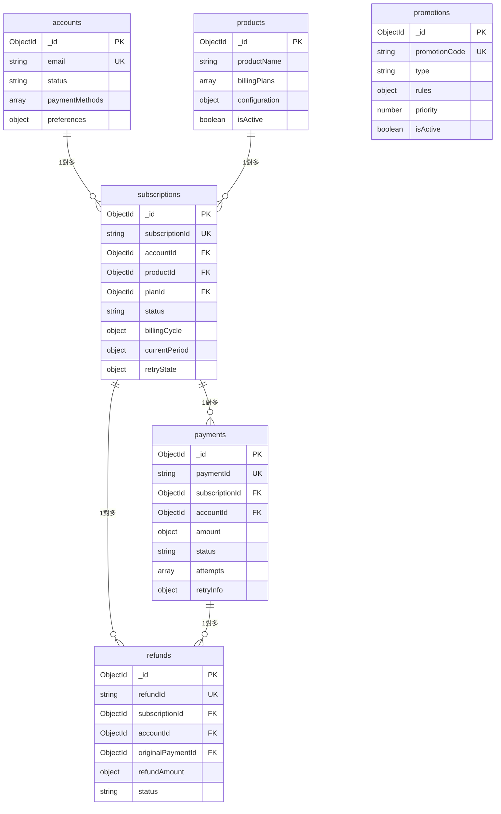

# 資料庫架構設計 (Database Schema Design)

## 1. 設計原則

### 1.1 MongoDB 設計準則
- **文檔導向**：充分利用 MongoDB 的文檔結構優勢
- **反正規化**：適度反正規化以提升查詢性能
- **嵌入 vs 引用**：根據查詢模式和資料大小選擇
- **索引策略**：為常用查詢模式建立合適索引

### 1.2 資料一致性策略
- **單文檔 ACID**：利用 MongoDB 的單文檔原子性
- **事務支援**：關鍵業務流程使用多文檔事務
- **最終一致性**：非關鍵資料採用最終一致性
- **樂觀鎖定**：使用版本號防止併發衝突

## 2. 資料表總覽

### 2.1 核心資料表關係圖



### 2.2 資料表功能總表

| 資料表名稱 | 中文名稱 | 主要作用 | 關鍵關聯 | 資料量級 |
|-----------|----------|----------|----------|----------|
| **accounts** | 帳戶表 | 儲存用戶基本資訊、支付方式、偏好設定 | 一對多：subscriptions<br/>一對多：payments<br/>一對多：refunds | 中等 (萬級) |
| **products** | 產品表 | 儲存產品資訊、計費方案、業務配置 | 一對多：subscriptions | 小 (百級) |
| **subscriptions** | 訂閱表 | 核心業務表，管理訂閱生命週期和狀態 | 多對一：accounts<br/>多對一：products<br/>一對多：payments<br/>一對多：refunds | 大 (百萬級) |
| **payments** | 支付表 | 儲存支付交易記錄、重試資訊、狀態追蹤 | 多對一：subscriptions<br/>多對一：accounts<br/>一對多：refunds | 極大 (千萬級) |
| **promotions** | 優惠表 | 管理各類優惠活動、優惠碼、使用統計 | 多對多：subscriptions (通過嵌入陣列) | 中等 (千級) |
| **refunds** | 退款表 | 處理退款申請、狀態追蹤、流程管理 | 多對一：subscriptions<br/>多對一：accounts<br/>多對一：payments | 中等 (十萬級) |

### 2.3 資料表特性說明

#### 核心特性
- **accounts**: 用戶身份識別的核心，包含支付方式和偏好設定
- **subscriptions**: 系統的業務核心，狀態機複雜，關聯最多
- **payments**: 交易量最大，需要完整的審計追蹤和重試機制
- **promotions**: 業務規則複雜，需要支援多種優惠類型和計算邏輯

#### 查詢模式
- **高頻查詢**: subscriptions (按狀態、日期)、payments (按訂閱、狀態)
- **中頻查詢**: accounts (按 email、狀態)、promotions (按代碼、有效期)
- **低頻查詢**: products (按活躍狀態)、refunds (按狀態、日期)

#### 資料成長趨勢
- **快速成長**: payments (每日新增)、subscriptions (持續成長)
- **穩定成長**: accounts (用戶註冊)、refunds (按比例成長)
- **緩慢成長**: products (業務驅動)、promotions (活動驅動)

## 2. 集合 (Collection) 設計

### 2.1 訂閱集合 (subscriptions)

```typescript
interface SubscriptionDocument {
  _id: ObjectId;                    // 主鍵
  subscriptionId: string;           // 業務識別碼 (unique)
  accountId: ObjectId;              // 帳戶引用
  productId: ObjectId;              // 產品引用
  planId: ObjectId;                 // 方案引用
  
  // 狀態資訊
  status: SubscriptionStatus;       // 訂閱狀態
  statusHistory: StatusHistoryItem[]; // 狀態變更歷史
  
  // 計費資訊
  billingCycle: {
    type: 'MONTHLY' | 'YEARLY' | 'QUARTERLY' | 'WEEKLY' | 'CUSTOM';
    intervalDays?: number;          // 自定義週期天數
    billingDay: number;             // 計費日 (1-31)
  };
  
  currentPeriod: {
    startDate: Date;                // 當期開始
    endDate: Date;                  // 當期結束
    nextBillingDate: Date;          // 下次計費日
    cycleNumber: number;            // 週期序號
  };
  
  // 價格資訊
  pricing: {
    baseAmount: number;             // 基礎金額
    currency: string;               // 幣別
    taxAmount?: number;             // 稅額
  };
  
  // 重試資訊
  retryState: {
    retryCount: number;             // 重試次數
    maxRetries: number;             // 最大重試次數
    lastRetryDate?: Date;           // 最後重試時間
    nextRetryDate?: Date;           // 下次重試時間
    gracePeriodExtensions: number;   // 寬限期延長次數
    maxGraceExtensions: number;     // 最大延長次數
  };
  
  // 方案變更
  pendingPlanChange?: {
    targetPlanId: ObjectId;         // 目標方案
    changeType: 'IMMEDIATE' | 'NEXT_CYCLE';
    requestedAt: Date;              // 申請時間
    effectiveAt: Date;              // 生效時間
    reason?: string;                // 變更原因
  };
  
  // 優惠資訊
  appliedPromotions: {
    promotionId: ObjectId;          // 優惠 ID
    appliedAt: Date;                // 套用時間
    cycleNumber: number;            // 套用週期
    discountAmount: number;         // 折扣金額
  status: 'ACTIVE' | 'EXPIRED' | 'CANCELED';
  }[];
  
  // 元資料
  createdAt: Date;                  // 創建時間
  updatedAt: Date;                  // 更新時間
  version: number;                  // 版本號 (樂觀鎖)
  
  // 取消資訊
  cancellation?: {
    canceledAt: Date;               // 取消時間
    reason: string;                 // 取消原因
    canceledBy: ObjectId;           // 取消者
    refundRequested: boolean;       // 是否申請退款
  };
}

// 狀態歷史項目
interface StatusHistoryItem {
  fromStatus: SubscriptionStatus;
  toStatus: SubscriptionStatus;
  changedAt: Date;
  reason?: string;
  triggeredBy?: 'SYSTEM' | 'USER' | 'ADMIN';
  metadata?: Record<string, any>;
}
```

**索引設計**：
```javascript
// 複合索引
db.subscriptions.createIndex({ "accountId": 1, "status": 1 })
db.subscriptions.createIndex({ "currentPeriod.nextBillingDate": 1, "status": 1 })
db.subscriptions.createIndex({ "productId": 1, "status": 1 })

// 唯一索引
db.subscriptions.createIndex({ "subscriptionId": 1 }, { unique: true })

// 稀疏索引
db.subscriptions.createIndex({ "retryState.nextRetryDate": 1 }, { sparse: true })
```

### 2.2 產品集合 (products)

```typescript
interface ProductDocument {
  _id: ObjectId;
  productName: string;              // 產品名稱
  displayName: {                    // 多語系顯示名稱
    'zh-TW': string;
    'en-US': string;
  };
  description: {                    // 多語系描述
    'zh-TW': string;
    'en-US': string;
  };
  
  // 產品配置
  configuration: {
    // 重試配置
    retryPolicy: {
      maxAttempts: number;          // 最大重試次數
      retryIntervals: number[];     // 重試間隔 (小時)
      gracePeriodDays: number;      // 寬限期天數
      maxGraceExtensions: number;   // 最大延長次數
    };
    
    // 退款配置
    refundPolicy: {
      allowRefund: boolean;         // 是否允許退款
      refundWindowDays: number;     // 退款窗口期
      autoApproval: boolean;        // 是否自動核准
    };
    
    // 方案轉換規則
    planConversionRules: {
      allowedConversions: ObjectId[]; // 允許轉換的方案 ID
      immediateChangeAllowed: boolean; // 是否允許立即生效
    };
  };
  
  // 計費方案
  billingPlans: {
    _id: ObjectId;                  // 方案 ID
    planName: string;               // 方案名稱
    displayName: {                  // 多語系顯示名稱
      'zh-TW': string;
      'en-US': string;
    };
    pricing: {
      amount: number;               // 價格
      currency: string;             // 幣別
      taxRate?: number;             // 稅率
    };
    billingCycle: {
      type: 'MONTHLY' | 'YEARLY' | 'QUARTERLY' | 'WEEKLY' | 'CUSTOM';
      intervalDays?: number;        // 自定義間隔
    };
    features: string[];             // 功能特性
    isActive: boolean;              // 是否啟用
    sortOrder: number;              // 排序順序
  }[];
  
  // 平台特定資訊
  platformInfo: {
    googleProductId?: string;       // Google 產品 ID
    appleProductId?: string;        // Apple 產品 ID
    stripeProductId?: string;       // Stripe 產品 ID
  };
  
  // 元資料
  isActive: boolean;                // 是否啟用
  createdAt: Date;
  updatedAt: Date;
  createdBy: ObjectId;              // 創建者
}
```

**索引設計**：
```javascript
db.products.createIndex({ "isActive": 1 })
db.products.createIndex({ "billingPlans.isActive": 1 })
db.products.createIndex({ "platformInfo.googleProductId": 1 }, { sparse: true })
```

### 2.3 支付集合 (payments)

```typescript
interface PaymentDocument {
  _id: ObjectId;
  paymentId: string;                // 業務識別碼
  subscriptionId: ObjectId;         // 訂閱引用
  accountId: ObjectId;              // 帳戶引用
  
  // 支付資訊
  amount: {
    original: number;               // 原始金額
    final: number;                  // 實付金額
    discount: number;               // 折扣金額
    tax: number;                    // 稅額
    currency: string;               // 幣別
  };
  
  // 支付方式
  paymentMethod: {
    type: 'CREDIT_CARD' | 'DEBIT_CARD' | 'BANK_ACCOUNT' | 'DIGITAL_WALLET';
    provider: string;               // 支付供應商
    paymentToken: string;           // 支付令牌
    last4Digits?: string;           // 卡號後四碼
    expiryDate?: string;            // 有效期
  };
  
  // 狀態資訊
  status: PaymentStatus;
  statusHistory: {
    status: PaymentStatus;
    changedAt: Date;
    reason?: string;
  }[];
  
  // 支付嘗試
  attempts: {
    attemptNumber: number;          // 嘗試序號
    attemptedAt: Date;              // 嘗試時間
    status: 'PROCESSING' | 'SUCCESS' | 'FAILED';
    externalTransactionId?: string; // 外部交易 ID
    failureReason?: string;         // 失敗原因
    failureCode?: string;           // 失敗代碼
    failureCategory?: 'RETRIABLE' | 'DELAYED_RETRY' | 'NON_RETRIABLE';
    gatewayResponse?: Record<string, any>; // 閘道回應
  }[];
  
  // 計費週期資訊
  billingCycle: {
    cycleNumber: number;            // 週期序號
    periodStart: Date;              // 週期開始
    periodEnd: Date;                // 週期結束
  };
  
  // 優惠資訊
  appliedPromotions: {
    promotionId: ObjectId;
    discountAmount: number;
    promotionType: string;
  }[];
  
  // 重試資訊
  retryInfo?: {
    nextRetryDate: Date;            // 下次重試時間
    retryCount: number;             // 當前重試次數
    maxRetries: number;             // 最大重試次數
    retryIntervals: number[];       // 重試間隔配置
  };
  
  // 元資料
  createdAt: Date;
  updatedAt: Date;
  processedAt?: Date;               // 處理完成時間
}
```

**索引設計**：
```javascript
db.payments.createIndex({ "subscriptionId": 1, "createdAt": -1 })
db.payments.createIndex({ "accountId": 1, "status": 1 })
db.payments.createIndex({ "status": 1, "retryInfo.nextRetryDate": 1 })
db.payments.createIndex({ "paymentId": 1 }, { unique: true })
```

### 2.4 優惠集合 (promotions)

```typescript
interface PromotionDocument {
  _id: ObjectId;
  promotionCode?: string;           // 優惠碼 (可選)
  promotionName: string;            // 優惠名稱
  
  // 優惠類型
  type: 'STAGE_DISCOUNT' | 'COUPON_CODE' | 'SEASONAL_PROMOTION' | 'FIRST_TIME_FREE';
  
  // 優惠規則
  rules: {
    discountType: 'PERCENTAGE' | 'FIXED_AMOUNT';
    discountValue: number;          // 折扣值
    
    // 適用條件
    applicableProducts: ObjectId[]; // 適用產品
    applicablePlans: ObjectId[];    // 適用方案
    minimumAmount?: number;         // 最低消費金額
    
    // 階段式優惠專用
    stagingRules?: {
      cycleNumbers: number[];       // 適用週期 [1, 3, 6]
      repeatPattern?: boolean;      // 是否循環
    };
    
    // 使用限制
    usageLimit?: number;            // 總使用次數限制
    userUsageLimit?: number;        // 單用戶使用次數限制
    
    // 時間限制
    validPeriod: {
      startDate: Date;              // 開始時間
      endDate: Date;                // 結束時間
    };
  };
  
  // 優先級
  priority: number;                 // 數字越小優先級越高
  
  // 使用統計
  usage: {
    totalUsed: number;              // 總使用次數
    userUsage: {                    // 用戶使用記錄
      accountId: ObjectId;
      usedCount: number;
      lastUsedAt: Date;
    }[];
  };
  
  // 狀態
  isActive: boolean;                // 是否啟用
  
  // 元資料
  createdAt: Date;
  updatedAt: Date;
  createdBy: ObjectId;
}
```

**索引設計**：
```javascript
db.promotions.createIndex({ "promotionCode": 1 }, { unique: true, sparse: true })
db.promotions.createIndex({ "isActive": 1, "rules.validPeriod.startDate": 1, "rules.validPeriod.endDate": 1 })
db.promotions.createIndex({ "rules.applicableProducts": 1, "isActive": 1 })
db.promotions.createIndex({ "type": 1, "priority": 1 })
```

### 2.5 帳戶集合 (accounts)

```typescript
interface AccountDocument {
  _id: ObjectId;
  email: string;                    // 電子郵件 (唯一)
  emailVerified: boolean;           // 信箱已驗證
  
  // 基本資訊
  profile: {
    name: string;                   // 姓名
    phone?: string;                 // 電話
    locale: string;                 // 語言偏好
    timezone: string;               // 時區
  };
  
  // 帳戶狀態
  status: 'ACTIVE' | 'SUSPENDED' | 'CLOSED';
  statusHistory: {
    status: string;
    changedAt: Date;
    reason?: string;
  }[];
  
  // 支付方式
  paymentMethods: {
    _id: ObjectId;                  // 支付方式 ID
    type: 'CREDIT_CARD' | 'DEBIT_CARD' | 'BANK_ACCOUNT' | 'DIGITAL_WALLET';
    provider: string;               // 供應商
    displayName: string;            // 顯示名稱 (例: **** 1234)
    paymentToken: string;           // 加密的支付令牌
    isDefault: boolean;             // 是否為預設
    isActive: boolean;              // 是否啟用
    expiresAt?: Date;               // 有效期限
    metadata?: Record<string, any>; // 額外資訊
    createdAt: Date;
    updatedAt: Date;
  }[];
  
  // 偏好設定
  preferences: {
    notifications: {
      email: boolean;               // 電子郵件通知
      paymentReminder: boolean;     // 付款提醒
      serviceUpdates: boolean;      // 服務更新
    };
    billing: {
      currency: string;             // 偏好幣別
      invoiceLanguage: string;      // 發票語言
    };
  };
  
  // 安全資訊
  security: {
    passwordHash: string;           // 密碼雜湊
    lastLoginAt?: Date;             // 最後登入時間
    loginAttempts: number;          // 登入嘗試次數
    lockedUntil?: Date;             // 鎖定到期時間
    twoFactorEnabled: boolean;      // 雙因子認證
  };
  
  // 元資料
  createdAt: Date;
  updatedAt: Date;
  lastActiveAt?: Date;              // 最後活動時間
}
```

**索引設計**：
```javascript
db.accounts.createIndex({ "email": 1 }, { unique: true })
db.accounts.createIndex({ "status": 1 })
db.accounts.createIndex({ "paymentMethods._id": 1 }, { sparse: true })
```

### 2.6 退款集合 (refunds)

```typescript
interface RefundDocument {
  _id: ObjectId;
  refundId: string;                 // 業務識別碼
  subscriptionId: ObjectId;         // 訂閱引用
  accountId: ObjectId;              // 帳戶引用
  originalPaymentId: ObjectId;      // 原始支付 ID
  
  // 退款資訊
  refundAmount: {
    amount: number;                 // 退款金額
    currency: string;               // 幣別
  };
  
  refundReason: string;             // 退款原因
  refundType: 'FULL' | 'PARTIAL' | 'PRORATED'; // 退款類型
  
  // 狀態資訊
  status: RefundStatus;
  statusHistory: {
    status: RefundStatus;
    changedAt: Date;
    processedBy?: ObjectId;         // 處理者
    notes?: string;                 // 處理備註
  }[];
  
  // 處理資訊
  processing: {
    requestedAt: Date;              // 申請時間
    processedAt?: Date;             // 處理時間
    completedAt?: Date;             // 完成時間
    externalRefundId?: string;      // 外部退款 ID
    gatewayResponse?: Record<string, any>; // 閘道回應
  };
  
  // 退款到的支付方式
  refundMethod: {
    type: string;                   // 退款方式類型
    accountInfo: string;            // 帳戶資訊 (脫敏)
    provider: string;               // 供應商
  };
  
  // 元資料
  createdAt: Date;
  updatedAt: Date;
}
```

**索引設計**：
```javascript
db.refunds.createIndex({ "refundId": 1 }, { unique: true })
db.refunds.createIndex({ "subscriptionId": 1, "createdAt": -1 })
db.refunds.createIndex({ "accountId": 1, "status": 1 })
db.refunds.createIndex({ "status": 1, "processing.requestedAt": 1 })
```

## 3. 關係設計模式

### 3.1 嵌入 vs 引用選擇原則

| 資料關係 | 選擇策略 | 原因 |
|----------|----------|------|
| 訂閱 → 狀態歷史 | 嵌入 | 頻繁一起查詢，資料量可控 |
| 訂閱 → 帳戶 | 引用 | 帳戶資訊獨立，避免重複 |
| 產品 → 方案 | 嵌入 | 強相關性，一起管理 |
| 支付 → 重試記錄 | 嵌入 | 歷史資料，查詢模式簡單 |
| 優惠 → 使用記錄 | 嵌入 | 統計資料，讀寫比例高 |

### 3.2 資料一致性策略

```typescript
// 多文檔事務範例
class SubscriptionService {
  async createSubscriptionWithPayment(
    subscriptionData: CreateSubscriptionData,
    paymentData: CreatePaymentData
  ): Promise<void> {
    const session = await mongoose.startSession();
    
    try {
      await session.withTransaction(async () => {
        // 創建訂閱
        const subscription = await Subscription.create(
          [subscriptionData], 
          { session }
        );
        
        // 創建支付記錄
        paymentData.subscriptionId = subscription[0]._id;
        await Payment.create([paymentData], { session });
        
        // 更新帳戶統計
        await Account.updateOne(
          { _id: subscriptionData.accountId },
          { 
            $inc: { 'statistics.totalSubscriptions': 1 },
            $set: { updatedAt: new Date() }
          },
          { session }
        );
      });
    } finally {
      await session.endSession();
    }
  }
}
```

## 4. 查詢模式優化

### 4.1 常用查詢模式

```javascript
// 1. 查詢待計費的訂閱
db.subscriptions.find({
  "status": "ACTIVE",
  "currentPeriod.nextBillingDate": { 
    $lte: new Date(),
    $gte: new Date(Date.now() - 24 * 60 * 60 * 1000) // 過去24小時內
  }
}).hint({ "currentPeriod.nextBillingDate": 1, "status": 1 })

// 2. 查詢需要重試的支付
db.payments.find({
  "status": "FAILED",
  "retryInfo.nextRetryDate": { $lte: new Date() },
  "retryInfo.retryCount": { $lt: "$retryInfo.maxRetries" }
})

// 3. 查詢用戶的有效訂閱
db.subscriptions.find({
  "accountId": ObjectId("..."),
  "status": { $in: ["ACTIVE", "GRACE_PERIOD"] }
}).sort({ "createdAt": -1 })

// 4. 優惠使用統計查詢
db.promotions.aggregate([
  { $match: { "isActive": true } },
  { $project: {
    "promotionName": 1,
    "usage.totalUsed": 1,
    "rules.usageLimit": 1,
    "usageRate": {
      $divide: ["$usage.totalUsed", "$rules.usageLimit"]
    }
  }},
  { $sort: { "usageRate": -1 } }
])
```

### 4.2 聚合查詢範例

```javascript
// 訂閱狀態分佈統計
db.subscriptions.aggregate([
  {
    $group: {
      _id: "$status",
      count: { $sum: 1 },
      totalRevenue: { $sum: "$pricing.baseAmount" }
    }
  },
  {
    $sort: { count: -1 }
  }
])

// 支付失敗分析
db.payments.aggregate([
  { 
    $match: { 
      "status": "FAILED",
      "createdAt": { 
        $gte: new Date(Date.now() - 30 * 24 * 60 * 60 * 1000) 
      }
    }
  },
  { $unwind: "$attempts" },
  {
    $group: {
      _id: "$attempts.failureCategory",
      count: { $sum: 1 },
      avgRetries: { $avg: "$attempts.attemptNumber" }
    }
  }
])
```

## 5. 資料庫配置與優化

### 5.1 MongoDB 配置建議

```yaml
# mongod.conf
storage:
  engine: wiredTiger
  wiredTiger:
    engineConfig:
      cacheSizeGB: 4              # 根據記憶體調整
    collectionConfig:
      blockCompressor: snappy     # 壓縮演算法
    indexConfig:
      prefixCompression: true

operationProfiling:
  mode: slowOp
  slowOpThresholdMs: 100          # 慢查詢閾值

setParameter:
  internalQueryMaxBlockingSortMemoryUsageBytes: 67108864
```

### 5.2 分片策略 (Sharding Strategy)

```javascript
// 訂閱集合分片鍵
sh.shardCollection("billing.subscriptions", { "accountId": "hashed" })

// 支付集合分片鍵
sh.shardCollection("billing.payments", { 
  "createdAt": 1, 
  "subscriptionId": 1 
})

// 建立分片標籤
sh.addShardTag("shard0000", "recent")
sh.addShardTag("shard0001", "archive")

// 設定標籤範圍
sh.addTagRange(
  "billing.payments",
  { "createdAt": new Date("2024-01-01") },
  { "createdAt": new Date("2025-01-01") },
  "recent"
)
```

### 5.3 備份與恢復策略

```bash
# 全量備份
mongodump --host=replica-set/host1:27017,host2:27017,host3:27017 \
          --db=billing \
          --out=/backup/$(date +%Y%m%d)

# 增量備份 (基於 oplog)
mongodump --host=replica-set/host1:27017,host2:27017,host3:27017 \
          --oplog \
          --out=/backup/incremental/$(date +%Y%m%d_%H%M)

# 時間點恢復
mongorestore --host=localhost:27017 \
             --db=billing \
             --oplogReplay \
             /backup/20241201/billing
```

## 6. 資料遷移策略

### 6.1 架構變更管理

```typescript
// 遷移腳本基礎類別
abstract class Migration {
  abstract readonly version: string;
  abstract readonly description: string;
  
  abstract up(): Promise<void>;
  abstract down(): Promise<void>;
  
  protected async updateDocuments(
    collection: string,
    filter: any,
    update: any
  ): Promise<void> {
    const db = await getDatabase();
    const result = await db.collection(collection).updateMany(filter, update);
    console.log(`Updated ${result.modifiedCount} documents in ${collection}`);
  }
}

// 具體遷移範例
class AddRetryStateToSubscriptions extends Migration {
  readonly version = '001';
  readonly description = 'Add retry state to existing subscriptions';
  
  async up(): Promise<void> {
    await this.updateDocuments(
      'subscriptions',
      { retryState: { $exists: false } },
      {
        $set: {
          retryState: {
            retryCount: 0,
            maxRetries: 3,
            gracePeriodExtensions: 0,
            maxGraceExtensions: 2
          },
          version: 2
        }
      }
    );
  }
  
  async down(): Promise<void> {
    await this.updateDocuments(
      'subscriptions',
      { version: 2 },
      {
        $unset: { retryState: "" },
        $set: { version: 1 }
      }
    );
  }
}
```

### 6.2 資料驗證與清理

```typescript
// 資料一致性檢查
class DataConsistencyChecker {
  async checkOrphanedPayments(): Promise<ValidationResult[]> {
    const results: ValidationResult[] = [];
    
    // 檢查沒有對應訂閱的支付記錄
    const orphanedPayments = await db.collection('payments')
      .aggregate([
        {
          $lookup: {
            from: 'subscriptions',
            localField: 'subscriptionId',
            foreignField: '_id',
            as: 'subscription'
          }
        },
        {
          $match: {
            'subscription': { $size: 0 }
          }
        }
      ]).toArray();
    
    if (orphanedPayments.length > 0) {
      results.push({
        type: 'ORPHANED_PAYMENTS',
        count: orphanedPayments.length,
        severity: 'ERROR',
        description: 'Found payments without corresponding subscriptions'
      });
    }
    
    return results;
  }
  
  async checkSubscriptionStates(): Promise<ValidationResult[]> {
    // 檢查狀態不一致的訂閱
    const inconsistentSubscriptions = await db.collection('subscriptions')
      .find({
        $or: [
          // ACTIVE 訂閱但沒有下次計費日
          {
            status: 'ACTIVE',
            'currentPeriod.nextBillingDate': { $exists: false }
          },
          // EXPIRED 訂閱但服務還未到期
          {
            status: 'EXPIRED',
            'currentPeriod.endDate': { $gt: new Date() }
          }
        ]
      }).toArray();
    
    return inconsistentSubscriptions.map(sub => ({
      type: 'INCONSISTENT_STATE',
      entityId: sub._id.toString(),
      severity: 'WARNING',
      description: `Subscription ${sub.subscriptionId} has inconsistent state`
    }));
  }
}
```

這個資料庫設計提供了完整的資料結構定義、索引策略、查詢優化和維護策略，為自動扣款系統提供了堅實的資料基礎。
