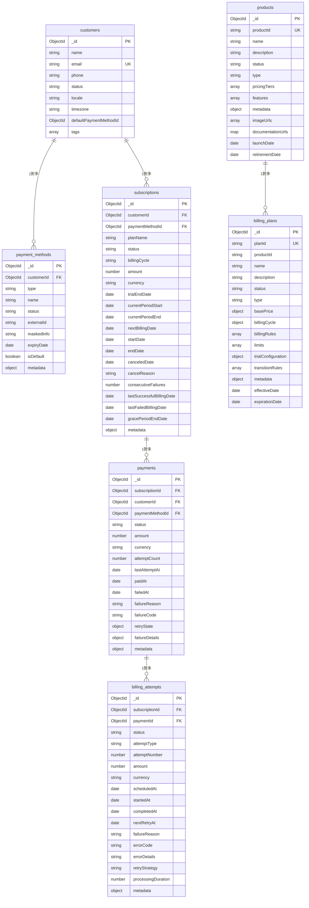

# 資料庫架構設計 (Database Schema Design)

本文件已對齊現行程式碼的「正規化」資料模型設計：
- 使用 customers 取代 accounts
- 支付方式、計費嘗試、計費方案為獨立集合：payment_methods、billing_attempts、billing_plans
- products 與 billing_plans 分離（不再內嵌）
- promotions、refunds 暫列為 Roadmap（尚未實作於程式碼）

## 1. 設計原則

### 1.1 MongoDB 設計準則
- 文檔導向：充分利用 MongoDB 的文檔結構優勢
- 適度反正規化：在讀多於寫、且資料量可控處嵌入快取
- 嵌入 vs 引用：依查詢模式與資料膨脹風險取捨
- 索引策略：針對高頻關鍵查詢建立複合索引

### 1.2 資料一致性策略
- 單文檔 ACID：優先利用單文檔原子性
- 多文檔事務：跨集合的關鍵流程使用交易
- 最終一致性：非關鍵衍生資料採用
- 樂觀鎖：必要時以版本欄位或條件更新避免覆寫

## 2. 核心集合關係圖



備註：promotions、refunds 為 Roadmap，暫不列入現行 ER 圖。

## 3. 集合設計（對齊現行程式碼）

### 3.1 客戶集合（customers）

```typescript
interface CustomerDocument {
  _id: ObjectId;
  name: string;
  email: string;
  phone?: string;
  status: CustomerStatus;
  defaultPaymentMethodId: ObjectId | null;
  notes?: string;
  tags: string[];
  locale: string;
  timezone: string;
}
```

建議索引：
```javascript
db.customers.createIndex({ email: 1 }, { unique: true })
db.customers.createIndex({ status: 1 })
```

### 3.2 支付方式集合（payment_methods）

```typescript
interface PaymentMethodDocument {
  _id: ObjectId;
  customerId: ObjectId;
  type: PaymentMethodType;
  name: string;
  status: PaymentMethodStatus;
  externalId?: string;
  maskedInfo?: string;
  expiryDate?: Date;
  isDefault: boolean;
  metadata: Record<string, any>;
}
```

建議索引：
```javascript
db.payment_methods.createIndex({ customerId: 1, isDefault: 1 })
db.payment_methods.createIndex({ customerId: 1, status: 1 })
```

### 3.3 訂閱集合（subscriptions）

```typescript
interface SubscriptionDocument {
  _id: ObjectId;
  customerId: ObjectId;
  paymentMethodId: ObjectId;
  planName: string;
  status: SubscriptionStatus;
  billingCycle: BillingCycle; // 枚舉
  amount: number;             // 以「分」為單位
  currency: string;
  trialEndDate?: Date;
  currentPeriodStart: Date;
  currentPeriodEnd: Date;
  nextBillingDate: Date;
  startDate: Date;
  endDate?: Date;
  canceledDate?: Date;
  cancelReason?: string;
  consecutiveFailures: number;
  lastSuccessfulBillingDate?: Date;
  lastFailedBillingDate?: Date;
  gracePeriodEndDate?: Date;
  description?: string;
  metadata: Record<string, any>;
}
```

建議索引：
```javascript
db.subscriptions.createIndex({ customerId: 1, status: 1 })
db.subscriptions.createIndex({ nextBillingDate: 1, status: 1 })
```

### 3.4 支付集合（payments）

```typescript
interface PaymentDocument {
  _id: ObjectId;
  subscriptionId: ObjectId;
  customerId: ObjectId;
  paymentMethodId: ObjectId;
  status: PaymentStatus;
  amount: number; // 以「分」為單位
  currency: string;
  description?: string;
  externalTransactionId?: string;
  billingPeriodStart: Date;
  billingPeriodEnd: Date;
  attemptCount: number;
  lastAttemptAt?: Date;
  paidAt?: Date;
  failedAt?: Date;
  failureReason?: string;
  failureCode?: string;
  refundedAt?: Date;
  refundedAmount?: number;
  refundReason?: string;
  invoiceNumber?: string;
  receiptNumber?: string;
  metadata: Record<string, any>;
  failureDetails?: {
    errorCode?: string;
    errorMessage?: string;
    providerErrorCode?: string;
    providerErrorMessage?: string;
    category: number; // PaymentFailureCategory
    isRetriable: boolean;
    failedAt: Date;
    metadata?: Record<string, any>;
  };
  retryState?: {
    attemptNumber: number;
    maxRetries: number;
    nextRetryAt?: Date;
    lastFailureReason?: string;
    failureCategory?: number; // PaymentFailureCategory
    retryStrategy: string;
  };
}
```

建議索引：
```javascript
db.payments.createIndex({ subscriptionId: 1, createdAt: -1 })
db.payments.createIndex({ customerId: 1, status: 1 })
db.payments.createIndex({ 'retryState.nextRetryAt': 1 }, { sparse: true })
```

### 3.5 計費嘗試集合（billing_attempts）

```typescript
interface BillingAttemptDocument {
  _id: ObjectId;
  subscriptionId: ObjectId;
  paymentId: ObjectId | null;
  status: BillingAttemptStatus;
  attemptType: BillingAttemptType;
  attemptNumber: number;
  amount: number;
  currency: string;
  scheduledAt: Date;
  startedAt?: Date;
  completedAt?: Date;
  nextRetryAt?: Date;
  failureReason?: string;
  errorCode?: string;
  errorDetails?: string;
  retryStrategy?: RetryStrategy;
  processingDuration?: number;
  metadata: Record<string, any>;
}
```

建議索引：
```javascript
db.billing_attempts.createIndex({ subscriptionId: 1, scheduledAt: 1 })
db.billing_attempts.createIndex({ paymentId: 1 })
```

### 3.6 產品集合（products）

```typescript
interface ProductDocument {
  _id: ObjectId;
  productId: string; // unique
  name: string;
  description: string;
  status: ProductStatus;
  type: ProductType;
  pricingTiers: any[]; // 對應程式碼 IProductDocument.pricingTiers
  features: any[];     // 對應程式碼 IProductDocument.features
  metadata: any;       // 對應程式碼 IProductDocument.metadata
  imageUrls: string[];
  documentationUrls: Record<string, string>;
  launchDate?: Date;
  retirementDate?: Date;
  version: string;
  createdAt: Date;
  updatedAt: Date;
}
```

已實作索引（程式碼中）：
```javascript
// ProductModel
{ status: 1, type: 1 }
{ 'metadata.category': 1, status: 1 }
{ 'metadata.supportedRegions': 1, status: 1 }
```

### 3.7 計費方案集合（billing_plans）

```typescript
interface BillingPlanDocument {
  _id: ObjectId;
  planId: string;   // unique
  productId: string;
  name: string;
  description: string;
  status: PlanStatus;
  type: PlanType;
  basePrice: { amount: number; currency: string }; // 預設 TWD
  billingCycle: { type: BillingCycle; intervalDays?: number; billingDay?: number };
  billingRules: any[];        // 對應程式碼 schema
  limits: any[];              // 對應程式碼 schema
  trialConfiguration?: any;   // 對應程式碼 schema
  transitionRules: any[];     // 對應程式碼 schema
  metadata: any;              // 對應程式碼 schema
  effectiveDate?: Date;
  expirationDate?: Date;
  createdAt: Date;
  updatedAt: Date;
}
```

已實作索引（程式碼中）：
```javascript
// BillingPlanModel
{ productId: 1, status: 1 }
{ status: 1, type: 1 }
{ 'metadata.supportedRegions': 1, status: 1 }
{ effectiveDate: 1, expirationDate: 1 }
```

### 3.8 Promotions（優惠）資料模型（Phase 2 設計整合）

原先標示為 Roadmap，現更新為正式設計目標。以下集合支援：查詢可用優惠、資格驗證、使用次數限制、套用紀錄、審計與併發安全。

#### 3.8.1 promotions
主優惠定義。建議保持精簡（少量百級），適合常駐快取。
```typescript
interface PromotionDocument {
  _id: ObjectId;
  code?: string | null;                  // type=CODE 時存在且唯一
  name: string;
  type: 'CODE' | 'CAMPAIGN' | 'INTRO' | 'TIERED' | 'THRESHOLD';
  priority: number;                      // 排序用（高→低）
  status: 'DRAFT' | 'ACTIVE' | 'PAUSED' | 'EXPIRED';
  scope: { productIds?: string[]; planIds?: string[] }; // 為空 = 全域
  discount: {
    type: 'FIXED_AMOUNT' | 'PERCENTAGE' | 'FREE_CYCLES' | 'TIERED' | 'THRESHOLD_BONUS';
    value?: number;                      // FIXED/PERCENTAGE 基本值
    currency?: string;                   // FIXED_AMOUNT 幣別（預設 TWD）
    maxCycles?: number;                  // FREE_CYCLES 或 限期折扣週期
    tiers?: { threshold: number; value: number }[]; // TIERED 分段百分比或金額值（依規格）
    thresholdRules?: { min: number; bonusType: 'AMOUNT' | 'PERCENTAGE'; value: number }[]; // THRESHOLD_BONUS
  };
  period: { startAt: Date; endAt: Date };
  eligibility?: {
    newCustomerOnly?: boolean;
    minOrderAmount?: number;             // 以最小幣值（分）
    regions?: string[];                  // ISO Country Codes
    customerSegments?: string[];         // 行銷分群
  };
  usageLimits?: { globalLimit?: number; perCustomerLimit?: number };
  usageCounters?: { globalUsed: number }; // 實時計數（避免昂貴聚合）
  stacking?: { exclusive: boolean };      // 預設 true（不可疊加）
  metadata?: Record<string, any>;
  createdAt: Date;
  updatedAt: Date;
}
```
索引（Mongo Shell / Migration Script 擬）：
```javascript
// 啟用碼唯一（僅非草稿）
db.promotions.createIndex(
  { code: 1 },
  { unique: true, partialFilterExpression: { code: { $type: 'string' }, status: { $ne: 'DRAFT' } } }
);
// 期間 + 狀態 + 優先級（查可用 / 排序）
db.promotions.createIndex({ status: 1, 'period.startAt': 1, 'period.endAt': 1, priority: -1 });
// 產品/方案篩選
db.promotions.createIndex({ status: 1, 'scope.productIds': 1 });
db.promotions.createIndex({ status: 1, 'scope.planIds': 1 });
// 過期清理或批次排程（過期掃描）
db.promotions.createIndex({ 'period.endAt': 1, status: 1 });
```

#### 查詢模式
1. 列出「現在有效」優惠：
```javascript
const now = new Date();
db.promotions.find({
  status: 'ACTIVE',
  'period.startAt': { $lte: now },
  'period.endAt': { $gt: now },
  $and: [
    { $or: [ { 'scope.productIds': { $exists: false } }, { 'scope.productIds': productId }, { 'scope.productIds': { $size: 0 } } ] },
    { $or: [ { 'scope.planIds': { $exists: false } }, { 'scope.planIds': planId }, { 'scope.planIds': { $size: 0 } } ] }
  ]
}).sort({ priority: -1, _id: 1 });
```
2. 即將到期預警（營運用）：
```javascript
db.promotions.find({ status: 'ACTIVE', 'period.endAt': { $lte: new Date(Date.now() + 3*24*60*60*1000) } });
```

#### 3.8.2 promotion_usages
每（promotion, customer）使用統計，避免 promotions 自身膨脹。
```typescript
interface PromotionUsageDocument {
  _id: ObjectId;
  promotionId: ObjectId;
  customerId: ObjectId;
  timesUsed: number;         // 已套用次數（計消耗）
  cyclesGranted?: number;    // FREE_CYCLES 或 multi-cycle 折扣授予總數
  cyclesConsumed?: number;   // 已消耗週期數
  lastAppliedAt?: Date;
  createdAt: Date;
  updatedAt: Date;
}
```
索引：
```javascript
db.promotion_usages.createIndex({ promotionId: 1, customerId: 1 }, { unique: true });
db.promotion_usages.createIndex({ customerId: 1, promotionId: 1, lastAppliedAt: -1 });
```
原子增量（套用時）：
```javascript
// 判斷未超過 perCustomerLimit（若存在）
db.promotion_usages.findOneAndUpdate(
  { promotionId, customerId, $expr: { $lt: [ '$timesUsed', perCustomerLimit ?? Number.MAX_SAFE_INTEGER ] } },
  { $inc: { timesUsed: 1 }, $set: { lastAppliedAt: new Date(), updatedAt: new Date() }, $setOnInsert: { createdAt: new Date(), cyclesGranted: maxCycles ?? 0, cyclesConsumed: 0 } },
  { upsert: true, returnDocument: 'after' }
);
```

#### 3.8.3 promotion_applications
實際套用紀錄（審計 / 報表 / Idempotency）。
```typescript
interface PromotionApplicationDocument {
  _id: ObjectId;
  promotionId: ObjectId;
  subscriptionId: ObjectId;
  customerId: ObjectId;
  code?: string | null;
  appliedAt: Date;
  cycleNumber: number; // 0 = 初始建立時
  pricingSnapshot: {
    baseAmount: number;
    discountAmount: number;
    finalAmount: number;
    currency: string;
  };
  discountType: string;
  savings: number;          // 與 discountAmount 一致，保留冗餘利於聚合
  freeCycleApplied?: boolean;
  idempotencyKey: string;   // 外部傳入或 Engine 生成
  metadata?: Record<string, any>;
}
```
索引：
```javascript
db.promotion_applications.createIndex({ idempotencyKey: 1 }, { unique: true });
db.promotion_applications.createIndex({ subscriptionId: 1, cycleNumber: 1 });
db.promotion_applications.createIndex({ promotionId: 1, appliedAt: -1 });
db.promotion_applications.createIndex({ customerId: 1, appliedAt: -1 });
```
報表聚合範例：
```javascript
db.promotion_applications.aggregate([
  { $match: { appliedAt: { $gte: ISODate('2025-01-01') } } },
  { $group: { _id: '$promotionId', usageCount: { $sum: 1 }, totalSavings: { $sum: '$savings' } } },
  { $sort: { totalSavings: -1 } }
]);
```

#### 3.8.4 promotion_audit_logs
狀態/內容變更審計。
```typescript
interface PromotionAuditLogDocument {
  _id: ObjectId;
  promotionId: ObjectId;
  action: 'CREATED' | 'UPDATED' | 'STATUS_CHANGE' | 'FORCE_EXPIRE' | 'USAGE_ADJUST';
  before?: any;   // 差異（裁剪）
  after?: any;
  operator: { type: 'SYSTEM' | 'USER'; id?: string };
  createdAt: Date;
}
```
索引：
```javascript
db.promotion_audit_logs.createIndex({ promotionId: 1, createdAt: -1 });
db.promotion_audit_logs.createIndex({ action: 1, createdAt: -1 });
```

#### 3.8.5 Idempotency Key 策略
可選兩種：
1) 直接存在 promotion_applications.idempotencyKey（建議，已索引）
2) 獨立集合 promotion_application_keys：
```typescript
{ _id: ObjectId, key: string, subscriptionId: ObjectId, promotionId: ObjectId, createdAt: Date }
```
索引：
```javascript
// 若採獨立集合
// db.promotion_application_keys.createIndex({ key: 1 }, { unique: true });
// TTL（例如 90 天）
// db.promotion_application_keys.createIndex({ createdAt: 1 }, { expireAfterSeconds: 90*24*3600 });
```
建議：Phase 2 先採內嵌（簡化交易），未來視成長再抽離。

#### 3.8.6 交易流程（套用優惠）參考
```text
Start Session / Transaction
 1. promotions.findOneAndUpdate({_id, status:'ACTIVE', period.startAt <= now < period.endAt, (globalLimit 未達)})
    若 globalLimit 存在：使用 $expr 比較 usageCounters.globalUsed < usageLimits.globalLimit 並 $inc globalUsed:1
 2. promotion_usages.findOneAndUpdate({ promotionId, customerId, timesUsed < perCustomerLimit }) $inc timesUsed
 3. 計算折扣（Calculator）→ 建構 pricingSnapshot
 4. 寫入 promotion_applications（含 idempotencyKey）
Commit
```
降級模式（無 ReplicaSet）：移除跨集合交易，順序保持 1 → 2 → 4，若 3 失敗需補償（排程對齊 usage 計數）。

#### 3.8.7 併發與一致性風險對策
| 風險 | 描述 | 對策 |
|------|------|------|
| globalLimit 競爭 | 高併發下超配 | 單條件 findOneAndUpdate + $expr + $inc；失敗回傳重試/回滾 |
| perCustomerLimit 超限 | 重複快速請求 | usage upsert 條件加 timesUsed < limit |
| 重複提交 | 客戶重複點擊 | idempotencyKey 索引唯一，第二次直接查回結果 |
| 過期邊界 | 跨過 endAt 時刻 | 查詢條件使用 now 並在交易內再驗證 |
| 疊加繞過 | 並行嘗試多碼 | Engine 先排序後僅 apply 第一個；其餘忽略 |

#### 3.8.8 快取策略
| Key | 內容 | TTL | 失效事件 |
|-----|------|-----|----------|
| promotions:active:{productId}:{planId} | 過濾後 ACTIVE 清單(序列化簡版) | 60s | promotion 狀態/期間更新、範圍變更 |
| promotion:{id} | 單筆詳情 | 300s | 更新/狀態變更 |

清理：狀態改 PAUSED/EXPIRED 時廣播失效事件（Publish-Subscribe）。

#### 3.8.9 指標（Metrics）建議
- promotion_validate_latency_ms (histogram)
- promotion_list_cache_hit_ratio (gauge / counter)
- promotion_apply_success_total / failed_total
- promotion_apply_contention_retries_total
- promotion_global_limit_exhausted_total

#### 3.8.10 測試覆蓋要點
- 正常套用（FIXED, PERCENTAGE, FREE_CYCLES）
- globalLimit 精確截止（例如 5 次併發僅 5 成功）
- perCustomerLimit 阻擋第 N+1 次
- idempotency 重放
- 過期與未開始期間拒絕
- 排序與最佳選擇 deterministic（priority→savings→_id）
- Free cycles 多週期消耗

### 3.9 Refunds（仍為 Roadmap）
- 仍待後續設計：refunds 集合（申請/審批/狀態流轉），對應 payments.refundedAmount / refundedAt 回填。

## 4. 查詢模式與範例

### 4.1 常用查詢

```javascript
// 1) 查詢待計費的訂閱（對齊現行欄位）
db.subscriptions.find({
  status: 'ACTIVE',
  nextBillingDate: {
    $lte: new Date(),
    $gte: new Date(Date.now() - 24 * 60 * 60 * 1000)
  }
}).hint({ nextBillingDate: 1, status: 1 })

// 2) 查詢需要重試的支付（對齊 retryState 結構）
db.payments.find({
  status: 'FAILED',
  'retryState.nextRetryAt': { $lte: new Date() },
  'retryState.attemptNumber': { $lt: '$retryState.maxRetries' }
})

// 3) 查詢客戶的有效訂閱
db.subscriptions.find({
  customerId: ObjectId('...'),
  status: { $in: ['ACTIVE', 'GRACE_PERIOD'] }
}).sort({ currentPeriodStart: -1 })
```

### 4.2 聚合查詢

```javascript
// 計費嘗試失敗分析（以 billing_attempts 為主）
db.billing_attempts.aggregate([
  { $match: { status: 'FAILED', scheduledAt: { $gte: new Date(Date.now() - 30*24*60*60*1000) } } },
  { $group: { _id: '$errorCode', count: { $sum: 1 }, avgAttemptNo: { $avg: '$attemptNumber' } } },
  { $sort: { count: -1 } }
])
```

## 5. 交易、分片與維運

### 5.1 多文檔事務示例

```typescript
class SubscriptionService {
  async createSubscriptionWithPayment(subscriptionData: CreateSubscriptionData, paymentData: CreatePaymentData): Promise<void> {
    const session = await mongoose.startSession();
    try {
      await session.withTransaction(async () => {
        // 建立訂閱
        const subscription = await Subscription.create([subscriptionData], { session });

        // 建立支付紀錄
        paymentData.subscriptionId = subscription[0]._id;
        paymentData.customerId = subscriptionData.customerId;
        await Payment.create([paymentData], { session });

        // （選擇性）更新客戶統計
        await Customer.updateOne(
          { _id: subscriptionData.customerId },
          { $set: { updatedAt: new Date() } },
          { session }
        );
      });
    } finally {
      await session.endSession();
    }
  }
}
```

### 5.2 分片策略（Sharding）

```javascript
// 訂閱集合：以 customerId 為分片鍵（hashed）
sh.shardCollection('billing.subscriptions', { customerId: 'hashed' })

// 支付集合：以時間/訂閱維度查詢為主
sh.shardCollection('billing.payments', { createdAt: 1, subscriptionId: 1 })
```

### 5.3 備份與恢復（沿用原建議）

```bash
mongodump --host=replica-set/host1:27017,host2:27017,host3:27017 \
          --db=billing \
          --out=/backup/$(date +%Y%m%d)

mongodump --host=replica-set/host1:27017,host2:27017,host3:27017 \
          --oplog \
          --out=/backup/incremental/$(date +%Y%m%d_%H%M)

mongorestore --host=localhost:27017 \
             --db=billing \
             --oplogReplay \
             /backup/20241201/billing
```

## 6. 資料驗證與清理（對齊欄位命名）

```typescript
class DataConsistencyChecker {
  async checkOrphanedPayments(): Promise<ValidationResult[]> {
    const results: ValidationResult[] = [];
    const orphanedPayments = await db.collection('payments')
      .aggregate([
        { $lookup: { from: 'subscriptions', localField: 'subscriptionId', foreignField: '_id', as: 'subscription' } },
        { $match: { subscription: { $size: 0 } } }
      ]).toArray();

    if (orphanedPayments.length > 0) {
      results.push({
        type: 'ORPHANED_PAYMENTS',
        count: orphanedPayments.length,
        severity: 'ERROR',
        description: 'Found payments without corresponding subscriptions'
      });
    }
    return results;
  }

  async checkSubscriptionStates(): Promise<ValidationResult[]> {
    const inconsistentSubscriptions = await db.collection('subscriptions')
      .find({
        $or: [
          { status: 'ACTIVE', nextBillingDate: { $exists: false } },
          { status: 'EXPIRED', currentPeriodEnd: { $gt: new Date() } }
        ]
      }).toArray();

    return inconsistentSubscriptions.map(sub => ({
      type: 'INCONSISTENT_STATE',
      entityId: sub._id.toString(),
      severity: 'WARNING',
      description: `Subscription ${sub._id.toString()} has inconsistent state`
    }));
  }
}
```

---

本文已全面對齊現行程式碼的集合與欄位，並保留 refunds 為 Roadmap。後續若擴充至原文件之嵌入式設計，需伴隨資料遷移與查詢改寫評估。
