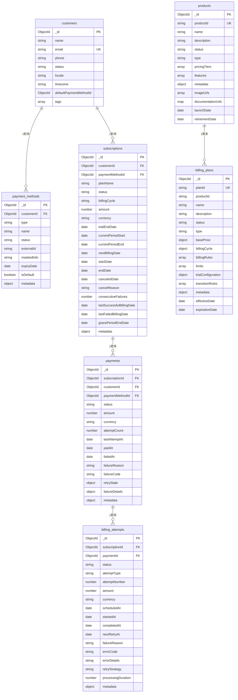

# 資料庫架構設計 (Database Schema Design)

本文件已對齊現行程式碼的「正規化」資料模型設計：
- 使用 customers 取代 accounts
- 支付方式、計費嘗試、計費方案為獨立集合：payment_methods、billing_attempts、billing_plans
- products 與 billing_plans 分離（不再內嵌）
- promotions、refunds 暫列為 Roadmap（尚未實作於程式碼）

## 1. 設計原則

### 1.1 MongoDB 設計準則
- 文檔導向：充分利用 MongoDB 的文檔結構優勢
- 適度反正規化：在讀多於寫、且資料量可控處嵌入快取
- 嵌入 vs 引用：依查詢模式與資料膨脹風險取捨
- 索引策略：針對高頻關鍵查詢建立複合索引

### 1.2 資料一致性策略
- 單文檔 ACID：優先利用單文檔原子性
- 多文檔事務：跨集合的關鍵流程使用交易
- 最終一致性：非關鍵衍生資料採用
- 樂觀鎖：必要時以版本欄位或條件更新避免覆寫

## 2. 核心集合關係圖



備註：promotions、refunds 為 Roadmap，暫不列入現行 ER 圖。

## 3. 集合設計（對齊現行程式碼）

### 3.1 客戶集合（customers）

```typescript
interface CustomerDocument {
  _id: ObjectId;
  name: string;
  email: string;
  phone?: string;
  status: CustomerStatus;
  defaultPaymentMethodId: ObjectId | null;
  notes?: string;
  tags: string[];
  locale: string;
  timezone: string;
}
```

建議索引：
```javascript
db.customers.createIndex({ email: 1 }, { unique: true })
db.customers.createIndex({ status: 1 })
```

### 3.2 支付方式集合（payment_methods）

```typescript
interface PaymentMethodDocument {
  _id: ObjectId;
  customerId: ObjectId;
  type: PaymentMethodType;
  name: string;
  status: PaymentMethodStatus;
  externalId?: string;
  maskedInfo?: string;
  expiryDate?: Date;
  isDefault: boolean;
  metadata: Record<string, any>;
}
```

建議索引：
```javascript
db.payment_methods.createIndex({ customerId: 1, isDefault: 1 })
db.payment_methods.createIndex({ customerId: 1, status: 1 })
```

### 3.3 訂閱集合（subscriptions）

```typescript
interface SubscriptionDocument {
  _id: ObjectId;
  customerId: ObjectId;
  paymentMethodId: ObjectId;
  planName: string;
  status: SubscriptionStatus;
  billingCycle: BillingCycle; // 枚舉
  amount: number;             // 以「分」為單位
  currency: string;
  trialEndDate?: Date;
  currentPeriodStart: Date;
  currentPeriodEnd: Date;
  nextBillingDate: Date;
  startDate: Date;
  endDate?: Date;
  canceledDate?: Date;
  cancelReason?: string;
  consecutiveFailures: number;
  lastSuccessfulBillingDate?: Date;
  lastFailedBillingDate?: Date;
  gracePeriodEndDate?: Date;
  description?: string;
  metadata: Record<string, any>;
}
```

建議索引：
```javascript
db.subscriptions.createIndex({ customerId: 1, status: 1 })
db.subscriptions.createIndex({ nextBillingDate: 1, status: 1 })
```

### 3.4 支付集合（payments）

```typescript
interface PaymentDocument {
  _id: ObjectId;
  subscriptionId: ObjectId;
  customerId: ObjectId;
  paymentMethodId: ObjectId;
  status: PaymentStatus;
  amount: number; // 以「分」為單位
  currency: string;
  description?: string;
  externalTransactionId?: string;
  billingPeriodStart: Date;
  billingPeriodEnd: Date;
  attemptCount: number;
  lastAttemptAt?: Date;
  paidAt?: Date;
  failedAt?: Date;
  failureReason?: string;
  failureCode?: string;
  refundedAt?: Date;
  refundedAmount?: number;
  refundReason?: string;
  invoiceNumber?: string;
  receiptNumber?: string;
  metadata: Record<string, any>;
  failureDetails?: {
    errorCode?: string;
    errorMessage?: string;
    providerErrorCode?: string;
    providerErrorMessage?: string;
    category: number; // PaymentFailureCategory
    isRetriable: boolean;
    failedAt: Date;
    metadata?: Record<string, any>;
  };
  retryState?: {
    attemptNumber: number;
    maxRetries: number;
    nextRetryAt?: Date;
    lastFailureReason?: string;
    failureCategory?: number; // PaymentFailureCategory
    retryStrategy: string;
  };
}
```

建議索引：
```javascript
db.payments.createIndex({ subscriptionId: 1, createdAt: -1 })
db.payments.createIndex({ customerId: 1, status: 1 })
db.payments.createIndex({ 'retryState.nextRetryAt': 1 }, { sparse: true })
```

### 3.5 計費嘗試集合（billing_attempts）

```typescript
interface BillingAttemptDocument {
  _id: ObjectId;
  subscriptionId: ObjectId;
  paymentId: ObjectId | null;
  status: BillingAttemptStatus;
  attemptType: BillingAttemptType;
  attemptNumber: number;
  amount: number;
  currency: string;
  scheduledAt: Date;
  startedAt?: Date;
  completedAt?: Date;
  nextRetryAt?: Date;
  failureReason?: string;
  errorCode?: string;
  errorDetails?: string;
  retryStrategy?: RetryStrategy;
  processingDuration?: number;
  metadata: Record<string, any>;
}
```

建議索引：
```javascript
db.billing_attempts.createIndex({ subscriptionId: 1, scheduledAt: 1 })
db.billing_attempts.createIndex({ paymentId: 1 })
```

### 3.6 產品集合（products）

```typescript
interface ProductDocument {
  _id: ObjectId;
  productId: string; // unique
  name: string;
  description: string;
  status: ProductStatus;
  type: ProductType;
  pricingTiers: any[]; // 對應程式碼 IProductDocument.pricingTiers
  features: any[];     // 對應程式碼 IProductDocument.features
  metadata: any;       // 對應程式碼 IProductDocument.metadata
  imageUrls: string[];
  documentationUrls: Record<string, string>;
  launchDate?: Date;
  retirementDate?: Date;
  version: string;
  createdAt: Date;
  updatedAt: Date;
}
```

已實作索引（程式碼中）：
```javascript
// ProductModel
{ status: 1, type: 1 }
{ 'metadata.category': 1, status: 1 }
{ 'metadata.supportedRegions': 1, status: 1 }
```

### 3.7 計費方案集合（billing_plans）

```typescript
interface BillingPlanDocument {
  _id: ObjectId;
  planId: string;   // unique
  productId: string;
  name: string;
  description: string;
  status: PlanStatus;
  type: PlanType;
  basePrice: { amount: number; currency: string }; // 預設 TWD
  billingCycle: { type: BillingCycle; intervalDays?: number; billingDay?: number };
  billingRules: any[];        // 對應程式碼 schema
  limits: any[];              // 對應程式碼 schema
  trialConfiguration?: any;   // 對應程式碼 schema
  transitionRules: any[];     // 對應程式碼 schema
  metadata: any;              // 對應程式碼 schema
  effectiveDate?: Date;
  expirationDate?: Date;
  createdAt: Date;
  updatedAt: Date;
}
```

已實作索引（程式碼中）：
```javascript
// BillingPlanModel
{ productId: 1, status: 1 }
{ status: 1, type: 1 }
{ 'metadata.supportedRegions': 1, status: 1 }
{ effectiveDate: 1, expirationDate: 1 }
```

### 3.8 Roadmap：promotions、refunds
- 文件中原有設計，現階段未落地於程式碼
- 保留作為後續擴展之參考與規格草案

## 4. 查詢模式與範例

### 4.1 常用查詢

```javascript
// 1) 查詢待計費的訂閱（對齊現行欄位）
db.subscriptions.find({
  status: 'ACTIVE',
  nextBillingDate: {
    $lte: new Date(),
    $gte: new Date(Date.now() - 24 * 60 * 60 * 1000)
  }
}).hint({ nextBillingDate: 1, status: 1 })

// 2) 查詢需要重試的支付（對齊 retryState 結構）
db.payments.find({
  status: 'FAILED',
  'retryState.nextRetryAt': { $lte: new Date() },
  'retryState.attemptNumber': { $lt: '$retryState.maxRetries' }
})

// 3) 查詢客戶的有效訂閱
db.subscriptions.find({
  customerId: ObjectId('...'),
  status: { $in: ['ACTIVE', 'GRACE_PERIOD'] }
}).sort({ currentPeriodStart: -1 })
```

### 4.2 聚合查詢

```javascript
// 計費嘗試失敗分析（以 billing_attempts 為主）
db.billing_attempts.aggregate([
  { $match: { status: 'FAILED', scheduledAt: { $gte: new Date(Date.now() - 30*24*60*60*1000) } } },
  { $group: { _id: '$errorCode', count: { $sum: 1 }, avgAttemptNo: { $avg: '$attemptNumber' } } },
  { $sort: { count: -1 } }
])
```

## 5. 交易、分片與維運

### 5.1 多文檔事務示例

```typescript
class SubscriptionService {
  async createSubscriptionWithPayment(subscriptionData: CreateSubscriptionData, paymentData: CreatePaymentData): Promise<void> {
    const session = await mongoose.startSession();
    try {
      await session.withTransaction(async () => {
        // 建立訂閱
        const subscription = await Subscription.create([subscriptionData], { session });

        // 建立支付紀錄
        paymentData.subscriptionId = subscription[0]._id;
        paymentData.customerId = subscriptionData.customerId;
        await Payment.create([paymentData], { session });

        // （選擇性）更新客戶統計
        await Customer.updateOne(
          { _id: subscriptionData.customerId },
          { $set: { updatedAt: new Date() } },
          { session }
        );
      });
    } finally {
      await session.endSession();
    }
  }
}
```

### 5.2 分片策略（Sharding）

```javascript
// 訂閱集合：以 customerId 為分片鍵（hashed）
sh.shardCollection('billing.subscriptions', { customerId: 'hashed' })

// 支付集合：以時間/訂閱維度查詢為主
sh.shardCollection('billing.payments', { createdAt: 1, subscriptionId: 1 })
```

### 5.3 備份與恢復（沿用原建議）

```bash
mongodump --host=replica-set/host1:27017,host2:27017,host3:27017 \
          --db=billing \
          --out=/backup/$(date +%Y%m%d)

mongodump --host=replica-set/host1:27017,host2:27017,host3:27017 \
          --oplog \
          --out=/backup/incremental/$(date +%Y%m%d_%H%M)

mongorestore --host=localhost:27017 \
             --db=billing \
             --oplogReplay \
             /backup/20241201/billing
```

## 6. 資料驗證與清理（對齊欄位命名）

```typescript
class DataConsistencyChecker {
  async checkOrphanedPayments(): Promise<ValidationResult[]> {
    const results: ValidationResult[] = [];
    const orphanedPayments = await db.collection('payments')
      .aggregate([
        { $lookup: { from: 'subscriptions', localField: 'subscriptionId', foreignField: '_id', as: 'subscription' } },
        { $match: { subscription: { $size: 0 } } }
      ]).toArray();

    if (orphanedPayments.length > 0) {
      results.push({
        type: 'ORPHANED_PAYMENTS',
        count: orphanedPayments.length,
        severity: 'ERROR',
        description: 'Found payments without corresponding subscriptions'
      });
    }
    return results;
  }

  async checkSubscriptionStates(): Promise<ValidationResult[]> {
    const inconsistentSubscriptions = await db.collection('subscriptions')
      .find({
        $or: [
          { status: 'ACTIVE', nextBillingDate: { $exists: false } },
          { status: 'EXPIRED', currentPeriodEnd: { $gt: new Date() } }
        ]
      }).toArray();

    return inconsistentSubscriptions.map(sub => ({
      type: 'INCONSISTENT_STATE',
      entityId: sub._id.toString(),
      severity: 'WARNING',
      description: `Subscription ${sub._id.toString()} has inconsistent state`
    }));
  }
}
```

---

本文已全面對齊現行程式碼的集合與欄位，並保留 promotions、refunds 為 Roadmap。後續若擴充至原文件之嵌入式設計，需伴隨資料遷移與查詢改寫評估。
