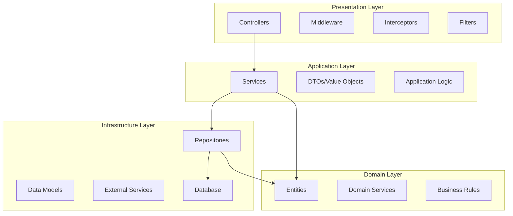
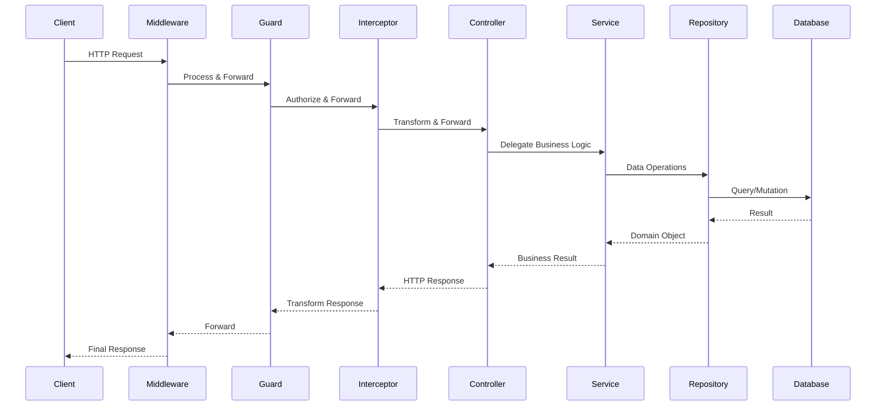

# 自動扣款系統 - 技術實作指南

## 1. 現有程式碼架構分析

### 1.1 專案整體結構

```
auto-payment-sample/
├── src/                          # 主要應用程式碼
│   ├── main.ts                   # 應用程式進入點
│   ├── app.module.ts             # 根模組定義
│   ├── app.controller.ts         # 根控制器
│   ├── app.service.ts            # 根服務
│   ├── app-components/           # 應用程式層元件
│   │   ├── app.initial.ts        # 應用程式初始化
│   │   ├── app-exception.filter.ts  # 全域異常過濾器
│   │   ├── app-tracer.middleware.ts # 請求追蹤中介軟體
│   │   └── single-upload-file.interceptor.ts # 檔案上傳攔截器
│   ├── controllers/              # 控制器層
│   │   └── exemple.controller.ts # 範例控制器
│   ├── domain/                   # 領域層
│   │   ├── entities/             # 實體定義
│   │   │   ├── base-entity.abstract.ts
│   │   │   └── example.entity.ts
│   │   └── value-objects/        # 值物件
│   │       └── create-example.request.ts
│   └── infra/                    # 基礎設施層
│       ├── models/               # 資料模型
│       │   ├── base-model.interface.ts
│       │   ├── example.model.ts
│       │   └── models.definition.ts
│       └── repositories/         # 資料庫存取層
│           └── example.repository.ts
├── libs/                         # 共用函式庫
│   ├── common/                   # 通用服務模組
│   │   └── src/
│   │       ├── common.module.ts  # 通用模組定義
│   │       ├── common.service.ts # 通用服務
│   │       ├── err.*.ts         # 錯誤處理相關
│   │       ├── clients/         # 客戶端提供者
│   │       └── components/      # 可重用元件
│   └── conf/                     # 配置管理模組
│       └── src/
│           ├── conf.module.ts   # 配置模組
│           ├── conf.service.ts  # 配置服務
│           └── conf.present.ts  # 配置呈現層
└── test/                        # 測試檔案
    ├── __helpers__/             # 測試輔助工具
    │   ├── app.helper.ts       # 應用程式測試輔助
    │   ├── e2e-global-setup.ts # E2E 測試全域設定
    │   └── mongo.helper.ts     # MongoDB 測試輔助
    ├── __upload-files__/       # 測試檔案資源
    └── *.e2e-spec.ts          # E2E 測試檔案
```

### 1.2 技術棧分析

#### 核心框架
- **NestJS 10.x**: 基於 TypeScript 的 Node.js 後端框架
- **MongoDB**: NoSQL 文檔資料庫，使用 MongoDB Driver 6.16.0
- **Express**: HTTP 伺服器框架（NestJS 預設平台）

#### 開發工具與函式庫
- **TypeScript**: 強型別 JavaScript 超集
- **class-transformer & class-validator**: 物件轉換與驗證
- **Jest**: 單元測試與 E2E 測試框架
- **ESLint & Prettier**: 程式碼品質與格式化工具
- **dotenv**: 環境變數管理

#### 自訂函式庫
- **@xxxhand/app-common**: 應用程式通用工具庫
- **@myapp/common**: 專案內部通用模組
- **@myapp/conf**: 配置管理模組

### 1.3 分層架構設計

#### 1.3.1 Domain-Driven Design (DDD) 分層



#### 1.3.2 現有實現分析

**表現層 (Presentation Layer)**
- `src/controllers/`: HTTP 請求處理
- `src/app-components/`: 中介軟體、過濾器、攔截器
- 使用 NestJS 裝飾器進行路由與驗證

**應用層 (Application Layer)**  
- `src/app.service.ts`: 應用邏輯協調
- `src/domain/value-objects/`: 請求/回應 DTO
- 目前實現較為簡化，缺乏複雜業務邏輯

**領域層 (Domain Layer)**
- `src/domain/entities/`: 業務實體定義
- 使用抽象基類 `BaseEntity` 提供共同屬性
- 目前僅有範例實體，需要擴展為完整的自動扣款領域模型

**基礎設施層 (Infrastructure Layer)**
- `src/infra/repositories/`: 資料持久化
- `src/infra/models/`: MongoDB 資料模型
- 使用 Repository 模式分離資料存取邏輯

## 2. NestJS 框架特性與模式

### 2.1 模組化架構

#### 根模組 (`AppModule`)
```typescript
@Module({
  imports: [CommonModule],           // 匯入共用模組
  controllers: [AppController, ExampleController],
  providers: [AppService, ExampleRepository],
})
export class AppModule implements NestModule, OnApplicationBootstrap {
  // 配置中介軟體
  configure(consumer: MiddlewareConsumer) {
    consumer.apply(AppTracerMiddleware).forRoutes('*');
  }
  
  // 應用程式生命週期鉤子
  async onApplicationBootstrap() {}
  async beforeApplicationShutdown(signal?: string) {
    this.cmmService.releaseResources();
  }
}
```

#### 共用模組 (`CommonModule`)
- 使用 `@Global()` 裝飾器，讓全域可用
- 提供 MongoDB 連接、HTTP 客戶端、翻譯服務
- 實現工廠模式進行依賴注入

### 2.2 依賴注入系統

#### 提供者註冊模式
```typescript
// 工廠提供者範例
{
  provide: DEFAULT_MONGO,
  useFactory: async (confService: ConfService): Promise<CustomMongoClient> => {
    const client = new CustomMongoClient(uri, options);
    await client.tryConnect();
    return client;
  },
  inject: [ConfService],
}
```

#### 注入代理模式
```typescript
// 在服務中注入
constructor(
  @Inject(DEFAULT_MONGO) private readonly mongoClient: CustomMongoClient,
  private readonly cmmService: CommonService,
) {}
```

### 2.3 請求處理流程



## 3. 資料層架構

### 3.1 MongoDB 整合

#### 連接管理
- 使用 `CustomMongoClient` 封裝原生 MongoDB Driver
- 連接池配置：`minPoolSize`, `maxPoolSize`, `connectTimeout`
- 支援認證與資料庫選擇

#### 資料模型設計
```typescript
// 基礎模型介面
export interface IBaseModel {
  createdAt?: Date;
  updatedAt?: Date;
}

// 業務模型擴展
export interface IExampleModel extends IBaseModel {
  name: string;
  callbackUrl: string;
}

// 文檔型別定義
export type IExampleDocument = WithId<IExampleModel>;
```

### 3.2 Repository 模式

#### 實現結構
```typescript
@Injectable()
export class ExampleRepository {
  constructor(@Inject(DEFAULT_MONGO) private readonly mongoClient: CustomMongoClient) {}

  async save(entity: ExampleEntity): Promise<ExampleEntity | undefined> {
    // 新增邏輯
    if (!entity.id) {
      const doc = this.entityToDocument(entity);
      const result = await collection.insertOne(doc);
      entity.id = result.insertedId.toHexString();
    }
    return entity;
  }

  async findOneByName(name: string): Promise<ExampleEntity | undefined> {
    const collection = this.mongoClient.getCollection(modelNames.EXAMPLE);
    const doc = await collection.findOne({ name });
    return doc ? this.documentToEntity(doc) : undefined;
  }
}
```

#### 資料轉換機制
- 使用 `plainToInstance` 進行 DTO 轉換
- MongoDB ObjectId 與字串 ID 轉換
- 實體與文檔之間的雙向對應

## 4. 錯誤處理與日誌系統

### 4.1 統一異常處理

#### 自訂異常類別
```typescript
export class ErrException extends Error {
  public static newFromCodeName(codeName: string): ErrException {
    const errInfo = errCodes[codeName];
    return new ErrException(errInfo.name, errInfo.code, errInfo.message);
  }
}
```

#### 全域異常過濾器
```typescript
@Catch()
export class AppExceptionFilter implements ExceptionFilter {
  catch(exception: unknown, host: ArgumentsHost) {
    // 統一錯誤回應格式
    // 日誌記錄
    // HTTP 狀態碼對應
  }
}
```

### 4.2 日誌與追蹤

#### 請求追蹤中介軟體
```typescript
export class AppTracerMiddleware implements NestMiddleware {
  use(req: Request, res: Response, next: NextFunction) {
    // 產生請求 ID
    // 記錄請求開始
    // 設定回應追蹤
    next();
  }
}
```

#### 結構化日誌
- 使用 Pino 高效能日誌框架
- 支援多層級日誌輸出
- 整合請求追蹤資訊

## 5. 測試架構

### 5.1 測試輔助工具

#### 應用程式測試輔助
```typescript
export class AppHelper {
  private static _app?: INestApplication;
  private static _agent?: superTest.SuperAgentTest;

  static async getAgent(): Promise<superTest.SuperAgentTest> {
    if (!this._agent) {
      const moduleFixture = await Test.createTestingModule({
        imports: [AppModule],
      }).compile();
      
      this._app = moduleFixture.createNestApplication();
      runInitial(this._app);
      await this._app.init();
      this._agent = superTest.agent(this._app.getHttpServer());
    }
    return this._agent;
  }
}
```

#### Mock 支援
- 支援依賴注入層級的 Mock
- `getAgentWithMockers()` 方法覆寫提供者
- 測試隔離與清理機制

### 5.2 E2E 測試策略

#### 測試結構
```
test/
├── __helpers__/           # 測試輔助工具
├── __upload-files__/      # 測試資源檔案
├── *.e2e-spec.ts         # 端對端測試
└── jest-e2e.json         # E2E 測試配置
```

#### 測試模式
- HTTP API 完整流程測試
- 資料庫操作驗證
- 檔案上傳功能測試
- 錯誤情境覆蓋

## 6. 配置管理

### 6.1 環境變數系統

#### 配置載入機制
```typescript
// main.ts
import * as dotenv from 'dotenv';
import { expand } from 'dotenv-expand';

expand({ parsed: dotenv.config().parsed });
```

#### 型別化配置
```typescript
export interface IConf {
  port: number;
  defaultApiRouterPrefix: string;
  defaultMongo: {
    uri: string;
    dbName: string;
    user: string;
    password: string;
    minPoolSize: number;
    maxPoolSize: number;
    connectTimeout: number;
  };
}
```

### 6.2 配置模組化

- `libs/conf/`: 獨立配置模組
- 支援環境變數展開（`${VAR}` 語法）
- 全域配置服務注入

#### 完整配置結構
```typescript
export interface IConf {
  port: number;
  domain: string;
  defaultApiRouterPrefix: string;
  defaultUploadTmpDir: string;
  defaultUploadMaxSize: number;
  defaultLoggerPath: string;
  localesPath: string;
  fallbackLocale: string;
  defaultMongo: {
    uri: string;
    minPoolSize: number;
    maxPoolSize: number;
    connectTimeout: number;
    dbName: string;
    user: string;
    password: string;
  };
}
```

#### 環境變數對應表
| 設定項目 | 環境變數 | 預設值 | 說明 |
|---------|---------|--------|------|
| 服務埠號 | `PORT` | - | HTTP 服務監聽埠號 |
| API 前綴 | `DEFAULT_API_ROUTER_PREFIX` | - | RESTful API 路由前綴 |
| MongoDB URI | `DEFAULT_MONGO_URI` | - | 資料庫連接字串 |
| 資料庫名稱 | `DEFAULT_MONGO_DB_NAME` | - | MongoDB 資料庫名稱 |
| 連接池最小 | `DEFAULT_MONGO_MIN_POOL` | - | 最小連接數 |
| 連接池最大 | `DEFAULT_MONGO_MAX_POOL` | - | 最大連接數 |
| 上傳暫存目錄 | `DEFAULT_UPLOAD_TEMP_DIR` | - | 檔案上傳暫存路徑 |
| 日誌路徑 | `DEFAULT_LOGGER_PATH` | - | 應用程式日誌檔案路徑 |

## 7. 容器化與部署

### 7.1 Docker 容器配置

#### 多階段建置 Dockerfile
```dockerfile
# 建置階段
FROM node:jod-slim AS builder
ENV NODE_ENV=build
WORKDIR /home/app
COPY package.json yarn.lock ./
RUN yarn install --frozen-lockfile
COPY . .
RUN yarn build

# 生產階段
FROM node:jod-slim
ENV NODE_ENV=production
WORKDIR /home/app
# 複製建置結果與必要檔案
COPY --from=builder /home/app/dist/ ./dist/
COPY --from=builder /home/app/node_modules/ ./node_modules/
COPY --from=builder /home/app/resources/ ./resources/
CMD ["yarn", "start:prod"]
```

#### Docker Compose 服務編排
```yaml
services:
  backend:
    build:
      context: .
      dockerfile: Dockerfile
      args:
        - IMAGE_ID=${IMAGE_ID}
    image: ${IMAGE_ID}:${IMAGE_TAG}
    container_name: ${IMAGE_ID}
    volumes:
      - ~/Documents/docker-data/${IMAGE_ID}/log:/var/log/${IMAGE_ID}/log
    env_file:
      - .env
```

### 7.2 日誌輪替機制

#### Logrotate 配置
- 整合系統級日誌輪替
- 自動清理過期日誌檔案
- 支援日誌壓縮與封存

```bash
# logrotate.conf
/var/log/backend/*.log {
    daily
    rotate 7
    compress
    missingok
    notifempty
}
```

### 7.3 生產環境最佳實踐

1. **資源限制**: 設定容器記憶體與 CPU 限制
2. **健康檢查**: 實作應用程式健康檢查端點
3. **監控整合**: 整合 Prometheus/Grafana 監控
4. **備份策略**: MongoDB 自動備份與還原機制

## 8. 第二階段實作準備建議

### 8.1 現有架構優勢

1. **清晰的分層架構**: DDD 分層設計為業務邏輯擴展提供良好基礎
2. **完善的基礎設施**: MongoDB、日誌、錯誤處理已就緒
3. **模組化設計**: NestJS 模組系統支援功能擴展
4. **測試框架**: E2E 測試輔助工具已建立
5. **型別安全**: TypeScript 強型別提供開發時錯誤檢查

### 8.2 需要擴展的領域

1. **領域模型**: 需要建立完整的自動扣款業務實體
2. **業務服務**: 缺乏複雜業務邏輯處理層
3. **排程系統**: 需要整合 Bull Queue 或類似排程框架
4. **支付整合**: 需要第三方支付服務介接
5. **狀態管理**: 需要實現訂閱狀態機制

### 8.3 建議實作順序

1. **第一優先**: 擴展領域模型（Subscription, Customer, Payment 實體）
2. **第二優先**: 建立業務服務層（SubscriptionService, BillingService）
3. **第三優先**: 實作資料庫 Schema 與 Repository
4. **第四優先**: 開發 RESTful API 端點
5. **第五優先**: 整合排程作業系統
6. **第六優先**: 實作支付閘道整合

## 9. 開發環境與工具

### 9.1 開發指令

```bash
# 開發模式
npm run start:dev

# 建置專案
npm run build

# 執行測試
npm run test
npm run test:e2e

# 程式碼品質
npm run lint
npm run format
```

### 9.2 專案配置檔案

- `nest-cli.json`: NestJS CLI 配置
- `tsconfig.json`: TypeScript 編譯配置  
- `package.json`: 專案依賴與腳本
- `jest-global-setup.ts`: 測試全域設定

### 9.3 推薦開發工具

- **VS Code**: 推薦 IDE 與擴展
  - NestJS Snippets
  - TypeScript Hero
  - MongoDB for VS Code
- **Postman/Insomnia**: API 測試工具
- **MongoDB Compass**: 資料庫管理工具
- **Docker Desktop**: 容器化開發與部署

## 10. 程式碼品質與最佳實踐

### 10.1 TypeScript 配置最佳化

#### 編譯器選項
```typescript
// tsconfig.json 關鍵設定
{
  "compilerOptions": {
    "strict": true,                    // 啟用嚴格模式
    "noImplicitAny": true,            // 禁止隱式 any 型別
    "strictNullChecks": true,         // 嚴格 null 檢查
    "noImplicitReturns": true,        // 禁止隱式返回
    "experimentalDecorators": true,   // 支援裝飾器語法
    "emitDecoratorMetadata": true     // 發出裝飾器中繼資料
  }
}
```

### 10.2 程式碼組織原則

#### 檔案命名規範
- **Entities**: `*.entity.ts` (例: `subscription.entity.ts`)
- **Services**: `*.service.ts` (例: `billing.service.ts`)
- **Controllers**: `*.controller.ts` (例: `subscription.controller.ts`)
- **Repositories**: `*.repository.ts` (例: `payment.repository.ts`)
- **Models**: `*.model.ts` (例: `subscription.model.ts`)
- **DTOs**: `*.dto.ts` 或 `*.request.ts`/`*.response.ts`

#### 模組劃分策略
```typescript
// 功能模組範例
@Module({
  imports: [
    // 外部模組依賴
    CommonModule,
    ConfigModule,
  ],
  controllers: [
    // 對外 API 介面
    SubscriptionController,
    BillingController,
  ],
  providers: [
    // 業務邏輯服務
    SubscriptionService,
    BillingService,
    // 資料存取層
    SubscriptionRepository,
    PaymentRepository,
  ],
  exports: [
    // 對外提供的服務
    SubscriptionService,
  ],
})
export class SubscriptionModule {}
```

### 10.3 錯誤處理最佳實踐

#### 業務異常定義
```typescript
// 自動扣款專屬錯誤碼
export const AUTO_PAYMENT_ERRORS = {
  SUBSCRIPTION_NOT_FOUND: {
    code: 'SUB_001',
    message: 'Subscription not found',
    httpStatus: 404,
  },
  PAYMENT_METHOD_INVALID: {
    code: 'PAY_001', 
    message: 'Invalid payment method',
    httpStatus: 400,
  },
  BILLING_CYCLE_ERROR: {
    code: 'BIL_001',
    message: 'Billing cycle calculation error',
    httpStatus: 500,
  },
};
```

#### 統一回應格式
```typescript
// 成功回應
export interface ISuccessResponse<T = any> {
  success: true;
  data: T;
  message?: string;
  timestamp: string;
}

// 錯誤回應
export interface IErrorResponse {
  success: false;
  error: {
    code: string;
    message: string;
    details?: any;
  };
  timestamp: string;
}
```

### 10.4 測試組織策略

#### 單元測試結構
```typescript
describe('SubscriptionService', () => {
  let service: SubscriptionService;
  let repository: SubscriptionRepository;

  beforeEach(async () => {
    const module = await Test.createTestingModule({
      providers: [
        SubscriptionService,
        {
          provide: SubscriptionRepository,
          useValue: createMock<SubscriptionRepository>(),
        },
      ],
    }).compile();

    service = module.get<SubscriptionService>(SubscriptionService);
    repository = module.get<SubscriptionRepository>(SubscriptionRepository);
  });

  describe('createSubscription', () => {
    it('should create subscription successfully', async () => {
      // Arrange
      const createDto = { /* test data */ };
      const expectedResult = { /* expected result */ };
      
      jest.spyOn(repository, 'save').mockResolvedValue(expectedResult);

      // Act
      const result = await service.createSubscription(createDto);

      // Assert
      expect(result).toEqual(expectedResult);
      expect(repository.save).toHaveBeenCalledWith(expect.any(Object));
    });
  });
});
```

#### 整合測試範例
```typescript
describe('SubscriptionController (Integration)', () => {
  let app: INestApplication;

  beforeAll(async () => {
    const moduleFixture = await Test.createTestingModule({
      imports: [AppModule],
    })
    .overrideProvider(SubscriptionRepository)
    .useValue(mockRepository)
    .compile();

    app = moduleFixture.createNestApplication();
    await app.init();
  });

  it('/subscriptions (POST)', () => {
    return request(app.getHttpServer())
      .post('/subscriptions')
      .send(testSubscriptionData)
      .expect(201)
      .expect((res) => {
        expect(res.body.success).toBe(true);
        expect(res.body.data).toHaveProperty('id');
      });
  });
});
```

## 結論

現有的程式碼架構採用 NestJS + MongoDB + DDD 設計模式，提供了堅實的基礎建設。架構分層清晰，模組化程度高，具備良好的擴展性。第二階段實作可以在此基礎上，專注於業務邏輯的實現，而無需重建基礎架構。

### 架構優勢總結

1. **企業級框架**: NestJS 提供完整的企業應用開發框架
2. **型別安全**: TypeScript 強型別系統確保程式碼品質
3. **分層清晰**: DDD 分層架構支援複雜業務邏輯
4. **測試完備**: E2E 和單元測試框架已就緒
5. **容器化**: Docker 支援一致的開發與部署環境
6. **配置彈性**: 環境變數系統支援多環境部署

### 實作路線圖

#### Phase 1: 核心領域建立 (1-2 週)
- [ ] 建立完整的領域實體 (Subscription, Customer, Payment)
- [ ] 設計資料庫 Schema 與索引策略
- [ ] 實作基礎的 Repository 層

#### Phase 2: 業務邏輯實現 (2-3 週)  
- [ ] 開發訂閱管理服務
- [ ] 實作計費邏輯與狀態機
- [ ] 建立支付處理流程

#### Phase 3: API 層完善 (1-2 週)
- [ ] 設計 RESTful API 端點
- [ ] 實作請求驗證與回應格式
- [ ] 完善錯誤處理機制

#### Phase 4: 排程系統整合 (2-3 週)
- [ ] 整合 Bull Queue 排程框架
- [ ] 實作每日計費作業
- [ ] 建立智能重試機制

#### Phase 5: 外部整合 (1-2 週)
- [ ] 整合第三方支付閘道
- [ ] 實作 Webhook 處理
- [ ] 建立通知系統

#### Phase 6: 測試與優化 (1-2 週)
- [ ] 完善單元測試與整合測試  
- [ ] 效能測試與調優
- [ ] 生產環境部署準備

### 關鍵技術決策

1. **資料一致性**: 使用 MongoDB 事務確保資料完整性
2. **併發控制**: 實作樂觀鎖定機制避免競爭條件
3. **可觀測性**: 整合日誌、指標與分散式追蹤
4. **容錯設計**: 實作斷路器模式與重試策略
5. **安全機制**: API 認證、授權與輸入驗證

透過這份技術分析與實作指南，開發團隊可以：
- **快速上手**: 理解現有架構與開發模式
- **避免重工**: 基於現有基礎進行功能擴展  
- **確保品質**: 遵循最佳實踐與程式碼規範
- **提升效率**: 使用完善的開發工具與測試框架

下一步建議立即開始 Phase 1 的核心領域建立，為後續的業務邏輯實作建立堅實的基礎。
