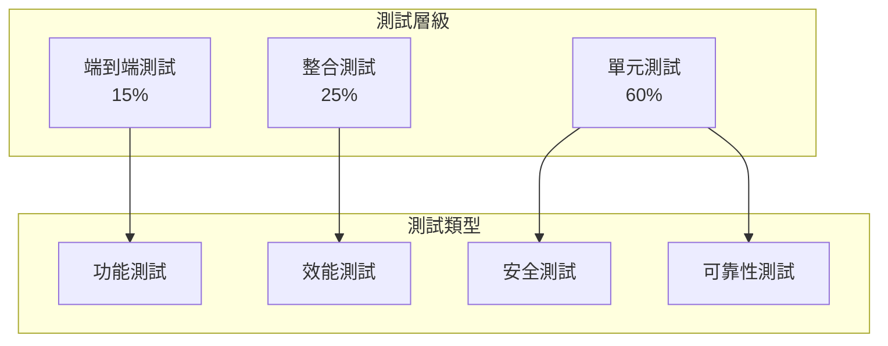
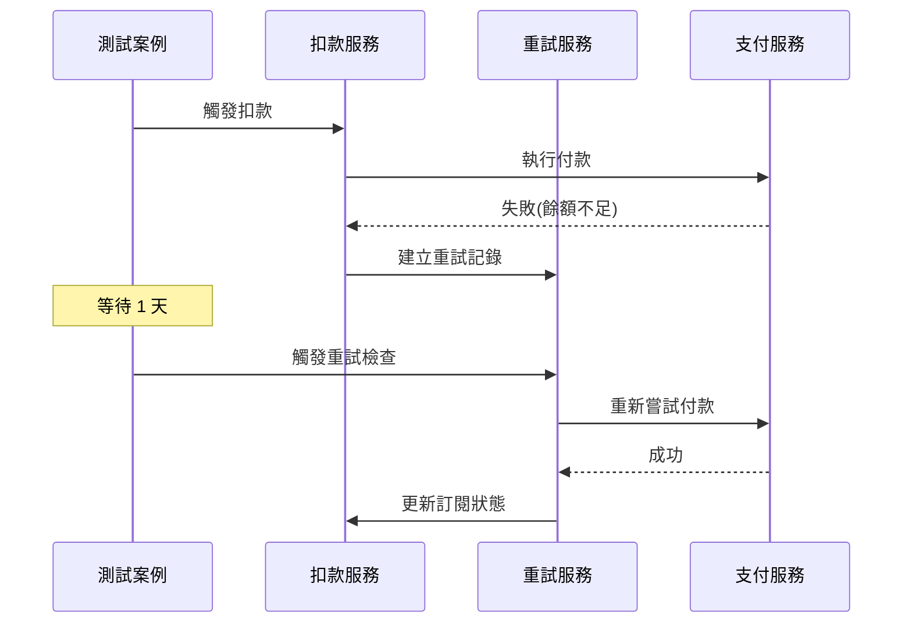
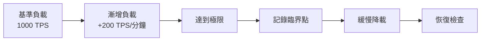
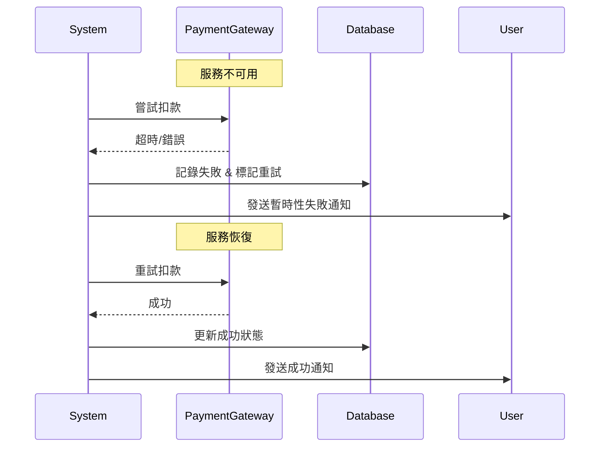

# 測試案例及驗收標準 (Test Cases & Acceptance Criteria)

本文件定義自動扣款系統的完整測試策略、測試案例和驗收標準，確保系統品質和業務需求的滿足。

## 1. 測試策略概覽

### 1.1 測試金字塔

```mermaid
pyramid
    title 測試金字塔結構
```



### 1.2 測試環境策略

| 環境 | 用途 | 資料 | 測試範圍 |
|------|------|------|----------|
| **單元測試** | 開發階段快速驗證 | Mock 資料 | 個別功能模組 |
| **整合測試** | CI/CD 自動化測試 | 測試資料集 | 服務間整合 |
| **系統測試** | 完整功能驗證 | 仿真資料 | 端到端流程 |
| **效能測試** | 負載壓力測試 | 大量模擬資料 | 系統效能限制 |
| **UAT** | 用戶驗收測試 | 脫敏真實資料 | 業務場景驗證 |

## 2. 功能測試案例

### 2.1 訂閱創建測試 (Subscription Creation)

#### TC-SUB-001: 成功創建月費訂閱

**測試目標**：驗證用戶可以成功創建月費訂閱

**前置條件**：
- 用戶已完成註冊和身份驗證
- 支付方式已設定且有效
- 選定的產品方案可用

**測試步驟**：
```gherkin
Given 用戶已登入系統
  And 選擇月費產品方案 "Basic Monthly Plan"
  And 輸入有效的信用卡資訊
When 用戶點擊 "開始訂閱" 按鈕
Then 系統應該執行首次扣款
  And 創建訂閱記錄，狀態為 "ACTIVE"
  And 設定下次扣款日期為下個週期（依 BillingCycleVO 月度規則）
  And 發送訂閱確認 Email
  And 用戶可以立即使用服務
```

**驗收標準**：
- [ ] 訂閱記錄成功創建在資料庫中
- [ ] 首次扣款交易狀態為 `SUCCEEDED`
- [ ] `nextBillingDate` 依 BillingCycleVO 月度規則計算（次月對應日；若無對應日則取月底）
- [ ] `serviceEndDate` 依 BillingCycleVO 計算的期間結束日
- [ ] 確認 Email 已發送到用戶信箱
- [ ] 用戶權限已正確分配

**測試資料**：
```json
{
  "user": {
    "id": "user_test_001",
    "email": "test@example.com"
  },
  "plan": {
    "id": "plan_basic_monthly",
    "price": 299,
    "currency": "TWD",
    "billingCycle": "MONTHLY"
  },
  "paymentMethod": {
    "type": "CREDIT_CARD",
    "last4": "4242",
    "expiry": "12/25"
  }
}
```

#### TC-SUB-002: 帶優惠碼的訂閱創建

**測試目標**：驗證優惠碼正確應用到新訂閱

**測試步驟**：
```typescript
// 測試程式碼範例
describe('訂閱創建 - 優惠碼應用', () => {
  it('應該正確計算首購優惠', async () => {
    // Arrange
    const subscriptionRequest = {
      planId: 'plan_basic_monthly',
      promotionCode: 'FIRST30OFF'
    };
    const expectedDiscount = 0.3; // 30% 折扣

    // Act
    const result = await subscriptionService.createSubscription(subscriptionRequest);

    // Assert
    expect(result.subscription.status).toBe('ACTIVE');
    expect(result.firstPayment.originalAmount).toBe(299);
    expect(result.firstPayment.actualAmount).toBe(209); // 299 * 0.7
    expect(result.firstPayment.discountAmount).toBe(90);
    expect(result.subscription.appliedPromotion?.code).toBe('FIRST30OFF');
    expect(result.subscription.appliedPromotion?.discount).toEqual(
      expect.objectContaining({ type: 'PERCENTAGE', value: 30 })
    );
  });
});
```

### 2.2 自動扣款測試 (Recurring Billing)

#### TC-BILL-001: 正常月費扣款

**測試描述**：驗證系統在正確時間點執行月費扣款

**自動化測試腳本**：
```typescript
describe('自動扣款流程', () => {
  beforeEach(async () => {
    // 設定測試訂閱資料
    await testDb.subscription.create({
      id: 'sub_test_001',
      userId: 'user_test_001',
      planId: 'plan_basic_monthly',
      status: 'ACTIVE',
      nextBillingDate: new Date('2024-02-01T00:00:00Z'),
      currentAmount: 299
    });
    
    // Mock 時間到扣款日
    jest.useFakeTimers();
    jest.setSystemTime(new Date('2024-02-01T01:00:00Z'));
  });

  it('應該在指定日期執行扣款', async () => {
    // Act
    await billingScheduler.processDailyBilling();
    
    // Assert
    const updatedSubscription = await testDb.subscription.findById('sub_test_001');
    expect(updatedSubscription.nextBillingDate).toEqual(
      new Date('2024-03-01T00:00:00Z')
    );
    expect(updatedSubscription.billingCycleCount).toBe(2);
    
    const paymentRecord = await testDb.purchaseHistory.findLatest('sub_test_001');
    expect(paymentRecord.status).toBe('SUCCEEDED');
    expect(paymentRecord.amount).toBe(299);
  });
});
```

#### TC-BILL-002: 扣款失敗處理

**場景覆蓋**：
- 餘額不足
- 卡片過期
- 網路逾時
- 銀行拒絕

**測試矩陣**：
| 失敗原因 | 失敗類型 | 預期重試 | 預期狀態 | 通知類型 |
|----------|----------|----------|----------|----------|
| 餘額不足 | DELAYED_RETRY | 1天後 | GRACE_PERIOD | 餘額提醒 |
| 卡片過期 | DELAYED_RETRY | 3天後 | GRACE_PERIOD | 更新卡片 |
| 網路逾時 | RETRIABLE | 5分鐘後 | RETRY | 無 |
| 銀行拒絕 | NON_RETRIABLE | 不重試 | EXPIRED | 聯繫客服 |

### 2.3 智能重試測試 (Smart Retry)

#### TC-RETRY-001: 重試機制正確性

**測試場景**：餘額不足的智能重試



**驗證點**：
```typescript
it('餘額不足後重試成功', async () => {
  // 1. 模擬初始扣款失敗
  const failureResult = await billingService.processPayment('sub_001');
  expect(failureResult.status).toBe('FAILED');
  
  // 2. 確認重試記錄創建
  const retryLog = await testDb.paymentRetryLog.findBySubscription('sub_001');
  expect(retryLog.failureCategory).toBe('DELAYED_RETRY');
  expect(retryLog.nextRetryDate).toBeAfter(new Date());
  
  // 3. 模擬時間前進到重試時間
  jest.advanceTimersByTime(24 * 60 * 60 * 1000); // 1天
  
  // 4. 執行重試並驗證成功
  const retryResult = await retryService.processScheduledRetries();
  expect(retryResult.successful).toContain('sub_001');
  
  const subscription = await testDb.subscription.findById('sub_001');
  expect(subscription.status).toBe('ACTIVE');
  expect(subscription.retryCount).toBe(0); // 重置重試計數
});
```

### 2.4 方案轉換測試 (Plan Change)

#### TC-CHANGE-001: 立即升級測試

**業務需求**：用戶從基本方案立即升級到專業方案

**測試資料設定**：
```json
{
  "currentPlan": {
    "id": "basic_monthly",
    "price": 299,
    "remainingDays": 20
  },
  "targetPlan": {
    "id": "pro_monthly",
    "price": 599
  },
  "expectedProration": 200  // (599-299) * 20/30
}
```

**測試執行**：
```typescript
describe('方案升級', () => {
  it('應該正確計算並執行補款', async () => {
    // Arrange
    const changeRequest = {
      subscriptionId: 'sub_001',
      newPlanId: 'pro_monthly',
      effectiveType: 'IMMEDIATE'
    };
    
    // Act
    const result = await planChangeService.changePlan(changeRequest);
    
    // Assert
    expect(result.prorationAmount).toBe(200);
    expect(result.prorationPayment.status).toBe('SUCCEEDED');
    expect(result.subscription.currentPlanId).toBe('pro_monthly');
    
    // 驗證歷史記錄（方案變更狀態仍為 COMPLETED）
    const changeHistory = await testDb.planChangeHistory.findLatest('sub_001');
    expect(changeHistory.effectiveDate).toBeCloseTo(new Date(), 1000);
    expect(changeHistory.status).toBe('COMPLETED');
  });
});
```

### 2.5 優惠管理測試 (Promotions)

#### TC-PROM-001: 驗證優惠碼成功
- 前置條件：有效期間、符合產品/方案、符合客戶資格、未超過使用上限
- 步驟：POST /api/v1/promotions/validate with { promotionCode, productId, planId }
- 驗收：
  - [ ] result.isValid = true，reasons = []
  - [ ] promotion 欄位包含 id/code/name/priority/type
  - [ ] discount 物件包含 type/value/(currency|maxCycles 視情況)
  - [ ] validPeriod.startAt/endAt 存在
  - [ ] usage.remainingForCustomer >= 0

#### TC-PROM-002: 無效優惠碼
- 步驟：POST /validate with 不存在的 promotionCode
- 驗收：
  - [ ] HTTP 422
  - [ ] code = 4531 (PROMOTION_CODE_INVALID)

#### TC-PROM-003: 已過期的優惠碼
- 步驟：POST /validate with 過期 promotionCode
- 驗收：
  - [ ] HTTP 422
  - [ ] code = 4533 (PROMOTION_EXPIRED)

#### TC-PROM-004: 客戶不符合資格
- 範例：限新客，老客申請
- 驗收：
  - [ ] HTTP 422
  - [ ] code = 4534 (PROMOTION_NOT_ELIGIBLE)

#### TC-PROM-005: 不適用於該方案
- 範例：優惠僅支援特定 planId
- 驗收：
  - [ ] HTTP 422
  - [ ] code = 4535 (PROMOTION_NOT_APPLICABLE_TO_PLAN)

#### TC-PROM-006: 已使用過的優惠碼
- 範例：每客一次，用戶第二次使用
- 驗收：
  - [ ] HTTP 422
  - [ ] code = 4532 (PROMOTION_ALREADY_USED)

#### TC-PROM-007: 免月數 (FREE_CYCLES) 優惠應用
- 前置：discount = { type: 'FREE_CYCLES', value: null, maxCycles: 1 }
- 步驟：創建訂閱帶 promotionCode
- 驗收：
  - [ ] 本期 firstPayment.finalAmount = 0
  - [ ] appliedPromotion.cyclesRemaining = 0 或按規則遞減

#### TC-PROM-008: 查詢可用優惠並排序
- 步驟：GET /promotions/available?productId=...&planId=...&includeIneligible=false
- 驗收：
  - [ ] 僅返回 isValid=true 的項目
  - [ ] 按 priority desc → 節省金額 desc → id 升冪排序
  - [ ] 項目包含 promotion/discount/validPeriod/usage 欄位
- 變體：includeIneligible=true，驗收包含 isValid=false 與 reasons

#### TC-PROM-009: 不允許疊加 (Stacking)
- 步驟：創建訂閱指定 A 與 B 兩個可用優惠
- 驗收：
  - [ ] 僅套用一個最佳優惠（依排序規則選擇）
  - [ ] 回應中僅有 appliedPromotion（單一物件）

#### TC-PROM-010: 向後相容欄位
- 步驟：/promotions/validate 傳 code 與 promotionCode 其一
- 驗收：
  - [ ] 兩者皆可被接受；建議回應中回傳 promotion.code

#### TC-PROM-011: 訂閱創建端對端（含優惠）
- 步驟：POST /subscriptions 帶 promotionCode
- 驗收：
  - [ ] result.appliedPromotion 與 Promotions API 格式一致
  - [ ] pricing.baseAmount/discountAmount/finalAmount 正確
  - [ ] 當優惠失效時，回應對應錯誤碼（見上）

## 3. 效能測試案例

### 3.1 負載測試 (Load Testing)

#### TC-PERF-001: 每日扣款作業效能

**測試目標**：驗證系統可以處理預期的每日扣款量

**測試配置**：
```yaml
load_test:
  scenario: "daily_billing"
  target_subscriptions: 100000
  batch_size: 500
  concurrent_workers: 10
  max_execution_time: "30m"
  
  thresholds:
    success_rate: "> 99.5%"
    avg_response_time: "< 200ms"
    p95_response_time: "< 500ms"
    max_memory_usage: "< 2GB"
```

**測試腳本**：
```javascript
// K6 負載測試腳本
export const options = {
  stages: [
    { duration: '5m', target: 100 },   // 暖身
    { duration: '10m', target: 500 },  // 正常負載
    { duration: '5m', target: 1000 },  // 峰值負載
    { duration: '10m', target: 0 },    // 冷卻
  ],
  thresholds: {
    http_req_duration: ['p(95)<500'],
    http_req_failed: ['rate<0.005'],
  },
};

export default function () {
  const subscriptions = generateTestSubscriptions(100);
  
  const response = http.post('/api/billing/process-batch', {
    subscriptions: subscriptions,
    batchId: uuidv4(),
  });
  
  check(response, {
    '狀態碼為 200': (r) => r.status === 200,
    '回應時間 < 500ms': (r) => r.timings.duration < 500,
    '處理成功': (r) => r.json('success') === true,
  });
}
```

### 3.2 壓力測試 (Stress Testing)

#### TC-STRESS-001: 系統極限測試

**目標**：找出系統的臨界點

**測試場景**：


## 4. 安全測試案例

### 4.1 支付安全測試

#### TC-SEC-001: 支付資訊加密

**驗證項目**：
- [ ] 信用卡號碼從不以明文儲存
- [ ] CVV 碼從不儲存在系統中
- [ ] 支付 Token 正確實作
- [ ] PCI DSS 合規性檢查

**測試方法**：
```typescript
describe('支付安全', () => {
  it('信用卡資訊應該正確加密', async () => {
    // Arrange
    const cardInfo = {
      number: '4242424242424242',
      cvv: '123',
      expiry: '12/25'
    };
    
    // Act
    const tokenizedCard = await paymentService.tokenizeCard(cardInfo);
    
    // Assert
    expect(tokenizedCard.token).toMatch(/^tok_[a-zA-Z0-9]+$/);
    expect(tokenizedCard.last4).toBe('4242');
    expect(tokenizedCard).not.toHaveProperty('number');
    expect(tokenizedCard).not.toHaveProperty('cvv');
    
    // 驗證資料庫中沒有明文資料
    const dbRecord = await testDb.paymentMethods.findByToken(tokenizedCard.token);
    expect(dbRecord.encryptedData).toBeDefined();
    expect(dbRecord.encryptedData).not.toContain('4242424242424242');
  });
});
```

### 4.2 授權驗證測試

#### TC-SEC-002: API 存取控制

**測試矩陣**：
| 端點 | 匿名用戶 | 一般用戶 | 管理員 | 預期結果 |
|------|----------|----------|--------|----------|
| GET /subscriptions | 401 | 200 (own) | 200 (all) | ✓ |
| POST /subscriptions | 401 | 201 | 201 | ✓ |
| PUT /subscriptions/:id | 401 | 403/200 | 200 | ✓ |
| DELETE /admin/subscriptions | 401 | 403 | 200 | ✓ |

## 5. 可靠性測試案例

### 5.1 災難恢復測試

#### TC-DR-001: 資料庫故障恢復

**場景**：主資料庫故障，系統自動切換到備用資料庫

**測試步驟**：
```bash
# 1. 建立測試資料
curl -X POST /api/subscriptions -d @test-subscription.json

# 2. 模擬主庫故障
docker stop mongodb-primary

# 3. 驗證自動切換
curl -X GET /api/subscriptions/sub_001
# 預期：仍然可以讀取資料

# 4. 模擬寫入操作
curl -X PUT /api/subscriptions/sub_001 -d @update-data.json
# 預期：寫入到備用庫成功

# 5. 主庫恢復
docker start mongodb-primary

# 6. 驗證資料同步
# 預期：資料在主備庫一致
```

### 5.2 網路分區測試

#### TC-NET-001: 支付服務斷線處理

**目標**：驗證支付服務不可用時的系統行為



## 6. 驗收測試案例 (UAT)

### 6.1 業務流程驗收

#### UAT-001: 完整訂閱生命週期

**業務場景**：模擬真實用戶的完整訂閱體驗

**角色**：測試用戶 Alice

**測試劇本**：
```gherkin
Feature: 完整訂閱生命週期
  As a potential customer
  I want to subscribe to a service and manage my subscription
  So that I can use the service without interruption

Background:
  Given Alice 是一個新用戶
  And 她有一張有效的信用卡

Scenario: 成功的訂閱旅程
  Given Alice 瀏覽服務方案頁面
  When 她選擇月費方案並完成付款
  Then 她應該立即獲得服務存取權限
  And 她應該收到歡迎 Email
  
Scenario: 首次扣款成功
  Given Alice 的訂閱已創建 30 天
  When 系統執行自動扣款
  Then 扣款應該成功
  And Alice 的服務應該依 BillingCycleVO 規則延續
  And 她應該收到扣款成功通知

Scenario: 方案升級
  Given Alice 使用基本方案 2 個月
  When 她選擇升級到專業方案
  Then 系統應該正確計算補款金額
  And 升級後她應該獲得專業方案功能
  
Scenario: 處理扣款失敗
  Given Alice 的信用卡餘額不足
  When 系統執行自動扣款
  Then 扣款應該失敗
  And Alice 應該收到餘額不足通知
  And 系統應該安排重試
  And 她的服務應該在寬限期內繼續可用
```

### 6.2 客服操作驗收

#### UAT-002: 客服支援功能

**測試場景**：客服人員協助用戶解決問題

**操作清單**：
- [ ] 查詢用戶訂閱狀態
- [ ] 檢視扣款歷史記錄
- [ ] 手動執行重試扣款
- [ ] 調整用戶服務期限
- [ ] 處理退款申請
- [ ] 修改用戶方案

**驗收標準**：
```typescript
describe('客服操作驗收', () => {
  const customerService = new CustomerServicePortal();
  
  it('客服應能查詢用戶完整資訊', async () => {
    const userInfo = await customerService.getUserInfo('user_001');
    
    expect(userInfo).toMatchObject({
      subscription: expect.objectContaining({
        status: expect.any(String),
        currentPlan: expect.any(Object),
        nextBillingDate: expect.any(Date)
      }),
      paymentHistory: expect.arrayContaining([
        expect.objectContaining({
          amount: expect.any(Number),
          status: expect.any(String),
          date: expect.any(Date)
        })
      ]),
      retryLogs: expect.any(Array)
    });
  });
});
```

## 7. 自動化測試流程

### 7.1 CI/CD 整合

**測試流水線**：
```yaml
# .github/workflows/test.yml
name: 測試流水線

on:
  push:
    branches: [ main, develop ]
  pull_request:
    branches: [ main ]

jobs:
  unit-tests:
    runs-on: ubuntu-latest
    steps:
      - uses: actions/checkout@v3
      - name: 執行單元測試
        run: |
          npm install
          npm run test:unit -- --coverage
          
  integration-tests:
    runs-on: ubuntu-latest
    needs: unit-tests
    services:
      mongodb:
        image: mongo:5.0
      redis:
        image: redis:7
    steps:
      - name: 執行整合測試
        run: npm run test:integration
        
  e2e-tests:
    runs-on: ubuntu-latest
    needs: integration-tests
    steps:
      - name: 啟動應用程式
        run: docker-compose up -d
      - name: 執行 E2E 測試
        run: npm run test:e2e
        
  performance-tests:
    runs-on: ubuntu-latest
    needs: e2e-tests
    if: github.ref == 'refs/heads/main'
    steps:
      - name: 執行效能測試
        run: npm run test:performance
```

### 7.2 測試報告

**品質閘門**：
- 單元測試覆蓋率 > 80%
- 整合測試通過率 > 95%
- E2E 測試通過率 > 90%
- 效能測試符合 SLA

**測試報告格式**：
```json
{
  "testSuite": "自動扣款系統",
  "timestamp": "2024-01-15T10:30:00Z",
  "summary": {
    "total": 1250,
    "passed": 1198,
    "failed": 52,
    "skipped": 0,
    "passRate": "95.8%"
  },
  "coverage": {
    "lines": "82.3%",
    "functions": "78.9%",
    "branches": "75.4%"
  },
  "performance": {
    "dailyBillingJob": {
      "averageTime": "1.2s",
      "p95Time": "2.1s",
      "successRate": "99.7%"
    }
  }
}
```
