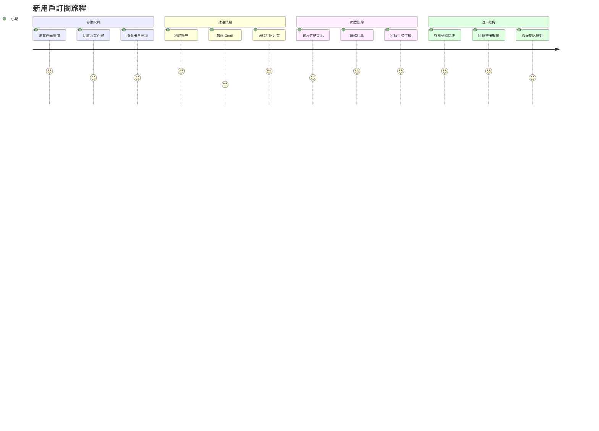
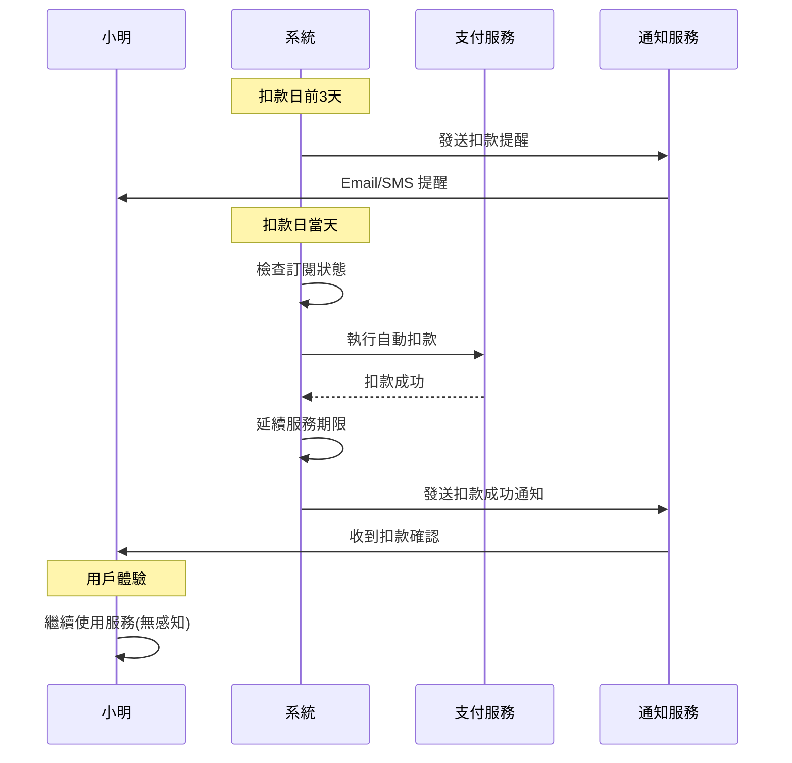
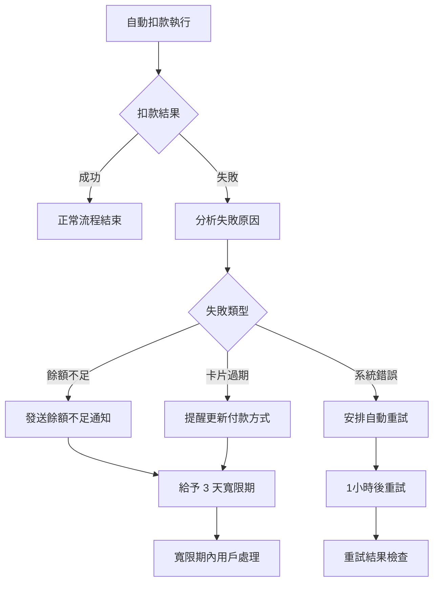
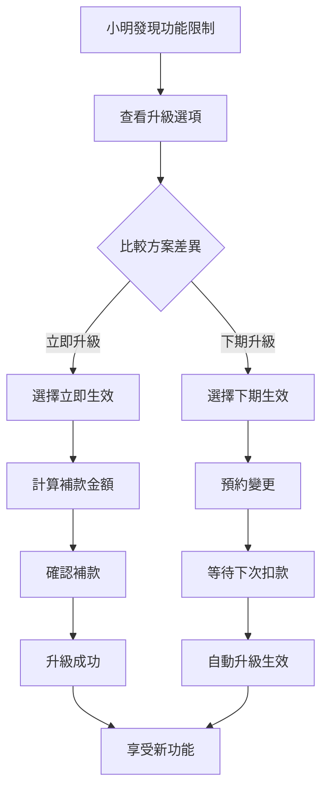
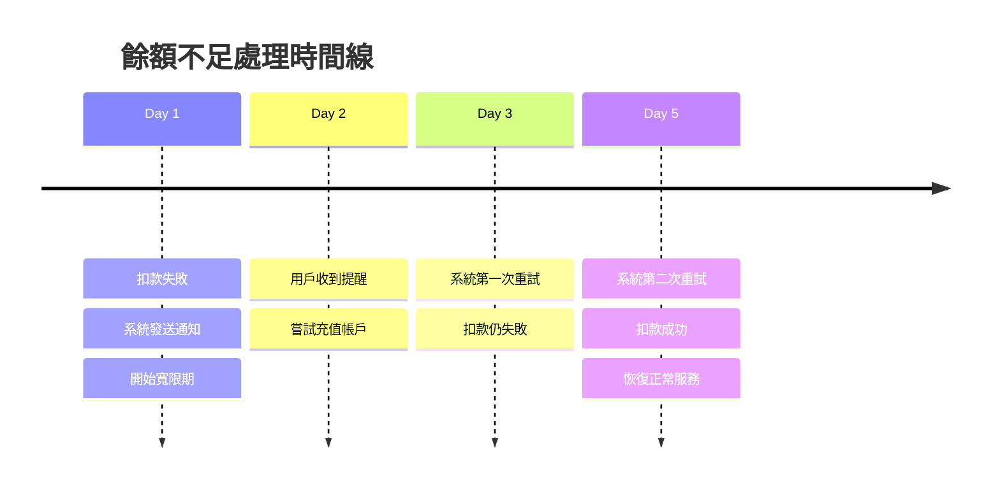
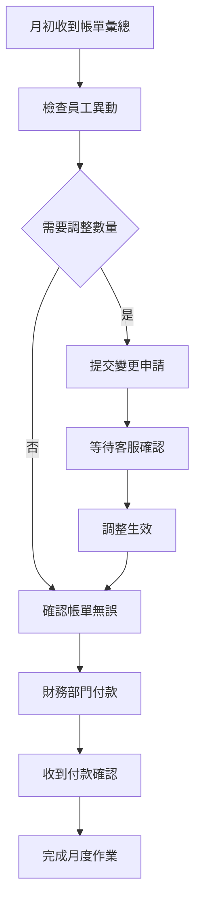
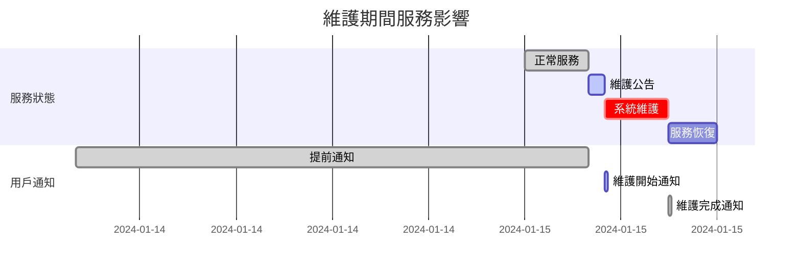
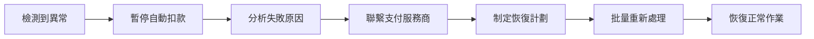
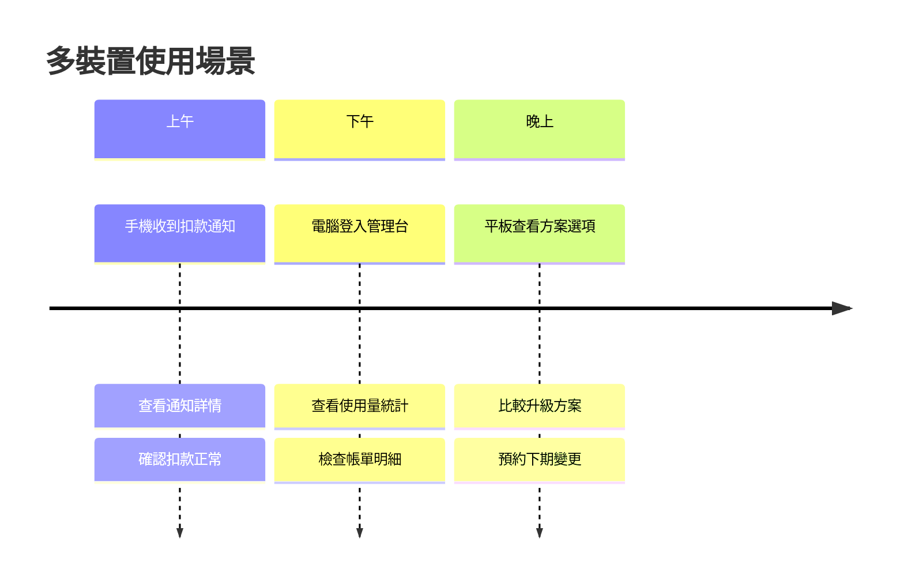

# 使用者情境 (User Scenarios)

本文件描述自動扣款系統的典型使用者情境，包含用戶旅程、操作流程和預期結果。

## 1. 使用者角色定義

### 1.1 主要角色

| 角色 | 描述 | 主要需求 | 系統權限 |
|------|------|----------|----------|
| **一般用戶** | 使用訂閱服務的終端消費者 | 便捷訂閱、透明計費、服務穩定 | 訂閱管理、帳單查詢 |
| **企業用戶** | 大量採購的組織客戶 | 批量管理、企業級支援、成本控制 | 多帳戶管理、報表匯出 |
| **客服人員** | 處理用戶問題的支援團隊 | 快速查詢、問題解決、狀態修改 | 訂閱查詢、狀態調整 |
| **財務人員** | 負責收入管理的財務團隊 | 收入追蹤、對帳作業、異常處理 | 財務報表、退款處理 |
| **系統管理員** | 負責系統維運的技術團隊 | 系統監控、異常處理、效能調優 | 完整系統權限 |

### 1.2 使用者畫像

#### 小明 - 個人用戶
- **背景**：30歲軟體工程師，重度科技產品使用者
- **需求**：穩定的雲端服務，希望自動化管理
- **痛點**：不想記住繳費日期，期望價格透明
- **期待**：服務不中斷，有問題能快速解決

#### 王經理 - 企業用戶
- **背景**：中型企業 IT 部門主管，管理 50+ 員工帳戶
- **需求**：批量管理、成本控制、合規要求
- **痛點**：個別管理太複雜，需要統一帳單
- **期待**：企業級支援、彈性付費方案

## 2. 核心使用情境

### 2.1 情境一：新用戶首次訂閱

#### 詳細流程

| 步驟 | 用戶動作 | 系統回應 | 成功條件 | 失敗處理 |
|------|----------|----------|----------|----------|
| 1 | 選擇月費方案 | 顯示價格明細 | 方案可選擇 | 顯示錯誤訊息 |
| 2 | 輸入信用卡資訊 | 驗證卡號格式 | 格式正確 | 標示錯誤欄位 |
| 3 | 點擊「開始訂閱」 | 處理付款請求 | 付款成功 | 顯示失敗原因 |
| 4 | 等待處理結果 | 發送確認 Email | Email 發送成功 | 系統重試發送 |
| 5 | 點擊確認連結 | 啟用帳戶服務 | 服務正常啟用 | 聯繫客服處理 |

### 2.2 情境二：老用戶自動續費

#### 成功路徑
- **前置條件**：有效訂閱、餘額充足、卡片未過期
- **執行過程**：自動扣款成功、服務無中斷
- **後續動作**：更新帳單、發送通知、設定下次扣款

#### 異常路徑

### 2.3 情境三：方案升級體驗

#### 用戶需求背景
小明因為業務成長，需要升級到企業方案

#### 升級流程細節

**立即升級路徑**
1. **觸發時機**：用戶主動選擇立即升級
2. **補款計算**：`(新方案價格 - 舊方案價格) × 剩餘天數 / 30`
3. **執行動作**：
   - 計算並執行補款
   - 立即開放新功能權限
   - 更新下次扣款金額
   - 發送升級確認通知

**下期生效路徑**
1. **預約變更**：系統記錄待變更方案
2. **扣款日處理**：以新方案價格執行扣款
3. **服務切換**：自動開放新功能權限
4. **通知確認**：告知升級已生效

### 2.4 情境四：支付失敗處理

#### 餘額不足情境

#### 卡片過期情境

| 時間點 | 系統動作 | 用戶收到訊息 | 預期行為 |
|--------|----------|--------------|----------|
| 扣款失敗當下 | 標記為過期失敗 | Email + SMS 通知 | 更新付款方式 |
| 3 小時後 | 發送緊急通知 | 推播通知 | 立即處理 |
| 24 小時後 | 服務功能限制 | 登入時提醒 | 完成更新 |
| 72 小時後 | 暫停服務 | 最終警告 | 必須處理 |

### 2.5 情境五：企業客戶批量管理

#### 王經理的月度作業流程

#### 批量操作需求

**員工帳戶管理**
- 新增員工：批量匯入、自動分配授權
- 離職處理：暫停帳戶、回收授權
- 部門轉移：變更帳戶歸屬、調整計費

**成本控制**
- 預算監控：設定月度預算上限
- 使用分析：各部門使用情況統計
- 異常告警：超預算或異常使用提醒

## 3. 異常情境處理

### 3.1 系統維護期間

**情境描述**：系統需要進行重大更新，預計維護 2 小時

**處理策略**
- **提前通知**：維護前 24 小時發送通知
- **扣款延後**：維護期間的扣款順延至恢復後
- **服務補償**：延長所有用戶服務 4 小時
- **狀態頁面**：即時更新維護進度

### 3.2 大量扣款失敗

**情境描述**：銀行系統故障導致 80% 扣款失敗

**應急響應**

**用戶溝通**
- 主動告知：發送系統異常通知
- 服務保證：承諾不會因系統問題暫停服務
- 處理進度：定時更新處理狀況
- 後續補償：提供適當的服務補償

## 4. 用戶體驗指標

### 4.1 關鍵指標定義

| 指標類別 | 指標名稱 | 目標值 | 測量方式 |
|----------|----------|--------|----------|
| **便利性** | 訂閱完成率 | > 85% | (完成訂閱數 / 開始訂閱數) × 100% |
| **可靠性** | 自動扣款成功率 | > 95% | (成功扣款數 / 總扣款數) × 100% |
| **透明性** | 帳單爭議率 | < 2% | (爭議案件數 / 總帳單數) × 100% |
| **響應性** | 問題解決時間 | < 24小時 | 從問題回報到解決的平均時間 |
| **滿意度** | 用戶滿意度 | > 4.2/5.0 | 月度用戶滿意度調查 |

### 4.2 體驗優化策略

**預防性措施**
- 扣款前提醒：避免意外扣款
- 智能重試：提高扣款成功率
- 異常預警：主動發現問題

**恢復性措施**
- 快速客服：縮短等待時間
- 自助服務：用戶自主解決問題
- 補償機制：適當的服務補償

## 5. 多裝置使用情境

### 5.1 跨裝置一致性

**小明的一天**

**一致性要求**
- 資料同步：所有裝置顯示相同資訊
- 狀態同步：操作結果即時反映
- 體驗一致：介面和流程保持統一

### 5.2 離線場景處理

**網路不穩定情境**
- 操作快取：關鍵操作離線暫存
- 自動重試：網路恢復後自動同步
- 狀態提示：清楚顯示同步狀態

這個使用者情境文件涵蓋了主要的用戶旅程和使用場景。現在讓我創建測試案例及驗收標準文件。
